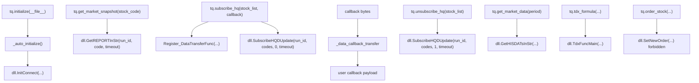

# TDXCENTER-CALL-GRAPH

## Files Read

- `F:\tongdaxin\PYPlugins\user\tqcenter.py`
- `F:\tongdaxin\PYPlugins\sys\tqcenter.py`
- `F:\tongdaxin\PYPlugins\user\tdxdata_test.py`
- `F:\tongdaxin\PYPlugins\TPythClient.dll`

## Wrapper Version

`tqcenter.py` header reports:

- Version: `1.0.4`
- Date: `2026-03-06`

## DLL Functions Declared By Python Wrapper

The wrapper declares these DLL entry points through `ctypes`:

| DLL function | Wrapper meaning |
|---|---|
| `InitConnect` | Initialize and obtain run id |
| `CloseConnect` | Used by release/close logic |
| `GetStockListInStr` | Stock list |
| `GetHISDATsInStr` | Historical market data / K-line |
| `GetCWDATAInStr` | Dividend/factor data |
| `Register_DataTransferFunc` | Callback registration |
| `SubscribeGPData` | Subscribe single-stock period data |
| `SubscribeHQDUpdate` | Subscribe quote updates |
| `SetNewOrder` | Trading/order interface, forbidden in this audit |
| `GetSTOCKInStr` | Stock detail |
| `GetREPORTInStr` | Market snapshot/report data |
| `SetResToMain` | Send result/message to client |
| `GetBlockListInStr` | Sector list |
| `GetBlockStocksInStr` | Sector constituents |
| `GetTradeCalendarInStr` | Trading calendar |
| `ReFreshCacheAll` | Refresh quote cache |
| `ReFreshCacheKLine` | Refresh K-line cache |
| `DownLoadFiles` | Download file |
| `UserBlockControl` | User sector operation |
| `GetProDataInStr` | Professional data |
| `GetCBINFOInStr` | Convertible bond info |
| `GetIPOINFOInStr` | IPO info |
| `GetUserBlockInStr` | User sectors |
| `TdxFuncMain` | TDX formula/internal function entry |
| `GetMoreInfoInStr` | More stock info |
| `GetGbInfoInStr` | Share capital info |
| `GetTrackZsETFInfoInStr` | ETF tracking index info |

## Public `tq` Methods Relevant To This Audit

| Method | Calls / role | Audit status |
|---|---|---|
| `initialize(path, dll_path='')` | Calls `InitConnect` through `_auto_initialize` | Required for any runtime probe |
| `close()` | Calls `CloseConnect` through `_auto_close` | Required cleanup |
| `get_market_snapshot(stock_code, field_list=[])` | Calls `GetREPORTInStr` | Primary snapshot test |
| `get_market_data(field_list, stock_list, period, ...)` | Calls `GetHISDATsInStr` | Needs special test for period support; current whitelist excludes `tick` |
| `subscribe_quote(stock_code, period, ..., callback)` | Calls `SubscribeGPData` | Historical/period subscription; comment says no actual function in this wrapper section |
| `subscribe_hq(stock_list, callback)` | Calls `SubscribeHQDUpdate` | Primary quote-update stream test |
| `unsubscribe_hq(stock_list)` | Calls `SubscribeHQDUpdate(..., 1, ...)` | Required cleanup |
| `get_subscribe_hq_stock_list()` | Returns `_sub_hq_update` | Subscription audit |
| `tdx_formula` / `formula_zb` / `formula_xg` / `formula_exp` | Calls `TdxFuncMain` | Formula-layer test candidate |
| `order_stock` | Calls `SetNewOrder` | Forbidden |

## L2 Keyword Search Result

Static wrapper search found no public method named:

- `get_tick`
- `get_transaction`
- `get_trade`
- `get_order`
- `get_entrust`
- `get_queue`
- `get_auction`
- `get_l2`

Important nuance:

- `tdxdata_test.py` says `get_market_snapshot` was formerly named `get_full_tick` / `get_report_data`.
- `get_market_data` contains a branch for `period == 'tick'`, but its `valid_periods` list currently excludes `tick`. This must be tested without assuming support.

## Static Call Graph

## DLL Export Gap

The Python wrapper gives practical public-call evidence, but a real export table was not extracted in this plan run because `dumpbin` / `llvm-readobj` were not available and `pefile` is not installed. A future goal-mode static audit may use a portable PE parser in an isolated read-only environment.

