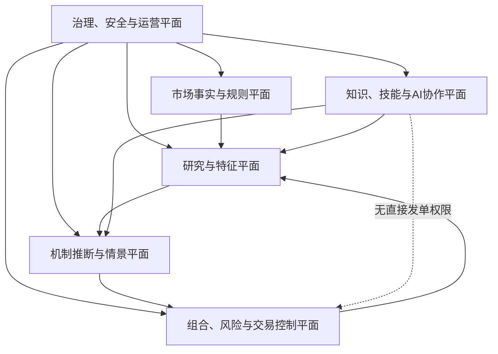

# 企业级 A 股 AI 量化交易与主导行为机制推断平台
## 总蓝图 v3.0 · 三文档整合定版

> **文档性质**：项目权威方向母本、企业架构基线、研发与验收总纲  
> **基线日期**：2026-07-17  
> **一期市场**：上海、深圳 A 股；北京证券交易所、ETF、可转债、期指、港美市场按独立规则包扩展  
> **部署定位**：本地优先、隐私优先、企业级治理、研究与决策支持优先、受控执行后置  
> **核心边界**：系统推断的是可验证、可反驳的“主导行为机制概率”，不确认真实账户身份、控制关系或主观意图；不承诺收益；语言模型和通用 AI 无权绕过确定性风控下单。

---

# 文档控制

| 项目 | 定义 |
|---|---|
| 权威正文 | 本 Markdown 及其同版本 DOCX |
| 前置输入 | 《交易系统补加》《A股 AI 量化交易与主导行为机制推断平台》《企业级A股AI量化交易系统总蓝图 v2.0》 |
| 变更方式 | 新版本追加，不覆盖历史；重大决定必须建立 ADR |
| 生产默认状态 | `research_only / NO_TRADE` |
| 事实优先级 | 官方规则与合同 > 点时原始数据 > 可复现实验 > 权威论文 > 机构研究 > 经典交易体系 > 媒体与社区线索 |
| 系统真相源 | 项目仓库、不可变原始数据、版本化注册表、券商回报与审计日志 |

---

# 0. 执行摘要

本项目要建设的不是一个“大模型看盘、猜主力、直接下单”的机器人，而是一套能够长期演化的企业级量化操作系统。它由六个相互隔离又可追溯闭环的系统平面组成：

1. **市场事实与规则平面**：保存合法获得、点时可见、可重放的数据、市场规则、来源、版本和质量状态。
2. **研究与特征平面**：把论文、交易理论、经验、指标和本地知识转化为可证伪的特征、标签、实验和样本外验证。
3. **机制推断与情景平面**：以竞争假设解释量价、订单流、事件和基本面，输出概率、反证、混淆解释和多分支路径。
4. **组合、风险与交易控制平面**：独立完成目标仓位、硬风控、OMS、执行、券商对账、熔断和恢复。
5. **知识、技能与 AI 协作平面**：连接本地第二大脑、WorkBuddy、Codex、MCP 和自定义技能，但只通过受控网关工作。
6. **治理、安全与运营平面**：统一身份、权限、审批、数据许可、模型治理、可观测性、灾备、事故响应和软件供应链。

核心产品不是一句“可以买”，而是结构化、可重放的 `DecisionPacket`。它必须明确：

- 当时可见的事实与数据质量；
- 当时有效的交易规则；
- 多个竞争性行为机制及校准概率；
- 支持证据、反对证据、混淆解释和不可观察项；
- 收益、成本、风险和成交概率分布；
- T+1、涨跌停、盘后固定价格交易、停牌、流动性和容量约束；
- 情景触发、失效条件、下一项最有价值的信息；
- `NO_TRADE / WATCH / ENTER / REDUCE / EXIT / HALT` 等动作；
- 完整的数据、代码、模型、技能、审批和审计血缘。

**真正的企业级，不是组件数量多，而是每个结论能被重建、每个未知被登记、每个高风险动作能被机械阻断、每次失败能反哺系统。**

---

# 1. 三份文档的融合结论

## 1.1 第一份文档贡献：完整业务与交易内核

保留以下能力作为业务母本：

- 双源 Level-2 接入、对账与降级；
- 原始数据不可变、逐事件重放和点时数据；
- A 股规则、T+1、竞价、涨跌停、费用与容量；
- 特征、策略、组合、风险、OMS、执行与 TCA；
- 主导行为机制的竞争假设、概率校准与弃权；
- 第二大脑、技能、MCP、WorkBuddy 和 Codex 接口；
- 本地单机到企业高可用的演进路径。

## 1.2 第二份文档贡献：企业闭环与压缩后的控制原则

保留以下能力作为企业架构骨架：

- 市场事实、研究工厂、概率推断、控制交易、知识协作五大系统；
- 端口适配和供应商可替换；
- 数据许可、点时事实和历史规则包；
- 独立风控、订单幂等、对账与恢复；
- 技能 Manifest、模型卡、数据卡和发布门禁；
- RPO/RTO、软件供应链和权限隔离；
- 先闭环、再智能、后受控执行。

## 1.3 第三份增补文档贡献：可运行的 AI 协作控制面

原有蓝图已经说明“AI 能做什么”，但未充分回答“多个 AI 如何共同工作而不互相踩文件、重复建设或越权”。本版正式加入：

- `Task Registry`：任务、依赖、负责人、锁、状态、审批和验收；
- `Capability Registry`：数据源、技能、Agent、接口和运行环境的真实能力卡；
- `Artifact Registry`：工件哈希、版本、来源、测试、审批和回滚；
- `Policy Engine`：将权限、环境、数据质量、规则、审批和风险变为机械门禁；
- `Secrets Broker`：生产密钥仅提供给确定性执行进程；
- `Agent Gateway`：统一 WorkBuddy、Codex、本地 AI 和第二大脑的白名单调用；
- Git/worktree 条件门禁：仓库未建立 Git 基线时，不假装支持并行 worktree；
- 统一 `run_id / trace_id / task_id / artifact_id`，贯穿任务、实验、部署和交易。

## 1.4 冲突裁决

| 冲突点 | 最终裁决 |
|---|---|
| 五系统还是六平面 | 采用六平面表达，运行时仍可按五大业务系统部署；治理安全为横切控制面 |
| 一开始微服务还是单体 | 逻辑领域化、接口化；部署从模块化单体开始，按负载和团队证据拆分 |
| 第二大脑自动写入还是只读 | 第一阶段只读；自动内容先进入候选区，验证后升级 |
| AI 是否能提出订单 | 可生成 `OrderIntentDraft`，不能绕过确定性策略、风控和审批发送订单 |
| 主力意图是否为标签 | 否；改写为潜在行为机制，身份默认不可识别 |
| 复杂模型是否优先 | 否；简单基线优先，复杂模型必须证明增量 |
| WorkBuddy/Codex 是否自由互聊 | 否；共享注册表、工件与任务契约，而非无审计自由对话 |
| 当前 DOCX 是否作为权威 | Markdown 为权威正文；DOCX 为经渲染验收的交付镜像 |

---

# 2. 项目章程

## 2.1 项目使命

建设面向 A 股的企业级 AI 量化平台，使其能够：

- 接入并重放日频、分钟、逐笔成交、逐笔委托、盘口快照、竞价和盘后交易数据；
- 融合公告、财报、政策、产业链、新闻、研报、指数调整和事件日历；
- 将威科夫、VSA、订单流、趋势、动量、均值回归、基本面和行为金融转为可检验假设；
- 推断参与者流量来源、库存方向和拍卖阶段的概率；
- 生成带触发、反证、截止时间和尾部路径的情景树；
- 输出成本后、规则后、风险后可执行或明确不可执行的决策；
- 通过历史回放、影子运行、纸面交易和极小规模 Canary 逐级晋级；
- 把研究结果、失败试验、规则变化、运行事故和经验反哺第二大脑与技能系统。

## 2.2 第一性目标函数

系统追求：

```text
最大化：净收益期望
减去：尾部预期损失、最大回撤、换手与冲击、模型不确定性、操作风险、合规风险
约束：资金保全、可卖库存、流动性、容量、集中度、交易规则、权限与人工授权
```

数学表达为：

```text
目标函数 = E[R_net] - λ1·ESα - λ2·DD - λ3·Cost - λ4·Uncertainty - λ5·OperationalRisk
```

## 2.3 “稳定盈利”的工程定义

不定义为每天赚钱，而定义为：

- 明确资金规模下，样本外净期望可重复；
- 结果不依赖极少数幸运交易；
- 回撤、尾部风险和恢复时间处于预批准范围；
- 概率长期可校准；
- 容量、冲击和退出时间可解释；
- 模型失效可检测、可自动降级；
- 生产结果可完整重放和归因；
- 扩容前重新验证，不线性外推历史收益。

## 2.4 非目标

- 不保证收益、胜率或无回撤；
- 不确认真实庄家、机构账户或控制关系；
- 不把大单、撤单、横盘、涨停等单一现象直接叙事化；
- 不让语言模型持有券商生产密钥；
- 不把自然语言直接转成实盘订单；
- 不在数据、许可、规则、成本、券商和风险未验证时自动实盘；
- 不抓取或复制无授权的行情、论文、研报和数据库全文；
- 不让单一大师、单一指标或单一黑箱模型成为系统真理。

---

# 3. 四层认知映射与未知管理

系统必须同时处理“你明确知道的、你知道但未说的、你不知道但能理解的、以及暂时不可识别的”。

| 层级 | 示例 | 工程对象 |
|---|---|---|
| 明示已知 | A 股优先、先最小闭环、未经批准不下单 | 项目硬约束、`AGENTS.md`、风险策略 |
| 隐性已知 | 已有 `MarketDataRecord / PriceBar / SMA`、公告栏、第二大脑 | Capability Card、仓库只读取证 |
| 可理解未知 | L2 字段差异、PIT、队列、成本、券商回报、灾备 | `UnknownRegistry` + 验证方法 + 安全默认 |
| 深层未知 | 真实账户身份、隐藏订单、场外动机、对手未来策略 | 概率区间、替代假设、不可识别声明、弃权 |

## 3.1 Unknown Registry

```yaml
UnknownItem:
  unknown_id: U-0001
  statement: "Source A 是否提供逐笔撤单的交易所原始序号"
  category: DATA|RULE|BROKER|MODEL|DEPLOYMENT|LEGAL|USER_PARAMETER
  impact: "决定能否可靠计算订单寿命和撤补行为"
  verification_materials: ["字段表", "脱敏样例", "合同"]
  verification_method: "金样本重放与供应商确认"
  safe_default: "禁用依赖撤单序号的特征"
  owner: data_engineering
  status: OPEN|VERIFIED|UNOBSERVABLE|DEFERRED
  evidence_refs: []
```

## 3.2 五个持续审问

1. 系统观察到了什么，时间与质量是否可靠？
2. 哪些不同机制能产生同样现象？
3. 哪个未来证据会推翻当前解释？
4. 即便预测正确，成本、T+1、涨跌停、盘后交易和流动性后是否仍值得交易？
5. 如果模型、数据、规则或券商错了，系统会自动做什么？

---

# 4. 企业级总体架构

## 4.1 六平面架构



## 4.2 三个控制面

### 企业治理控制面

负责：身份、权限、审批、数据许可、版本、变更、模型治理、事故和审计。

### 确定性交易控制面

负责：规则、账户、持仓、风险、OMS、执行、券商和对账。任何 AI 都不能覆盖它。

### AI 协作控制面

负责：任务、能力、工件、技能、Agent、第二大脑和研究编排。它可以建议、生成、解释，但不能拥有交易权威。

## 4.3 关键路径隔离

| 平面 | 是否进入下单关键路径 | 失败默认 |
|---|---:|---|
| 市场事实与规则 | 是 | 降级或 `NO_TRADE` |
| 研究与特征 | 否 | 保留最近批准版本或不交易 |
| 机制推断与情景 | 间接 | 弃权或不交易 |
| 组合风险交易 | 是 | 拒单、只减仓或停机 |
| AI 协作 | 否 | 失去解释/研究能力，不影响风控 |
| 治理运营 | 是 | 阻断变更或交易 |

---

# 5. 服务域与稳定契约

| 服务域 | 职责 | 稳定产物 |
|---|---|---|
| Data Ingestion | 行情、公告、财务、事件、文件采集 | `RawEnvelope` |
| Security Master | 证券身份、板块、状态、公司行动 | `InstrumentSnapshot` |
| Rule Engine | 历史交易规则、费用、可交易性 | `RuleSnapshot` |
| Quality & Replay | 数据闸门、跨源对账、逐事件回放 | `QualityReport`, `ReplayRun` |
| Feature Platform | 线上/离线一致特征和注册 | `FeatureVector`, `FeatureSet` |
| Research Factory | 数据集、标签、回测、统计审计 | `Experiment`, `ValidationReport` |
| Intent Engine | 竞争机制、概率、证据与反证 | `IntentBelief` |
| Scenario Engine | 分支、触发、失效与尾部路径 | `ScenarioTree` |
| Forecast Engine | 收益、风险、成本、成交概率 | `ForecastDistribution` |
| Portfolio Engine | 风险预算与目标仓位 | `TargetPosition` |
| Risk Engine | 硬限额、账户、规则与系统风险 | `RiskDecision` |
| OMS | 订单生命周期与幂等协调 | `OrderIntent`, `OrderState` |
| Execution | 拆单、路由、成交成本与 TCA | `ExecutionReport` |
| Reconciliation | 订单、持仓、现金、费用和公司行动对账 | `ReconciliationReport` |
| Knowledge Gateway | 证据、图谱、只读检索和候选回写 | `EvidenceClaim` |
| Skill Registry | 技能发现、版本、测试与权限 | `SkillManifest` |
| Agent Gateway | WorkBuddy/Codex 任务和审计 | `AgentTask`, `AgentAudit` |
| Governance/SRE | 监控、发布、灾备、事件响应 | SLO、Runbook、审计事件 |

所有外部供应商只能通过适配器接入，内部领域不得直接依赖供应商字段或协议。

---

# 6. AI 协作控制面

## 6.1 固定角色

| 主体 | 最终职责 |
|---|---|
| 项目所有者 | 方向、资金、风险预算、例外和生产授权 |
| ChatGPT | 研究设计、系统架构、证据审核、任务拆分、阶段验收 |
| Codex | 代码、测试、重构、回放、变更和回滚说明 |
| WorkBuddy | Windows 本地能力审计、服务部署、运行监控、接口和运维 |
| 第二大脑 | 只读检索、历史经验、候选知识和项目长期记忆 |
| 确定性服务 | 数据、规则、风险、订单、持仓和对账真相 |

## 6.2 核心注册表

### Task Registry

```yaml
TaskRecord:
  task_id: QSYS-0001
  title: "建立交易规则包 v0"
  mode: PROJECT_PLAN|GOAL|MECHANICAL
  owner: codex|workbuddy|human
  requester: chatgpt
  dependencies: []
  input_artifacts: []
  expected_outputs: []
  success_criteria: []
  path_ownership: []
  write_lock: string|null
  status: PROPOSED|APPROVED|ASSIGNED|RUNNING|BLOCKED|REVIEW|MERGED|CLOSED
  risk_level: LOW|MEDIUM|HIGH|CRITICAL
  approval_required: boolean
  run_id: string|null
```

### Capability Registry

```yaml
CapabilityCard:
  capability_id: DATA.TDX.L2D.V1
  provider: workbuddy|codex|service|vendor
  type: DATA_SOURCE|SKILL|TOOL|RUNTIME|BROKER|STORAGE
  description: string
  verified_fields: []
  sample_artifacts: []
  limitations: []
  license_scope: []
  runtime_environment: {}
  golden_tests: []
  security_classification: string
  status: CLAIMED|OBSERVED|VERIFIED|BLOCKED|DEPRECATED
  last_verified_at: timestamp
```

### Artifact Registry

```yaml
ArtifactRecord:
  artifact_id: ART-0001
  type: CODE|DATASET|MODEL|REPORT|CONFIG|RULE_PACK|SKILL
  version: 1.0.0
  content_hash: sha256
  produced_by_task: QSYS-0001
  source_commit: string|null
  lineage_refs: []
  tests: []
  approvals: []
  deployment_status: DRAFT|VALIDATED|RELEASED|RETIRED
  rollback_ref: string|null
```

## 6.3 任务流

```text
提出任务 → 能力检查 → 风险与权限检查 → 分配路径/锁 → 执行 → 测试 → 工件登记
→ 独立复核 → 合并 → 交接包更新 → 关闭
```

关键原则：

- 多个 AI 不以“互相聊天”作为协作事实，而以注册表和工件为事实；
- Git 仓库和干净基线存在后才启用 worktree；
- 未建立 Git 时采用单工作树、目录所有权、串行写锁和只读审计；
- 同一文件不得由两个 Agent 无锁并发修改；
- 任何任务完成都必须包含测试、变更文件、已验证事实和未解决项。

## 6.4 Codex 模式协议

### 【Codex模式：项目计划模式】

用于大型跨模块、未知项多、需要先盘点真实仓库和持续维护计划的任务。

### 【Codex模式：目标模式】

用于目标和验收明确，但实现路径需要根据真实代码、测试和运行结果动态调整的任务。

统一回传：

```yaml
CodexProgressReport:
  task_id: string
  mode: PROJECT_PLAN|GOAL
  current_goal: string
  success_criteria: []
  current_phase: string
  completion_percentage: number
  verified_facts: []
  unknowns: []
  changed_files: []
  commands_run: []
  tests_run: []
  test_results: []
  key_decisions: []
  alternatives_considered: []
  risks_and_blockers: []
  next_actions: []
  rollback_notes: []
```

## 6.5 Policy Engine

策略至少判断：

- 调用者身份和角色；
- 当前环境：DEV/TEST/RESEARCH/SHADOW/PAPER/CANARY/PRODUCTION；
- 数据许可和敏感级别；
- 数据质量；
- 规则版本；
- 任务审批；
- 技能许可；
- 网络和文件权限；
- 是否涉及券商、账户或生产密钥；
- 是否允许写入正式知识；
- 是否触发人工复核。

## 6.6 Secrets Broker

- 生产密钥只提供给独立执行进程；
- Agent、Notebook、技能和第二大脑均不能读取；
- 使用短期凭证和机器身份；
- 所有读取、轮换和失败均审计；
- 凭证不得出现在日志、Prompt、错误栈和工件中。

---

# 7. 数据平台

## 7.1 数据层级

| 层 | 内容 | 规则 |
|---|---|---|
| L0 Raw | 原始二进制、消息、文件、公告原文、供应商头 | 不可变、哈希、许可、解析器版本 |
| L1 Canonical | 统一成交、委托、撤单、盘口和状态事件 | Schema 版本、来源与时间语义 |
| L2 Reconstructed | 订单簿、竞价状态、证券状态、公司时间线 | 可重建、质量标记 |
| L3 Feature | 因子、指标、订单流和市场状态 | as-of、线上离线一致 |
| L4 Research | 标签、实验、模型、策略和报告 | 快照、试验族、代码提交 |
| L5 Decision/Trade | 决策、审批、订单、成交、损益和归因 | 不覆盖历史、完整审计 |

## 7.2 时间语义

必须同时保存：

- `event_time`：事件发生；
- `published_at`：信息公开；
- `received_at`：系统收到；
- `available_at`：质量闸门通过后可用；
- `revised_at`：后续修订；
- `valid_from / valid_to`：规则和主数据有效区间；
- `processed_at`：系统处理。

回测只能读取：`available_at <= simulation_clock`。

## 7.3 RawEnvelope

```yaml
RawEnvelope:
  source_id: string
  feed_id: string
  venue: string
  channel_id: string
  source_sequence: integer|null
  exchange_timestamp: timestamp|null
  vendor_timestamp: timestamp|null
  receive_timestamp: timestamp
  available_timestamp: timestamp|null
  payload_schema_version: string
  parser_version: string
  payload_hash: string
  license_policy_id: string
  raw_object_uri: string
  ingestion_run_id: string
```

## 7.4 证券主数据

稳定主键使用 `instrument_id`，证券代码只是带有效期的属性。至少包括：

- 交易所、代码、历史代码、证券类型和板块；
- 上市、退市、ST/风险状态、停复牌；
- 交易时段、订单单位、最小价位；
- 涨跌幅、价格笼子、临停和盘后交易资格；
- T+1/回转属性；
- 两融、券源和指数成分；
- 公司行动、除权除息和复权因子生效时间。

## 7.5 双源 Level-2

双源用于缺口检测、字段交叉验证、序列恢复、时钟校验、供应商异常识别和降级运行，而不只是备份。

能力矩阵必须按字段填充，禁止虚构：

| 能力 | Source A | Source B | 缺失影响 |
|---|---|---|---|
| 逐笔委托/撤单 | 待验证 | 待验证 | 订单寿命、队列和撤补 |
| 逐笔成交及引用 | 待验证 | 待验证 | Delta、母单代理和方向 |
| 多档盘口 | 待验证 | 待验证 | 深度、微价格和冲击 |
| 集合竞价字段 | 待验证 | 待验证 | 虚拟价格和不平衡 |
| 交易所序号 | 待验证 | 待验证 | 缺口恢复与排序 |
| 历史回放 | 待验证 | 待验证 | 研究可复现 |
| 落盘/衍生/训练许可 | 待验证 | 待验证 | 存储与模型合法性 |

若使用客户端落盘文件或社区解析格式，必须先建立 Capability Card、解析器版本、合同边界和金样本。不能把客户端快照误当完整交易所 Level-2。

## 7.6 数据质量状态机

```text
HEALTHY → DEGRADED_SINGLE_SOURCE → STALE → HALTED → RECOVERING → HEALTHY
```

触发：序列缺口、重复、逆序、时钟偏差、字段漂移、跨源冲突、映射错误、订单簿守恒失败、许可异常。

恢复顺序：补数 → 重放 → 跨源对账 → 证券/规则状态确认 → 特征重建 → 持仓与订单对账 → 解除熔断。

## 7.7 DataQualityState

```yaml
DataQualityState:
  source_health: HEALTHY
  completeness_score: 0.999
  latency_score: 0.995
  sequence_integrity: PASS
  clock_integrity: PASS
  cross_source_agreement: 0.997
  schema_drift: false
  stale: false
  permitted_feature_families: []
  blocked_feature_families: []
  trading_permission: FULL|DEGRADED|NO_TRADE
```

---

# 8. A 股规则引擎与 2026 基线

## 8.1 版本主键

```text
(venue, board, security_type, security_status,
 trading_method, effective_from, effective_to, implementation_status)
```

`implementation_status` 支持：`ACTIVE / DEFERRED / PILOT / SUSPENDED / RETIRED`，用于处理规则已发布但部分条款暂缓实施的情况。

## 8.2 2026 年必须新增的规则能力

截至本蓝图基线日，沪深交易规则在 2026-07-06 起实施新版本。系统必须把以下变化作为正式测试对象，而不是沿用旧假设：

- 盘后固定价格交易范围扩展；
- 上交所全部 A 股和 ETF 的盘后固定价格交易规则适配；
- 基金收盘阶段交易方式调整；
- 主板风险警示股票涨跌幅限制调整；
- 深交所 2026 交易规则包切换；
- 规则中暂缓实施内容以功能开关管理；
- 历史回测按交易日加载当时有效规则，不能用 2026 规则回放旧年份。

## 8.3 RuleSnapshot

```yaml
RuleSnapshot:
  rule_version: string
  venue: string
  board: string
  security_type: string
  security_status: string
  implementation_status: ACTIVE
  effective_from: timestamp
  effective_to: timestamp|null
  sessions: []
  auction_policy: {}
  after_hours_fixed_price_policy: {}
  cancellation_policy: {}
  order_types: []
  lot_size: number
  minimum_price_tick: number
  price_limit_policy: {}
  dynamic_price_range: {}
  temporary_halt_policy: {}
  settlement_policy: {}
  t_plus_one_policy: {}
  fees_and_taxes: {}
  program_trading_constraints: {}
  source_documents: []
```

## 8.4 T+1 批次库存

```yaml
PositionLot:
  instrument_id: string
  account_id: string
  trade_date: date
  settle_date: date
  acquired_quantity: number
  available_to_sell: number
  frozen_quantity: number
  unsettled_quantity: number
  average_cost: decimal
  source_order_id: string
```

必须区分总持仓、可卖、冻结、在途、券商确认和本地账本。任何止损或退出建议必须先检查可卖数量。

## 8.5 竞价与盘后交易

独立建模：

- 开盘集合竞价可撤阶段；
- 开盘集合竞价不可撤阶段；
- 连续竞价；
- 收盘集合竞价；
- 盘后固定价格交易。

盘后固定价格交易不能被当成连续竞价：需要独立处理申报窗口、成交价格来源、成交顺序、流动性、可撤规则、成交延迟和回测填单。

## 8.6 涨跌停和队列

- 触及价格限制不代表能够成交；
- 回测必须包括开板、再封、排队、次日一字板和无法退出；
- 无法精确重建队列时提供乐观/中性/悲观成交；
- 策略必须在保守模型下仍有缓冲；
- 风险警示状态和板块规则必须按有效期加载。

## 8.7 程序化交易合规

架构必须前置支持：

- 程序化交易报告状态；
- 账户、策略、软件和交易单元信息；
- 申报和撤单速率监控；
- 异常交易检测；
- 系统测试、日志和风险管理；
- 券商尽调和接口限制；
- 高频识别和内部更严格限额；
- 交易所、监管和券商规则热更新。

默认不以贴近监管阈值作为优化目标，内部限额必须留有明显安全边际。

---

# 9. 研究工厂

## 9.1 对象链

```text
DatasetSpec → FeatureSet → LabelSpec → Experiment
→ ModelArtifact / StrategyArtifact → ValidationReport → DecisionPolicy
```

每个对象必须有 ID、版本、哈希、创建者、来源、适用范围、禁用场景、测试、有效期和血缘。

## 9.2 研究预注册

每项研究在运行前登记：

- 经济机制；
- 主要假设、替代假设和反证；
- 数据范围和时间切分；
- 特征、标签和参数空间；
- 基准；
- 成本和容量；
- 成功/失败门槛；
- 停止规则；
- 最终锁箱位置；
- 试验族 ID。

## 9.3 强制反泄漏

- 点时股票池、财务、公告、公司行动、ST、停复牌、指数成分和规则；
- 不使用最终复权值产生历史信号；
- 不把日末汇总泄漏给日内模型；
- 跨源按当时接收时间重放；
- 标准化、特征选择和阈值只在训练/验证集完成；
- 重叠标签采用 purge/embargo；
- 锁箱不反复查看；
- 人工观察后产生的新变体计入试验总数。

## 9.4 反过拟合与统计审计

- 保存所有失败试验；
- 披露参数搜索和人工选择总数；
- 使用简单基线和消融；
- 适用时使用 PBO/CSCV、Deflated Sharpe、White Reality Check 或 Hansen SPA；
- 对依赖结构使用 block/bootstrap；
- 按制度、年份、板块、流动性、规模和市场状态切片；
- PBO 和 DSR 是试验族审计工具，不能替代成本、容量、最终锁箱和纸面交易。

## 9.5 回测仿真

必须模拟：

- 历史交易规则和盘后交易；
- 集合竞价与不可撤阶段；
- T+1 批次库存；
- 涨跌停、价格范围、停复牌；
- 公司行动和费用税率；
- 部分成交、拒单、延迟、顺序异常；
- 队列不确定性；
- 市场冲击、容量和机会成本；
- 现金、冻结资金和可卖量。

---

# 10. 特征、因子和指标平台

## 10.1 特征家族

| 家族 | 核心内容 |
|---|---|
| 价量 | 收益、波动、振幅、缺口、换手、区间位置、相对强弱、价格效率 |
| 订单流 | Delta、CVD、多档 OFI、到达率、主动买卖差、持续性、方向置信 |
| 盘口 | 深度、斜率、凸性、微价格、价差、队列不平衡、订单寿命、撤补 |
| 冲击韧性 | 单位订单流冲击、恢复速度、半衰期、流动性韧性、不利选择 |
| 吸收失败 | 卖流不跌、买流不涨、突破失败、量缩测试、努力与结果残差 |
| 拍卖结构 | Volume Profile、POC、Value Area、VWAP、锚定 VWAP、成本带 |
| 基本面事件 | 盈利质量、预期差、回购、减持、解禁、订单、产能、监管问询 |
| 市场环境 | 指数、行业、风格、宽度、波动、相关性、拥挤、ETF/期指 |
| 行为金融 | 注意力、处置效应、公告后漂移、涨停磁吸、鸵鸟效应 |
| 数据质量 | 延迟、丢包、跨源一致率、规则不确定性、分类置信 |

筹码和账户分类均为代理估计，必须标注不确定性，不能称为真实账户成本或身份。

## 10.2 FeatureDefinition

```yaml
FeatureDefinition:
  feature_id: string
  version: string
  owner: string
  economic_rationale: string
  inputs: []
  calculation_code_ref: string
  windows: []
  frequency: string
  units: string
  missing_semantics: string
  minimum_data_quality: {}
  allowed_market_phases: []
  offline_online_parity_test: string
  latency_budget_ms: number|null
  lineage_policy: string
```

## 10.3 线上离线一致

- 同一变换代码；
- as-of 查询；
- 训练/服务偏差监控；
- 金样本和性质测试；
- 高成本特征可缓存但可重建；
- 数据质量不足时显式禁用特征族。

---

# 11. 主导行为机制概率推断

## 11.1 问题定义

系统不问“主力到底在干什么”，而问：

> 在当前可观察证据、数据质量、市场规则和历史校准下，哪些行为机制最能解释行情？各机制若成立，未来应该出现什么证据？什么证据会推翻它？成本和风险后是否仍可交易？

## 11.2 分层状态

1. **制度环境**：竞价、连续、收盘、盘后、停牌、价格限制、事件窗口；
2. **流量来源**：信息型、机械型、流动性型、被迫型、拥挤型、套利型、混合/未知；
3. **库存方向**：净建立、净降低、双边、中性、未知；
4. **拍卖阶段**：平衡、吸收、测试、突破、趋势、衰竭、反转、不可判定；
5. **未来路径**：确认、延续、失败、切换、极端流动性事件。

## 11.3 第一版机制本体

| 机制 | 观测候选 | 混淆解释 |
|---|---|---|
| 被动吸收/库存建立 | 卖流强但下行冲击减弱、买侧补给 | ETF、套利、流动性供给 |
| 主动抬价 | 买方 OFI、跨档消耗、相对强势 | 新闻、散户拥挤、板块 beta |
| 供给测试 | 再探、量缩、冲击恢复 | 低活跃随机波动 |
| 需求测试 | 小规模拉升但跟随不足 | 时段与流动性效应 |
| 派发/库存降低 | 买流旺盛但上涨效率下降 | 解禁、事件卖出、对冲 |
| 被迫减仓 | 持续卖流、冲击加剧、恢复失败 | 基本面坏消息、系统性下跌 |
| 流动性供给 | 双边挂撤、短期均值回归 | 执行算法、欺骗候选 |
| 被动再平衡 | 指数日历、尾盘/盘后同步、跨标的流 | 主动机构交易 |
| 套利对冲 | ETF、期现和多腿同步 | 共同信息冲击 |
| 散户拥挤 | 注意力、整数小单、追涨杀跌 | 机构拆单误分类 |
| 事件驱动 | 公告时点、行业链和预期差 | 同期市场共振 |
| 混合/无主导 | 低信息、模型分歧、多机制并存 | 未建模机制 |

## 11.4 威科夫形式化

| 术语 | 可观测代理 | 反证 |
|---|---|---|
| 吸筹 | 卖流被吸收、下跌冲击减弱、低点抬高 | 再次卖流快速破位 |
| 派发 | 买流强但上涨效率下降、上方补给 | 突破后冲击持续扩大并稳定 |
| Spring | 跌破区间后收复，卖压衰减 | 收复后再次失守并扩大 |
| Upthrust | 向上突破后快速跌回，买流衰竭 | 重新站稳并维持正向冲击 |
| Test | 再探时成交、范围和冲击缩小 | 再探继续扩展且无恢复 |
| Effort vs Result | 交易努力与价格结果残差 | 残差没有样本外预测能力 |

所有大师体系进入候选假设库，不直接进入生产真理库。

## 11.5 模型栈

按复杂度晋级：

1. 规则评分和正则化逻辑回归；
2. HMM/HSMM、状态空间和动态贝叶斯；
3. 在线变点检测；
4. 梯度提升、生存和竞争风险；
5. Hawkes/点过程；
6. TCN/LSTM/Transformer/DeepLOB 类模型；
7. 图模型和制度混合专家；
8. 概率校准、Conformal/选择性预测和模型分歧门控。

DeepLOB 等模型只能在合法、完整、时间一致的订单簿数据后进入候选队列；海外基准优异不代表 A 股有效。

## 11.6 标签纪律

真实意图无可靠地面真值，采用：未来路径、冲击恢复、成交概率、弱监督、已知事件、自有执行、仿真植入和专家分歧软标签。

禁止循环标签、单一大单身份分类和强迫模型在证据不足时输出强结论。

## 11.7 IntentBelief

```yaml
IntentBelief:
  belief_id: string
  instrument_id: string
  as_of: timestamp
  horizon: string
  market_regime: string
  data_quality_state: string
  hypotheses:
    - mechanism_code: PASSIVE_ABSORPTION
      probability: 0.42
      supporting_evidence: []
      counter_evidence: []
      confounders: []
      observable_prediction: string
      falsification_condition: string
      next_best_observation: string
      expiry: timestamp
  predictive_confidence: number
  mechanism_confidence: number
  identity_confidence: unidentifiable|low
  mixed_or_unknown_probability: number
  calibration_status: string
  applicability_limits: []
  model_versions: []
```

---

# 12. 情景树与决策包

## 12.1 必备分支

- 基准路径；
- 正向确认；
- 反向失效；
- 机械流替代；
- 数据异常；
- 涨跌停、停牌、盘后流动性枯竭等极端路径；
- 不交易路径。

## 12.2 ScenarioBranch

```yaml
ScenarioBranch:
  branch_id: string
  probability: number
  trigger_conditions: []
  observation_window: string
  expected_return_distribution: {}
  maximum_adverse_excursion: {}
  liquidity_assumption: {}
  fill_probability: {}
  recommended_action: string
  invalidation_conditions: []
  next_evaluation_time: timestamp
```

## 12.3 决策动作

`NO_TRADE | WATCH | PAPER_PROBE | ENTER | ADD | HOLD | REDUCE | EXIT | HEDGE | ONLY_REDUCE | GLOBAL_HALT`

预测方向正确也可能不交易，因为成本、尾部风险、T+1、容量、数据、校准、组合敞口和成交概率可能不允许。

## 12.4 DecisionPacket

```yaml
DecisionPacket:
  schema_version: string
  decision_id: string
  created_at: timestamp
  as_of: timestamp
  instrument_id: string
  horizon: string
  data_context:
    dataset_versions: {}
    data_quality_state: {}
    stale: boolean
    source_conflicts: []
  rule_context:
    rule_version: string
    trading_phase: string
    after_hours_state: {}
    t_plus_one_policy: {}
    price_limit_state: {}
  market_context: {}
  intent_belief: {}
  scenario_branches: []
  forecasts:
    return_distribution: {}
    risk_distribution: {}
    fill_probability: {}
    cost_distribution: {}
  recommendation:
    action: NO_TRADE
    target_exposure: number
    rationale: string
    expected_value_net_costs: number
    invalidation: string
    next_review: timestamp
  risk_controls:
    available_to_sell: number
    maximum_position: number
    maximum_loss: number
    liquidity_limit: number
    concentration_limit: number
    kill_conditions: []
  uncertainty:
    model_disagreement: number
    calibration_status: string
    unobservables: []
    applicability_limits: []
  lineage:
    feature_versions: []
    model_versions: []
    skill_versions: []
    strategy_version: string
    knowledge_claims: []
    experiment_ids: []
  audit:
    generated_by: string
    approved_by: []
    trace_id: string
```

---

# 13. 策略平台

## 13.1 StrategyManifest

```yaml
StrategyManifest:
  strategy_id: string
  version: string
  owner: string
  status: DRAFT|RESEARCH|VALIDATED|SHADOW|PAPER|CANARY|PRODUCTION|SUSPENDED|RETIRED
  universe_spec: string
  horizons: []
  required_features: []
  required_data_quality: {}
  supported_market_regimes: []
  forbidden_market_regimes: []
  signal_entrypoint: string
  portfolio_policy: string
  execution_policy: string
  risk_policy: string
  explainability_policy: string
  rollback_version: string|null
  approvals: []
```

策略不得直接调用券商、修改硬风控、使用未登记特征、读取未来数据或修改审计日志。

## 13.2 生命周期

```text
DRAFT → RESEARCH → VALIDATED → SHADOW → PAPER → CANARY → PRODUCTION
                                        ↓
                              SUSPENDED / RETIRED
```

任何晋级均由证据门禁决定，不因短期收益跳级。

---

# 14. 组合与风险

## 14.1 三模型分离

- 预测模型：未来收益、风险、机制和成交概率；
- 组合模型：目标仓位、相关性和风险预算；
- 执行模型：订单类型、拆单、参与率和冲击。

## 14.2 组合约束

单票、行业、主题、风格、beta、相关性、流动性、退出天数、T+1、停牌、价格限制、盘后流动性、CVaR、最大回撤、日损、换手和容量。

## 14.3 TargetPosition

```yaml
TargetPosition:
  instrument_id: string
  current_quantity: number
  available_to_sell: number
  target_quantity: number
  target_weight: number
  risk_budget: number
  urgency: LOW|NORMAL|HIGH
  reason_codes: []
  validity_window: {}
  maximum_participation_rate: number
  maximum_slippage: number
```

## 14.4 独立硬风控

覆盖：

- 最大订单金额、持仓、参与率、日损和回撤；
- T+1 可卖量、冻结、涨跌停和流动性；
- 订单速率、撤单率、重复订单和幂等；
- 数据陈旧、时钟、规则、模型漂移和券商异常；
- 策略、账户和全局 Kill Switch；
- 正常、降仓、禁止新增、只减仓、只平仓和全停模式。

## 14.5 RiskDecision

```yaml
RiskDecision:
  decision_id: string
  status: APPROVE|RESIZE|DEFER|REJECT|HALT
  approved_quantity: number
  approved_price_range: {}
  triggered_limits: []
  reasons: []
  risk_snapshot_version: string
  rule_snapshot_version: string
  generated_at: timestamp
```

---

# 15. OMS、执行与对账

## 15.1 订单状态机

```text
CREATED → PRECHECKED → APPROVED → SENT → ACKNOWLEDGED
→ PARTIAL → FILLED / CANCELLED / REJECTED / EXPIRED → RECONCILED
```

每次转移必须幂等、有来源、事件时间和 trace ID；重启后从券商真相源重建。

## 15.2 OrderIntent

```yaml
OrderIntent:
  decision_id: string
  portfolio_snapshot_id: string
  instrument_id: string
  target_or_delta: decimal
  urgency: LOW|NORMAL|HIGH
  max_participation: decimal
  limit_policy: string
  expiry: timestamp
  scenario_id: string
  risk_budget: decimal
  human_approval_required: boolean
  idempotency_key: string
```

## 15.3 执行算法

限价、价格保护、TWAP、VWAP、POV、竞价参与、盘后固定价格、只减仓和紧急退出。每个算法有最大参与率、滑点、价格保护、撤退条件、质量要求、实时 TCA 和停机条件。

## 15.4 成本归因

手续费、税费、点差、实现缺口、临时/永久冲击代理、排队损失、未成交机会成本、撤单和异常成交。

## 15.5 对账门禁

盘中、收盘后和次日开盘前对账：现金、可用资金、总持仓、可卖量、冻结、委托、成交、费用、公司行动和盘后成交。无法解释的差异阻断新增风险。

---

# 16. 第二大脑与知识图谱

## 16.1 原则

本地优先、只读优先、最小权限、来源可追溯、冲突不覆盖、候选写入、验证后升级。

## 16.2 节点与关系

节点：`Source, Document, Claim, Evidence, Rule, Dataset, Feature, Hypothesis, Experiment, Model, Strategy, Scenario, Decision, Outcome, Incident, Skill, Tool, Instrument, Issuer, Industry, Event`。

关系：`SUPPORTS, REFUTES, DERIVED_FROM, APPLIES_TO, VALID_DURING, USES, TESTS, INVALIDATES, CONFLICTS_WITH, SUPERSEDES, PRODUCED_BY`。

## 16.3 EvidenceClaim

```yaml
EvidenceClaim:
  claim_id: string
  statement: string
  source_id: string
  published_at: timestamp|null
  sample_period: {}
  market_scope: []
  method: string
  finding: string
  effect_size: {}
  uncertainty: string
  limitations: []
  conflicts: []
  license_policy: string
  a_share_transfer_assumptions: []
  local_replication_status: NOT_TESTED|FAILED|PARTIAL|CONFIRMED
  valid_from: timestamp|null
  valid_to: timestamp|null
  last_verified_at: timestamp
```

## 16.4 知识状态

`CANDIDATE → UNDER_REVIEW → VERIFIED → ACTIVE → SUPERSEDED / REJECTED / RETIRED`

一次个股复盘不能自动泛化为全市场规律；自动生成内容一律先进入候选区。

---

# 17. 技能平台

## 17.1 SkillManifest

```yaml
SkillManifest:
  skill_id: string
  version: string
  category: DATA|FEATURE|RESEARCH|MODEL|RISK|EXECUTION|KNOWLEDGE|REPORT|OPERATIONS
  runtime: PYTHON|CLI|HTTP|MCP|CONTAINER
  entrypoint: string
  input_schema: string
  output_schema: string
  required_permissions: []
  required_data_scopes: []
  network_policy: NONE|LOCAL_ONLY|ALLOWLIST
  filesystem_policy: READ_ONLY|SANDBOX_WRITE|APPROVED_PATHS
  secret_policy: NONE|NAMED_SECRET
  deterministic: boolean
  timeout_seconds: number
  resource_limits: {}
  tests:
    unit: []
    golden: []
    point_in_time: []
    integration: []
    security: []
  lineage_policy: string
  audit_policy: string
  rollback_version: string|null
  status: DRAFT|APPROVED|DEPRECATED|BLOCKED
```

## 17.2 技能生命周期

提交 Manifest → Schema/权限校验 → 单元和金样本 → 无前视测试 → 安全扫描 → 沙箱回放 → 影子调用 → 批准注册 → 版本发布。

技能不得读取生产密钥、直接下单、修改硬风控、修改正式知识或绕过审计。

## 17.3 首批技能目录

- `a-share-rule-engine`：历史规则和 2026 新规则包；
- `market-data-capability-audit`：L2/TDX 字段级能力卡；
- `point-in-time-dataset`：点时数据集构建；
- `backtest-integrity-audit`：泄漏、PBO、DSR 和成本审计；
- `wyckoff-mechanism-research`：威科夫候选机制形式化；
- `order-flow-microstructure`：OFI、Delta、CVD、冲击和韧性；
- `a-share-intent-inference`：竞争机制和校准；
- `event-radar`：公告、政策、产业和宏观事件；
- `a-share-quant-collaboration`：WorkBuddy/Codex/第二大脑协作控制；
- `trading-incident-review`：事故、归因和系统反哺。

---

# 18. AI 与 Agent 安全边界

## 18.1 允许

文献发现、声明卡、反证、特征候选、代码、测试、回测编排、报告、解释、接口审计和事故复盘。

## 18.2 禁止

持有生产密钥、绕过风险、自然语言直下单、删除审计、在数据陈旧时强行给方向、自动发布未经验证知识。

## 18.3 Agent Gateway 白名单

```text
discover_capabilities
search_knowledge
get_market_snapshot
get_point_in_time_context
submit_research_job
get_experiment
propose_hypothesis
validate_hypothesis
explain_decision
validate_decision_packet
request_human_review
generate_documentation
```

默认没有 `place_order`。MCP 工具必须自行实现权限、沙箱、Schema 和审计，不能假设 Agent 客户端会替它防护。

## 18.4 Prompt 注入与工具污染

- 网页、公告、PDF、研报和知识库文本均视为不可信数据；
- 文档中的“指令”不得改变系统权限；
- 工具返回值做来源标记和结构化校验；
- MCP Server 建立允许列表、最小权限和输出 Schema；
- 对外发数据进行脱敏和用途检查；
- 高风险工具需要人工审批和双人复核。

---

# 19. 治理、AI 风险和模型治理

采用 `Govern / Map / Measure / Manage` 思路：

## Govern

责任人、风险偏好、审批、职责分离、政策、许可和审计。

## Map

业务场景、利益相关者、数据、模型、依赖、失效和不可观察项。

## Measure

数据质量、校准、漂移、鲁棒性、偏差、解释、成本、容量和安全测试。

## Manage

限额、弃权、降级、撤回、停机、事故响应、复核和退役。

每个模型必须有模型卡：训练数据、适用域、禁用场景、指标、成本、延迟、校准、负责人、到期日和自动撤回条件。

---

# 20. 可观测性、血缘与软件供应链

## 20.1 OpenTelemetry 语义

统一 traces、metrics、logs，并使用共享上下文关联：

`trace_id / run_id / task_id / dataset_id / experiment_id / model_id / strategy_id / decision_id / order_id / skill_invocation_id`

## 20.2 OpenLineage 语义

以 `Dataset / Job / Run` 为核心，并使用扩展 Facet 记录：规则版本、代码提交、特征版本、许可证、数据质量、模型和决策。

## 20.3 软件供应链

采用渐进式供应链保障：

- 源代码和依赖锁定；
- SBOM；
- 构建来源证明；
- 托管构建和签名；
- 安全扫描；
- 制品签名和验证；
- 生产只允许批准制品；
- 回滚制品预先验证。

---

# 21. 监控、告警与自动降级

## 21.1 监控域

- 数据：新鲜度、完整率、乱序、丢包、漂移、跨源一致、订单簿守恒；
- 特征/模型：缺失、线上离线偏差、输入/输出漂移、校准和分歧；
- 风险：仓位、日损、回撤、CVaR、集中度、退出天数和 T+1；
- 订单：延迟、拒单、撤单、重复、成交率、滑点和账本差异；
- 基础设施：CPU、内存、磁盘、队列、数据库、网络、证书、密钥和备份；
- Agent：越权、工具失败、异常外发、工件冲突和任务漂移。

## 21.2 告警等级

| 级别 | 动作 |
|---|---|
| INFO | 记录与趋势 |
| WARNING | 降低置信度 |
| HIGH | 阻断部分策略或禁止新增 |
| CRITICAL | 全局停机并人工响应 |
| EMERGENCY | 断开执行、保全证据和安全接管 |

## 21.3 降级阶梯

`正常 → 降低仓位 → 禁止新增 → 只减仓 → 只平仓 → 观察 → 全停`

---

# 22. 高可用与灾备

## 22.1 关键设计

- 交易控制平面与研究/Agent 网络隔离；
- 事件日志可持久化、消费者幂等、可重放；
- 订单主控明确单一写权威和 fencing token，避免双重下单；
- 原始数据、规则、模型、配置和决策分层备份；
- 恢复后必须先对账再恢复交易权。

## 22.2 RPO/RTO 起点

| 域 | RPO | RTO | 原则 |
|---|---:|---:|---|
| 原始行情/审计 | 近零或按源能力 | 4 小时内 | 先保日志，派生可重建 |
| 研究数据/模型 | 24 小时 | 24 小时 | 从原始层重建 |
| 订单/持仓/风险账本 | 近零 | 15 分钟内 | 先与券商对账 |
| Agent/知识服务 | 24 小时 | 24 小时 | 故障不影响风控 |

具体值在资金、频率、券商和硬件确认后通过 ADR 固化。

## 22.3 必须演练

主行情断流、双源冲突、时钟漂移、规则热更新失败、数据库延迟、模型服务失效、券商回报中断、重复订单、网络分区、大面积价格限制、错误模型发布、持仓差异、密钥泄露、知识库污染和 AI 越权。

## 22.4 恢复门禁

服务健康 → 时间同步 → 数据补齐 → 跨源对账 → 订单/持仓/现金对账 → 风险重建 → 规则确认 → 模型确认 → 恢复批准。

---

# 23. 部署演进

| 档位 | 参考形态 | 适用 |
|---|---|---|
| A 本地研究 | Parquet、DuckDB/Polars、SQLite/PostgreSQL、本地对象目录、Git、容器 | 单人、日频/分钟、离线重放 |
| B 工作站准生产 | PostgreSQL、ClickHouse、事件总线、在线缓存、模型/特征注册、监控 | L2 回放、影子和纸面交易 |
| C 本地高可用 | 双机、多副本、主备行情、热备 OMS、独立风控、UPS、异地备份 | 小规模受控执行 |
| D 企业混合 | 高可用事件总线、Lakehouse、在线特征、Kubernetes、独立交易网络 | 多策略、多账户、团队和商业化 |

技术选型由接口、吞吐、延迟、预算和团队能力决定。业务语义固定在 Schema，基础设施可替换。

---

# 24. 推荐仓库结构

```text
a-share-quant-platform/
├── AGENTS.md
├── README.md
├── PROJECT_PARAMETERS.yaml
├── UNKNOWN_REGISTRY.yaml
├── TASK_REGISTRY.jsonl
├── CAPABILITY_REGISTRY/
├── ARTIFACT_REGISTRY/
├── CHANGELOG.md
├── .codex/
├── .agents/skills/
├── contracts/
│   ├── market/ rules/ features/ decisions/ risk/ orders/ knowledge/ skills/
├── services/
│   ├── market-data/ security-master/ rule-engine/ data-quality/
│   ├── feature-engine/ research-runner/ intent-engine/ scenario-engine/
│   ├── forecast-engine/ portfolio-engine/ risk-engine/
│   ├── order-manager/ execution-engine/ reconciliation/
│   ├── knowledge-gateway/ skill-registry/ agent-gateway/ policy-engine/
├── libs/
│   ├── domain/ schemas/ time/ rules/ indicators/ factors/ backtest/ statistics/
├── adapters/
│   ├── market-data/ brokers/ storage/ second-brain/ ai-tools/
├── pipelines/
│   ├── ingestion/ normalization/ feature/ research/ knowledge/ reporting/
├── strategies/ models/ skills/
├── notebooks/research-only/
├── tests/
│   ├── unit/ property/ golden/ point-in-time/ replay/ risk/ security/ disaster-recovery/
├── data/
│   ├── raw/ canonical/ curated/ features/ sandbox/
├── docs/
│   ├── architecture/ adr/ rules/ research/ models/ operations/ incidents/ handoff/
└── ops/
    ├── deployment/ monitoring/ backup/ runbooks/ security/
```

`AGENTS.md` 保持短小，只存每次都必须遵守的规则、目录、命令、验收和禁止项；详细知识放入 docs 和技能。

---

# 25. 分阶段路线与门禁

## Phase 0：事实盘点与协作控制面

交付：Git 基线、Project Parameters、Unknown/Capability/Task/Artifact Registry、数据许可、券商能力、第二大脑和 WorkBuddy 能力报告、核心 Schema、风险章程、ADR。

退出：数据从哪来、何时可得、谁能写什么、谁能下单、失败如何停均可回答；动作保持 `NO_TRADE`。

## Phase 1：最小可审计研究闭环

标准化行情 → 基础特征 → 简单策略 → 成本/T+1 回测 → 实验登记 → DecisionPacket。

退出：固定快照重复结果一致；点时和账本测试通过。

## Phase 2：规则、事件和知识闭环

历史规则、2026 新规则、公司行动、公告时间线、证据卡、第二大脑只读、事件研究。

退出：任何结论可回到原文、发布时间、快照和证据链。

## Phase 3：Level-2 和订单流

L2 解析、双源对账、订单簿重建、OFI、Delta/CVD、深度、微价格、撤补、冲击、韧性、竞价和盘后特征。

退出：金样本序列、盘口和成交守恒通过。

## Phase 4：行为机制推断 MVP

机制本体、规则/逻辑基线、HMM/HSMM、弱监督、校准、弃权、机械流对照、IntentBelief 和情景树。

退出：允许未知，有反证，身份不可识别，样本外校准达标。

## Phase 5：组合、风险和执行仿真

组合、容量、成本、独立风控、OMS、纸面订单、盘后执行、TCA、对账和 Kill Switch。

退出：端到端无真实发单演练通过。

## Phase 6：实时影子

实时管线、在线特征、实时决策、影子订单、漂移和每日归因。

退出：稳定期内无持仓、现金和订单状态差异。

## Phase 7：极小规模 Canary

前置：监管/券商确认、程序化报告、人工授权、硬限额、最小资金、自动回退。

退出：成本差异可解释，异常自动停机，不因短期盈利扩容。

## Phase 8：企业平台化

多策略、多账户、高可用、灾备、团队权限、独立验证、容量分配、模型组合和持续知识复现。

---

# 26. 首个 90 天实施包

## 0–30 天

- 初始化 Git 和仓库骨架；
- 建立四大注册表和公告栏对账；
- 建立核心 Schema、数据许可和规则包 v0；
- 建立点时测试、T+1、竞价、盘后固定价格和价格限制测试；
- 盘点第二大脑、WorkBuddy、Codex、L2 和券商能力；
- 实现基础策略和固定 `NO_TRADE` 的 DecisionPacket。

## 31–60 天

- 导入代表性历史数据和证券主数据；
- 完成事件驱动回测、成本和三种填单；
- 建立知识图谱 MVP 和只读网关；
- 注册首批技能；
- 形式化吸收、Spring、Upthrust；
- 完成第一轮滚动样本外和试验族审计。

## 61–90 天

- L2 样例重放和双源对账；
- 基础订单流、冲击和韧性；
- 行为机制基线和情景树；
- 独立风险快照和纸面订单状态机；
- 演练断流、重复订单、规则错误、持仓差异和 AI 越权；
- 输出 Phase 4 是否继续的证据报告。

---

# 27. 验收总清单

## 架构

- [ ] 六平面边界和三控制面明确；
- [ ] AI 不在实时发单关键路径；
- [ ] 所有关键对象有 Schema、版本和血缘；
- [ ] 本地单机可平滑升级；
- [ ] 决策可完整重放。

## 协作

- [ ] Task/Capability/Artifact Registry 可运行；
- [ ] 路径所有权和写锁生效；
- [ ] Codex/WorkBuddy 回传格式统一；
- [ ] 生产密钥对 Agent 不可见；
- [ ] Git 未就绪时不会虚构 worktree。

## 数据和规则

- [ ] 数据许可、字段、时钟、序列和金样本完成；
- [ ] 原始数据不可变；
- [ ] 点时主数据、公司行动和规则可回放；
- [ ] 2026 规则、盘后交易和暂缓条款已测试；
- [ ] 数据质量直接控制交易权限。

## 研究和模型

- [ ] 每个假设有替代、反证和失效；
- [ ] 简单基线、净成本、最终锁箱和试验总数齐全；
- [ ] PBO/DSR 等试验族审计适用时执行；
- [ ] 概率校准，允许未知和弃权；
- [ ] 无循环标签和未来信息。

## 风险和执行

- [ ] T+1 可卖库存准确；
- [ ] 硬风控独立；
- [ ] 订单幂等、部分成交、拒单和恢复可处理；
- [ ] 盘后固定价格交易独立建模；
- [ ] Kill Switch、对账和灾备演练通过。

## 知识和技能

- [ ] 正式结论有来源、有效期、冲突和复现；
- [ ] 第二大脑默认只读；
- [ ] 技能有 Manifest、权限、测试和版本；
- [ ] 外部文本不能改变系统权限；
- [ ] 失败经验被保留并反哺。

## 生产

- [ ] Shadow、Paper、Canary 顺序晋级；
- [ ] 生产制品可追溯、签名和回滚；
- [ ] 扩容前重新验证容量、冲击和相关性；
- [ ] 监管、券商、权限和人工授权全部完成。

---

# 28. 主要风险登记

| 风险 | 后果 | 控制 |
|---|---|---|
| L2 字段误解 | 订单簿和特征失真 | Capability Card、双源、金样本、版本解析器 |
| 未来信息 | 虚假绩效 | PIT、锁箱、自动测试 |
| 2026 规则遗漏 | 回测和执行不一致 | 有效期规则包、功能开关、边界测试 |
| 过拟合 | 实盘失效 | 试验族、PBO/DSR、失败记录、简单基线 |
| 机制叙事偏差 | 把故事当事实 | 竞争假设、反证、弃权 |
| 队列高估 | 成交和容量虚假 | 三种填单、保守门禁 |
| T+1 忽略 | 无法止损 | 批次库存和尾部压力 |
| AI 越权 | 错单或泄露 | Agent Gateway、Policy Engine、Secrets Broker |
| MCP 工具污染 | 权限绕过 | Server 侧最小权限、Schema 和审计 |
| 知识污染 | 长期错误记忆 | 候选状态、冲突、验证和退役 |
| Agent 并发冲突 | 文件覆盖和错误合并 | Git/worktree 门禁、路径所有权、写锁 |
| 券商状态差异 | 重复订单和错误持仓 | 幂等状态机和对账 |
| 单机故障 | 交易中断 | 备份、主备、恢复门禁 |
| 供应链攻击 | 恶意制品 | SBOM、来源证明、签名和扫描 |
| 模型漂移 | 概率失真 | 校准、漂移、自动撤回 |

---

# 29. 证据与来源索引

## A 级：监管和交易规则

- [R1] 中国证监会，《证券市场程序化交易管理规定（试行）》，2024-05-11，2024-10-08 施行。
- [R2] 上海证券交易所，《程序化交易管理实施细则》，2025-04-03 发布，2025-07-07 施行。
- [R3] 深圳证券交易所，《程序化交易管理实施细则》，2025-04-03 发布，2025-07-07 施行。
- [R4] 上海证券交易所，《上海证券交易所交易规则（2026年修订）》，2026-04-24 发布，2026-07-06 施行。
- [R5] 深圳证券交易所，《深圳证券交易所交易规则（2026年修订）》，2026-04-24 发布，2026-07-06 施行。

## B 级：研究与统计方法

- [R6] Cont, Kukanov & Stoikov，订单簿事件与价格冲击研究。
- [R7] Zhang, Zohren & Roberts，DeepLOB，订单簿深度学习基线。
- [R8] Bailey et al.，Probability of Backtest Overfitting / CSCV。
- [R9] Bailey & López de Prado，Deflated Sharpe Ratio。

## C 级：工程和 AI 治理

- [R10] NIST AI RMF 1.0 与 Generative AI Profile，Govern/Map/Measure/Manage。
- [R11] OpenTelemetry，统一 traces、metrics、logs。
- [R12] OpenLineage，Dataset/Job/Run 和可扩展 Facet。
- [R13] SLSA 1.2，软件供应链来源证明和渐进安全级别。
- [R14] OpenAI Codex 官方文档：AGENTS.md、Skills、MCP、Agent Loop 和多 Agent/worktree 工作流。

外部资料只提供候选证据或工程基线。真正决定是否进入生产的是：A 股点时数据上的独立复现、成本、容量、风险、校准、纸面运行和持续监控。

---

# 30. 立即启动清单

1. 初始化 Git 仓库并建立干净基线；
2. 建立 `PROJECT_PARAMETERS.yaml`；
3. 建立 `UNKNOWN_REGISTRY.yaml`；
4. 建立 Task/Capability/Artifact Registry；
5. 导入 L2 脱敏样例并生成字段、许可和金样本报告；
6. 建立 2026 沪深规则包、T+1、竞价、盘后固定价格和价格限制测试；
7. 盘点第二大脑和 WorkBuddy 实际接口；
8. 固化 `AGENTS.md`、Codex 模式和统一回传；
9. 建立实验登记、数据血缘和证据声明卡；
10. 输出第一个固定为 `NO_TRADE` 的可重放 DecisionPacket。

在上述事实闭环前，所有交易动作保持：

```text
research_only / NO_TRADE
```

---

# 31. 最终原则

系统最终追求的不是“永远猜对主力”，而是：

> 在证据不完整、制度持续变化、对手具有适应性、模型必然失效的市场里，持续生成可验证、可反驳、成本后有意义、风险受控、失败时能及时停止，并能把经验反哺整个系统的决策。
