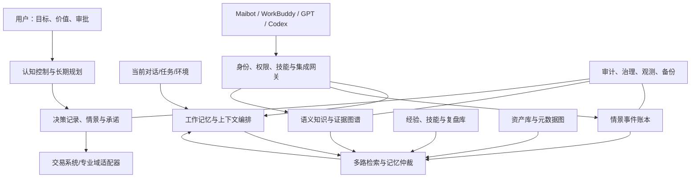
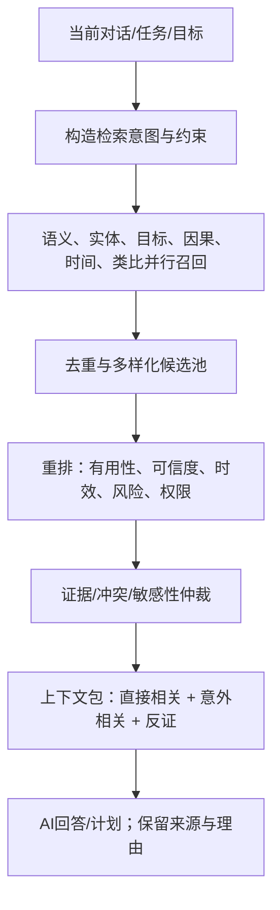

# 超级第二大脑：企业级认知操作系统蓝图 v3.0

> 基线日期：2026-07-17  
> 定位：**本地优先、证据优先、长期可演进、受控自我改进的认知操作系统**。  
> 关系：第二大脑是上位母系统；A 股量化系统是其中受严格规则、风险与审计约束的专业决策域。  
> 对接目标：现有本地雏形、Maibot、WorkBuddy、GPT、Codex，以及未来经审批的 MCP/技能/数据服务。  
> 重要边界：本系统模拟“记忆、认知控制和前瞻规划”的功能结构，不声称复制或等同人脑；它不替代用户授权，不直接持有生产密钥，也不允许自动修改生产代码、生产数据或下单。

---

## 0. 一页总纲

这不是“把聊天记录放进向量库”。它是一套把事实、经验、资产、目标、决策、计划、技能和反思放入同一可追溯系统，并让多种 AI 在不同权限下安全调用的**认知操作系统（Cognitive Operating System, COS）**。

系统的核心能力是：

1. 记住发生过什么、当时知道什么、后来结果如何；
2. 把重复经验蒸馏为可检验的知识与技能，而不把一次成功当规律；
3. 在当前对话表面不相关时，发现“目标、约束、因果、角色、时间窗口或失败模式”相似的旧记忆，并说明为什么它可能有用；
4. 用类似前额叶的控制机制维持长期目标、风险边界、优先级、备选路径和未来承诺；
5. 对接交易系统、创作资产库、日常工作和本地 AI，但把高风险确定性控制留给专业服务；
6. 支持恢复、回滚、审计、冲突保留、权限隔离和持续评估。

### 0.1 不可妥协的原则

- **事实、解释、决策、结果分开存。** 事实可被追溯；解释可被反驳；决策必须有当时上下文；结果不能改写过去。
- **先保留原始情景，再慢速蒸馏知识。** 不让摘要覆盖原对话、原文件、原数据或原资产。
- **检索必须带理由、来源、时间与置信度。** “相关”不是证据；记忆候选不等于事实。
- **意外相关记忆只能作为提示，不自动改变决定。** 它必须说明关联桥梁、风险和用户可见的出处。
- **反思只产生候选改进或维修请求。** 自动动作仅到 `Watch / Reflection / MaintenanceRequest`；不能直接修代码、部署或改生产数据。
- **交易域执行控制独立。** 第二大脑可提供证据、事件、假设、复盘和决策上下文，但不能绕过 `RuleSnapshot + DataQualityState + RiskDecision + 人工审批`。
- **本地雏形不被推翻重建。** 通过适配器和标准对象接入；原有 Markdown、文件夹、数据库、技能和资产保留原路径与历史。

---

## 1. 从高质量研究得到的设计结论

### 1.1 采用与不采用的边界

| 研究/标准 | 可采用的结论 | 不应直接推断的结论 | 蓝图落实 |
|---|---|---|---|
| 前额叶认知控制 | 目标和当前规则可作为“偏置信号”协调感知、记忆、行动和抑制 | 不代表软件可复制人类意识或价值判断 | 目标栈、约束引擎、注意力预算、行动门禁 |
| 互补学习系统（CLS） | 快速、稀疏的情景记忆与缓慢整合的语义知识应分层 | 情景自动变知识，或知识一定正确 | Episode Ledger + Knowledge Graph + 受审计蒸馏 |
| RAG | 显式、可替换的非参数记忆有助于知识更新与来源追溯 | 向量相似度就是相关性或事实真伪 | 多路召回、证据卡、生成前验证 |
| GraphRAG | 图关系和群落摘要适合全局问题与多跳关联 | 图谱自动构建结果就是可信事实 | 只把图用于候选与导航，关键关系需证据/审核 |
| 分层记忆/虚拟上下文 | 工作上下文与外部长期记忆分层，能缓解上下文窗口限制 | 让模型自由写长期记忆即可安全 | 受控记忆控制器、写入策略、审批和回放 |
| 反思型 Agent | 将任务反馈写入情景反思可改善下一轮任务 | 反思文本自动修复代码或直接改变策略 | Reflection → RepairTicket/ResearchTask → 人工/Codex 验收 |
| W3C PROV | 实体、活动、代理的来源链可互操作 | 来源存在就代表内容正确 | Provenance Graph + 可信度、冲突、时效字段 |

前额叶理论把认知控制描述为对目标与实现目标手段的主动维持，并向其他系统提供偏置信号；本蓝图将其转译为目标、约束、计划和注意力的显式控制面，而非“让模型自由思考”。[Miller & Cohen, 2001](https://doi.org/10.1146/annurev.neuro.24.1.167)

CLS 理论强调快速学习的、情景化系统与慢速整合的、抽取跨情景规律的系统互补；因此原始对话/事件和长期知识图谱必须有不同写入、版本和遗忘策略。[O’Reilly et al., 2014](https://onlinelibrary.wiley.com/doi/full/10.1111/j.1551-6709.2011.01214.x)

RAG 证明了可更新的外部非参数记忆对知识密集型任务有价值，但也指出来源追溯与知识更新是核心问题；本蓝图因此将检索证据和版本作为一等对象。[Lewis et al., 2020](https://arxiv.org/abs/2005.11401)

### 1.2 证据分级

| 等级 | 用途 | 当前纳入项 |
|---|---|---|
| A：规范/事实 | 定义互操作、权限和审计底座 | W3C PROV、交易所/监管规则、已验证本地接口文档 |
| B：原始研究/同行评审 | 形成架构机制与可检验假设 | PFC、CLS、RAG、长期记忆与回测研究 |
| C：工程研究/预印本/机构方案 | 作为候选实现和评估对象 | GraphRAG、MemGPT、Reflexion、MemOS 等 |
| D：经验/个人偏好 | 形成候选规则或个性化配置 | 用户复盘、工作习惯、创作经验 |

任何 B/C/D 级内容进入正式知识前，都要写清：来源、适用范围、样本/版本、反例、迁移假设、验证状态和失效条件。

---

## 2. 系统使命、边界与成功标准

### 2.1 系统使命

构建一个统一的、可本地运行、可持续学习、可自我验证、可回滚、可扩展的认知底座，使用户和授权 AI 能在长期项目中：

- 追踪长期目标、约束、承诺、风险预算与未完成任务；
- 检索跨时间、跨项目、跨媒介的相关经验与知识；
- 对复杂选择保留多个方案、理由、反证、后果与复盘；
- 把交易、创作、研究、日常工作、技术工程的资产与知识连接起来；
- 让不同 AI 在统一协议下读取、提出候选、执行受控计算和交接；
- 把有效经验渐进固化成技能，把失败经验转化为保护栏和改进任务。

### 2.2 非目标

- 不构造不可解释的“人格替身”或声称拥有意识；
- 不让自动摘要成为唯一记忆；
- 不把隐私、情绪或高风险个人信息默认共享给所有 Agent；
- 不因记忆相关性而跳过事实核验；
- 不让第二大脑成为交易、资金、部署或删除操作的旁路；
- 不因为“持续学习”而自动覆盖既有知识或资产。

### 2.3 成功标准

| 维度 | 成功定义 |
|---|---|
| 忠实性 | 任意结论可回到原始事件、文件、资产、数据快照与来源链 |
| 有用性 | 检索结果能说明关联桥梁，且在真实任务评估中提升决策/回答质量 |
| 长期性 | 历史会被归档、压缩、蒸馏和索引，但不会因摘要丢失可追溯性 |
| 安全性 | 权限、隐私、密钥、生产动作和高风险记忆有清晰隔离与审计 |
| 互操作 | Maibot、WorkBuddy、GPT、Codex 经适配器使用同一 Canonical Schema |
| 可演进 | 原有本地雏形可被映射；新存储、检索器、模型或技能可替换 |
| 决策质量 | 长期目标、约束、方案、反证、结果和复盘形成闭环；不只按结果倒推好坏 |

---

## 3. 总体架构：十二个认知域



| 域 | 职责 | 关键对象 | 不能做什么 |
|---|---|---|---|
| L0 宪章与治理 | 权限、风险级别、政策、审计、回滚、模块开关 | `Policy`, `Approval`, `AuditEvent` | 代替用户授权 |
| L1 认知控制 | 目标、价值、约束、注意力、长期规划、优先级 | `Goal`, `Constraint`, `Plan`, `Commitment` | 直接执行高风险动作 |
| L2 工作记忆 | 当前对话、任务态、短期上下文、临时草案 | `WorkingSet`, `ContextFrame` | 自动变为长期事实 |
| L3 情景记忆 | 原始对话、事件、决策时点、感知和结果 | `Episode`, `Event`, `ConversationTurn` | 被摘要覆盖 |
| L4 语义知识 | 原子主张、定义、概念、实体、关系、来源 | `Claim`, `Evidence`, `Entity` | 无证据升级为事实 |
| L5 程序经验 | 工作流、技能、失败模式、操作手册、评估 | `Skill`, `Procedure`, `Reflection` | 直接修改生产环境 |
| L6 未来记忆 | 长期布局、承诺、提醒、触发、情景、里程碑 | `Intent`, `Commitment`, `Trigger` | 绕过审批自动行动 |
| L7 检索仲裁 | 多路召回、重排序、多跳、意外相关提示、上下文预算 | `RetrievalPlan`, `MemoryCandidate` | 伪装相关性为因果 |
| L8 决策账本 | 方案、假设、权衡、风险、结果、复盘 | `DecisionRecord`, `Scenario`, `Outcome` | 用结果篡改当时理由 |
| L9 资产库 | 文档、代码、图像、视频、数据、模型、提示词和版本 | `Asset`, `AssetVersion`, `AssetRelation` | 失去版权/来源/版本信息 |
| L10 集成网关 | Maibot/WorkBuddy/GPT/Codex/交易系统适配 | `CapabilityCard`, `ToolInvocation` | 赋予 Agent 隐式权限 |
| L11 运维与评估 | 质量、漂移、备份、恢复、成本、基准评测 | `HealthReport`, `EvaluationRun` | 静默删除失败证据 |

---

## 4. 前额叶式决策控制：长期策略与行动抑制

### 4.1 功能翻译

“前额叶机制”在系统中不是一个模型名称，而是一个确定的决策控制回路：

```text
目标与价值 → 当前状态估计 → 约束/风险检查 → 生成方案
→ 多时间尺度情景推演 → 选择可逆且可验证的下一步
→ 执行授权/拒绝 → 观察结果 → 复盘并更新候选经验
```

它的意义是：短期情绪、热门信息、最近记忆或 Agent 的流畅表达，不能越过长期目标和硬约束。

### 4.2 目标栈与时间尺度

| 时间尺度 | 典型对象 | 决策问题 | 更新频率 |
|---|---|---|---|
| 愿景（年） | 第二大脑/交易系统/创作系统的方向 | 我们要建设什么能力、绝不牺牲什么 | 低频、人工审批 |
| 战略（季度） | 能力路线、预算、研究主题、风险边界 | 哪些项目优先、资源投向哪里 | 月度/季度 |
| 战役（月/周） | Phase、里程碑、实验族、资产建设 | 本周期证明什么、交付什么 | 周度 |
| 任务（日/会话） | 代码、研究、整理、复盘 | 下一步最有价值的动作是什么 | 实时 |

每个 `Goal` 有：目标描述、层级、成功指标、价值权重、不可违反约束、依赖、截止/复核、资源预算、所有者、状态和取消/降级条件。

### 4.3 决策对象与协议

```yaml
DecisionRecord:
  decision_id: dec_...
  as_of: timestamp
  goal_refs: [goal_id]
  context_snapshot: [episode_id, dataset_id, asset_id]
  facts: [claim_id]
  assumptions: [assumption_id]
  options:
    - option_id: A
      expected_benefits: []
      costs: []
      risks: []
      reversibility: high|medium|low
      evidence_refs: []
  constraints_checked: [constraint_id]
  chosen_option: A|NO_ACTION|DEFER
  rationale: string
  dissent_and_counterevidence: []
  uncertainty: {known_unknowns: [], deep_unknowns: []}
  review_trigger: []
  approval_state: draft|approved|rejected|superseded
  outcome_ref: outcome_id|null
```

`NO_ACTION` 和 `DEFER` 是合法结果。高风险决策必须附带：反向情景、最坏可接受损失、撤销路径、复核人和停止条件。

### 4.4 战略规划器

规划器以目标图和依赖图生成可更新计划，不承诺“唯一最优路线”。它必须：

1. 把行动分为可逆试验、可逆交付和不可逆变更；
2. 优先选择信息价值高、风险低、能解除关键未知的下一步；
3. 给出主路径与至少一条替代路径；
4. 用里程碑、预算、时间和验收标准约束计划；
5. 在新证据冲突、环境变化或结果不达标时重规划；
6. 将未实施的建议存为 `Proposal`，不伪装为已完成。

### 4.5 前瞻/未来记忆

未来记忆不是简单提醒，而是“在满足特定状态时，把过去承诺、风险或机会重新带回注意力”。

```yaml
Commitment:
  commitment_id: com_...
  owner: user|system
  statement: 在L2字段审计完成前不将订单流结论用于交易
  trigger: capability.market_l2.status == verified
  due_window: date_range|null
  priority: high
  linked_goals: [goal_id]
  required_approval: user
  state: active|snoozed|fulfilled|cancelled|expired
```

触发来源包括时间、事件、数据状态、项目里程碑、风险阈值和对话意图；触发后只创建提醒或审议项，不能直接执行敏感动作。

---

## 5. 记忆体系：六类记忆、四个温度层

### 5.1 六类记忆

| 记忆类型 | 内容 | 写入条件 | 读取方式 |
|---|---|---|---|
| 工作记忆 | 当前会话目标、约束、草稿、临时检索包 | 会话/任务创建 | 直接上下文 |
| 情景记忆 | 对话轮次、会议、事件、观察、当时决策和结果 | 原始记录/事件流 | 时间、实体、因果、相似情景 |
| 语义记忆 | 定义、事实主张、概念、领域知识和关系 | 有来源/证据或候选状态 | 图谱、全文、向量、版本 |
| 程序记忆 | 技能、流程、操作模式、代码/测试、失败保护栏 | 可复现步骤与验证 | 任务/能力/失败模式匹配 |
| 偏好与关系记忆 | 用户偏好、沟通约束、授权边界、协作模式 | 明示或长期一致行为；可撤回 | 最小必要读取 |
| 未来/前瞻记忆 | 目标、承诺、待办、事件雷达、计划与触发器 | 人工/受控计划生成 | 触发器和目标图 |

### 5.2 四个温度层

| 温度 | 位置 | 目标 | 写入/淘汰策略 |
|---|---|---|---|
| 热 | 当前 ContextFrame | 当前问题的直接推理 | 有 Token 预算，结束时归档候选 |
| 温 | 最近任务/活跃目标/未完成承诺 | 保持连续性与主动提醒 | 活动衰减、重要度提升 |
| 冷 | 事件账本、资产、知识、历史实验 | 长期可追溯 | 不可变/版本化，索引可重建 |
| 冻 | 过期、敏感、已废弃、低访问对象 | 保留证据/合规，默认不召回 | 仅显式或受权限检索 |

### 5.3 记忆写入政策

每条新信息先进入 `IntakeItem`，经过分类后才写入对应层：

```text
采集 → 脱敏/安全扫描 → 去重/实体链接 → 类型判定
→ 证据与权限标记 → 原始事件落账 → 候选摘要/主张/关系
→ 质量检查 → 索引 → 可检索状态
```

自动生成的摘要、偏好、情绪判断、因果关系、人物关系和“经验教训”默认 `candidate`。只有原始事件和文件元数据可直接记录为“已观测”。

### 5.4 遗忘、压缩和保护

遗忘不等于删除：

- **激活衰减**：降低默认召回，不删除原件；
- **压缩**：将多轮会话蒸馏为摘要、主张、决策与开放问题，并保留原始引用；
- **合并**：只合并语义重复且证据兼容的候选；冲突必须并存；
- **冻结**：过期/被拒绝/敏感知识不参与普通召回；
- **真实删除**：仅按用户隐私请求、许可/保留政策和明确范围执行，保留最小审计记录而非内容本体。

---

## 6. 检索与“意外有帮助”的关联机制

### 6.1 检索不是单一相似度

用户所要的“当前对话看似不相关、旧记忆却意外有帮助”，本质不是放大向量 Top-K，而是寻找**隐藏的决策同构关系**。系统同时运行六条召回通道：

| 通道 | 发现什么 | 示例 |
|---|---|---|
| 语义通道 | 文本意思相近 | 同一技术/公司/概念 |
| 实体图谱 | 人、项目、资产、事件的关系 | 某项资产与旧项目同属一角色/主题 |
| 目标/约束通道 | 同类目标、风险、资源或审批约束 | 当前要接接口，旧任务也受“未知字段不可假造”约束 |
| 因果/决策模式 | 相同的失败机制、权衡结构、反事实 | “先上复杂模型后补数据”曾失败，当前系统也有此风险 |
| 时间/未来通道 | 未完成承诺、季节性、历史节点 | 曾约定在数据到位后才开启某研究 |
| 类比/结构通道 | 跨领域但结构相似的经验 | 电影资产连续性治理 → 交易数据/模型版本连续性 |

### 6.2 召回—重排—仲裁流程



候选分数不是纯向量相似度：

\[
Score(m,q)=w_s S+w_g G+w_c C+w_t T+w_v V+w_n N-w_r R-w_p P
\]

其中 `S`=语义匹配，`G`=目标/约束匹配，`C`=因果或决策结构匹配，`T`=时间/开放承诺匹配，`V`=来源与验证质量，`N`=新颖信息价值，`R`=过期/冲突风险，`P`=隐私或权限惩罚。所有权重需通过本地任务集校准，而不是手工永久固定。

### 6.3 两条输出车道

| 车道 | 条件 | 向用户展示方式 |
|---|---|---|
| 直接相关记忆 | 高相关、高可信、符合权限 | 作为回答/决策的证据，附来源与时间 |
| 意外相关记忆 | 结构关联强但主题距离远，且可解释 | 单独标记“可能有帮助的旧经验”，说明关联桥梁与是否只是候选 |

“意外相关”默认最多 1–2 条，必须包含：`why_now`、来源、日期、状态、适用限制、是否与当前事实冲突。它不能暗中写入工作记忆，更不能改变交易/生产决策。

### 6.4 检索质量门禁

- 先检查权限与敏感分级，再做向量或图谱召回；
- 对事实型回答，要求至少一个证据节点而不是只有摘要；
- 对高风险回答，强制给出反证、冲突和“不知道”；
- 对过期知识，显示 `valid_to / last_verified_at`；
- 对关系推断，标明“关联/候选因果/已证实因果”；
- 记录检索计划、候选、被过滤原因、最终上下文和回答引用，支持回放。

---

## 7. 知识与证据图谱

### 7.1 最小本体

```text
Document/Asset --ASSERTS--> Claim --ABOUT--> Entity/Event/Concept
Evidence --SUPPORTS|REFUTES--> Claim
Claim --VALID_DURING--> TimeRange
Episode --OBSERVED--> Event
Decision --USES--> Claim/Skill/Dataset
Decision --RESULTED_IN--> Outcome
Outcome --VALIDATES|REFUTES--> Hypothesis/Procedure
Goal --CONSTRAINS--> Decision/Plan
Asset --DERIVED_FROM|VARIANT_OF--> Asset
Skill --REQUIRES--> Capability/Policy
AgentInvocation --USED--> Tool/Memory/Asset
```

来源模型参考实体—活动—代理的可追溯关系；PROV-O 是稳定的 W3C Recommendation，可作为互操作来源层，但本项目还需叠加可信度、权限、时效、冲突和审计字段。[W3C PROV-O](https://www.w3.org/TR/prov-o/)

### 7.2 主张而不是“大段知识”

```yaml
Claim:
  claim_id: clm_...
  statement: string
  claim_type: observed_fact|definition|hypothesis|preference|procedure|inference
  status: candidate|under_review|validated|rejected|deprecated
  scope: {domain: [], entities: [], market_or_project: []}
  valid_from: timestamp|null
  valid_to: timestamp|null
  source_refs: [asset_or_episode_id]
  evidence_refs: [evidence_id]
  counterevidence_refs: []
  confidence: low|medium|high|calibrated_probability
  extraction_method: human|deterministic|ai_assisted
  reviewer: agent_or_human|null
  last_verified_at: timestamp
```

冲突不是错误：同一主题可同时保存多条相反主张；系统用时间、范围、来源和验证等级区分，而不是静默覆盖。

### 7.3 知识入库工作流

1. 原件存入资产库，取得内容哈希、版权/许可和来源；
2. 抽取候选实体、事件、术语和主张；
3. 链接原文位置、版本和时间；
4. 用反证搜索、重复检测、适用范围和本地验证评估；
5. 候选状态进入图谱和检索，但在回答中明确状态；
6. 通过审核/复现实验后才能升级 `validated`；
7. 规则、数据接口或环境变化时触发 `deprecated/review`。

### 7.4 专业知识与经验的区别

| 内容 | 正确归属 | 例子 |
|---|---|---|
| 外部来源可验证的通用结论 | 语义知识 + 证据 | A 股规则、论文机制、官方定义 |
| 用户的稳定偏好或授权方式 | 偏好/政策记忆 | 未经批准不下单；交易优先于其他主线 |
| 一次项目复盘 | 情景 + 候选经验 | 某接口曾误把快照当逐笔 |
| 可复现且跨样本有效的流程 | 程序记忆/技能 | 数据 PIT 审计、回测审计流程 |
| 未确认的推测 | 假设 | 某事件可能影响一项策略 |

---

## 8. 经验、反思、自我迭代与维修系统

### 8.1 闭环

```text
任务/决策 → 执行与结果 → 证据化复盘 → 失败/成功模式候选
→ 交叉样本验证 → 更新技能/政策候选 → 审批发布 → 持续监控
```

结果好不等于过程好，结果差也不一定表示决策错误。复盘至少分开：信息质量、推理质量、执行质量、外部随机性、风险是否被遵守。

### 8.2 反思记录

```yaml
Reflection:
  reflection_id: ref_...
  target: task|decision|skill|incident
  observed_outcome: []
  expected_outcome: []
  gap: []
  candidate_causes: []
  evidence_refs: []
  transferable_lesson: string
  counterexamples: []
  proposed_action: watch|research_task|repair_ticket|policy_change_candidate
  approval_required: true
```

Reflexion 的“用任务反馈形成情景反思、帮助下一轮决策”可作为候选机制，但它的基准结果不等于本地生产可靠性；在这里它只生成候选经验和工单。[Reflexion](https://arxiv.org/abs/2303.11366)

### 8.3 维修模式

系统检测到失败、冲突、漂移、检索污染或接口变化时，只产生：

`MaintenanceRequest → RepairTicket → 人工确认 → Codex/WorkBuddy 实施 → 测试 → 审批合入 → 观察 → 复盘`。

RepairTicket 必含问题、证据、影响、复现步骤、推荐修复、禁止事项、测试要求、回滚方案、是否需 Codex、是否需用户批准。任何“自动维修”不得直接改代码或生产部署。

### 8.4 经验升级门槛

- 单次经验：`candidate`；
- 多次同结构情景、存在反例分析：`under_review`；
- 预设样本/任务验证通过、可复现、适用范围明确：`validated procedure`；
- 环境改变或新反证出现：`deprecated/rejected`。

---

## 9. 资产库：所有数字资产成为可检索、可连续的对象

### 9.1 资产范围

包括 Markdown、Word/PDF、代码、数据库快照、表格、图像、视频、音频、提示词、模型、实验、数据集、日志、场景/角色视觉资产、交易报告和外部来源副本。

### 9.2 `Asset` 契约

```yaml
Asset:
  asset_id: ast_...
  type: document|image|video|audio|code|dataset|model|prompt|report|log
  title: string
  original_uri: string
  content_hash: sha256
  created_at: timestamp|null
  ingested_at: timestamp
  version: semver_or_content_hash
  parent_asset_id: ast_|null
  rights_and_license: string
  sensitivity: public|project|private|restricted
  retention_policy: string
  metadata: {}
  extracted_text_ref: uri|null
  preview_ref: uri|null
  entity_refs: []
  decision_refs: []
  provenance: []
  status: active|archived|superseded|deleted
```

### 9.3 连续性与派生关系

资产关系包含 `DERIVED_FROM`、`VARIANT_OF`、`APPLIES_TO`、`DEPICTS`、`USED_IN`、`SUPERSEDES`、`CONFLICTS_WITH`。这让同一个角色图、场景图、交易数据快照、策略版本或报告可被反向追到来源与使用位置。

### 9.4 资产入库管线

文件落地 → 哈希/去重 → OCR/转录/结构抽取 → 元数据与权限 → 预览/缩略图 → 实体/项目链接 → 语义/多模态索引 → 人工可校正标签 → 版本和保留策略。

原文件永远是事实层；AI 标签、摘要、视觉描述和关联均是可重建派生层。

---

## 10. 与 A 股交易系统的联动

### 10.1 双向关系

第二大脑为交易系统提供：

- 规则、公告、行业、公司、论文与经验的带来源检索；
- `EvidenceClaim`、`Hypothesis`、事件时间线、情景和历史复盘；
- 决策理由、反证、未知项、研究任务和工单；
- 技能注册表、数据/模型/策略的知识图谱；
- 结果回写的候选经验与失效模式。

交易系统为第二大脑提供：

- 不可变数据快照、规则版本、实验、决策包、订单（仅元数据/权限许可）、成交和结果；
- 数据质量、模型校准、策略状态、风险拒绝和事故事件；
- 本地验证结果，决定哪些候选知识能升级。

### 10.2 硬隔离

```text
第二大脑/AI → ResearchProposal / OrderIntentDraft
                         │
                         ▼
交易确定性服务：RuleSnapshot → DataQualityState → RiskDecision → HumanApproval
                         │
                         ▼
                     OMS / Broker
```

第二大脑永不拥有实盘密钥、风险豁免权或订单路由权。对“主力意图”的记忆只能保存为竞争机制、证据、反证和概率状态，不能变成账户身份断言。

### 10.3 交易专属记忆对象

`DatasetSnapshot`、`RuleSnapshot`、`FeatureSet`、`Experiment`、`ModelCard`、`StrategyManifest`、`IntentBelief`、`DecisionPacket`、`RiskDecision`、`ExecutionReport`、`OutcomeAttribution`。所有对象均含 `as_of` 与版本，防止今天的知识改写过去的研究。

---

## 11. Maibot、WorkBuddy、GPT、Codex 集成架构

### 11.1 固定角色

| 平台 | 在第二大脑中的主责 | 读写权限默认 | 绝对边界 |
|---|---|---|---|
| Maibot | 日常陪伴、长期对话、情感与生活记忆的受控接入 | 最小必要读；候选写入 | 不将敏感/情绪推测当事实或共享给交易域 |
| WorkBuddy | Windows 本地常驻、真实接口、任务编排、脚本、监控和结果打包 | 受控工具读写 | 不绕过审批、风险服务或生产密钥隔离 |
| GPT/ChatGPT | 研究、总设计、检索解释、任务调度、审核验收 | 读取受限上下文；提交候选 | 不直接改本地生产状态/下单 |
| Codex | 代码、Schema、测试、回放、适配器与修复实现 | 任务范围内工作树写入 | 不扩大权限、不虚构接口/测试、不直接上线 |

### 11.2 统一网关与 Adapter

所有平台不直接读写不同存储，而经 `Cognitive Gateway`：

```text
身份认证 → 能力发现 → 政策/同意/敏感性检查 → 版本化工具调用
→ Schema 验证 → 审计事件 → 结果/来源/限制返回
```

适配器只做协议翻译，不承载业务真相。每个 Adapter 有 `CapabilityCard`：字段、权限、版本、证据、限制、支持环境、健康状态和回滚版本。未知接口保持 `unverified`。

### 11.3 MCP Resources 与 Tools

只读资源优先：

```text
brain://episodes/{id}?as_of=
brain://claims/{id}?as_of=
brain://goals/active
brain://decisions/{id}
brain://assets/{id}/metadata
brain://search?q=&scope=&as_of=
```

受控工具：`search_memory`、`get_evidence`、`build_context_pack`、`propose_claim`、`propose_reflection`、`create_research_task`、`request_asset_ingest`、`request_human_review`。写入工具都要求 `expected_version`、`idempotency_key`、`trace_id` 与审批策略。默认不提供生产修改或交易工具。

### 11.4 统一交接包

```yaml
CognitiveHandoff:
  project_id: string
  current_goals: []
  active_plans: []
  completed_capabilities: []
  open_unknowns: []
  recent_decisions: []
  evidence_and_conflicts: []
  active_assets: []
  agent_tasks: []
  health_and_incidents: []
  permissions_and_forbidden_actions: []
  next_best_actions: []
```

### 11.5 Codex 协作任务头

跨模块、接口未知、涉及本地雏形盘点时必须写：

`【Codex模式：项目计划模式】选择原因：本任务涉及多个记忆/知识/资产/集成模块，且本地文件、接口、权限和现有实现需要先核验，必须基于真实仓库形成可更新计划。`

目标与验收明确、需要多轮调试或验证时写：

`【Codex模式：目标模式】选择原因：目标和验收标准已固定，但实现路径依赖真实运行、测试、索引和数据结果，需要持续验证。`

---

## 12. 本地优先部署与兼容迁移

### 12.1 三档形态

| 档位 | 参考组件 | 适用 |
|---|---|---|
| A：单机雏形兼容 | 本地 Markdown/文件夹、SQLite/PostgreSQL、Parquet、全文索引、向量索引、对象目录、Docker Compose | 当前整理、检索、资产入库和离线任务 |
| B：本地工作站 | PostgreSQL 事务/元数据、对象存储、图数据库或图层、向量/全文混合检索、任务队列、可观测性 | 多 Agent、本地服务、资产/交易知识同步 |
| C：企业私有集群 | 高可用数据库、事件总线、对象存储副本、搜索集群、密钥服务、身份/审计、灾备 | 多用户、多项目、长期运行和敏感数据分域 |

技术产品可替换；稳定的是 Canonical Schema、事件日志、资产哈希、版本/来源/权限语义和 Adapter 契约。

### 12.2 不破坏雏形的迁移策略

1. 先只读扫描现有目录、文档、技能、公告栏和元数据；
2. 建立 `LegacyAdapter`，记录原路径、哈希、解析状态、映射对象和错误；
3. 原始文件不移动、不覆盖；把抽取文本、嵌入、图关系存为派生对象；
4. 先迁移最有价值的系统总纲、交易规则/数据契约、公告栏、项目计划、技能和资产索引；
5. 用抽样回链测试确认“检索结果能回到原文件”；
6. 通过验收后才增量开启候选写入；正式知识仍需审批。

### 12.3 建议目录

```text
second-brain/
  AGENTS.md
  SYSTEM_CHARTER.md
  PROJECT_PARAMETERS.yaml
  UNKNOWN_REGISTRY.yaml
  ANNOUNCEMENT_BOARD.md
  AI_HANDOFF.yaml
  contracts/
    memory/ knowledge/ decisions/ assets/ integration/ governance/
  ledger/
    episodes/ decisions/ audit/ provenance/
  knowledge/
    claims/ evidence/ entities/ concepts/ procedures/
  memory/
    working/ recall/ prospective/ preferences/
  assets/
    originals/ derivatives/ manifests/
  skills/
  adapters/
    legacy/ maibot/ workbuddy/ codex/ trading/
  services/
    cognitive-gateway/ memory-controller/ retrieval/ planner/
    knowledge-graph/ asset-catalog/ evaluation/ policy/
  pipelines/
    ingest/ distill/ index/ evaluate/ backup/
  docs/
    adr/ runbooks/ source-register/ evaluations/
  tests/
    contracts/ retrieval/ provenance/ privacy/ recovery/
```

---

## 13. 安全、隐私、治理与运维

### 13.1 数据分级与访问

`public / project / private / restricted` 四级；每个对象、关系、索引片段和导出包继承最严格的有效权限。检索在召回前过滤；不能先召回敏感内容再靠模型“不要提”。

### 13.2 关键政策

- 外部文本、网页、附件均为不可信数据，不能作为系统指令；
- 生产密钥、账户、私人敏感信息不进入向量库、日志或 Prompt；
- 资产导出、跨平台同步、候选知识升级和高风险任务需要策略/人审；
- 每次 Agent 调用保留身份、目的、输入范围、工具、结果哈希和审计引用；
- 支持更正、撤回、过期、冻结与按范围删除；
- 原始审计记录追加式保存，派生索引可重建。

### 13.3 SLO 与灾备

| 域 | 关键指标 | 恢复原则 |
|---|---|---|
| 事件/来源账本 | 追加成功率、哈希验证、RPO | 优先保护原始事实与审计 |
| 检索服务 | 延迟、召回覆盖、引用覆盖、敏感泄露率 | 降级为全文/只读，不阻塞原件访问 |
| 图谱/索引 | 构建成功率、漂移、孤儿关系 | 可由原始层重建 |
| 规划/Agent | 任务失败率、越权拒绝、工单闭环 | 故障降为只读建议 |
| 交易适配 | 快照时效、规则版本、风控阻断 | 交易系统独立恢复；第二大脑不在关键路径 |

---

## 14. 评估：证明第二大脑真的帮助而不是“显得聪明”

### 14.1 记忆检索基准集

建立本地、可更新的 `MemoryEvalSet`，至少覆盖：

1. 明确问答：能否找回准确历史事实；
2. 时间问答：能否按当时状态而非今日知识回答；
3. 多跳检索：能否跨文档、资产、决策和实体连接；
4. 意外相关：能否从旧经验中找到结构相似、并解释其桥梁；
5. 冲突/过期：能否呈现冲突而不选一个编造答案；
6. 权限/隐私：能否拒绝或脱敏；
7. 交易域：能否保留证据链、规则版本与 `NO_TRADE` 边界；
8. 资产连续性：能否找回正确版本、关联和用途。

### 14.2 指标

| 模块 | 指标 |
|---|---|
| 检索 | Recall@K、Precision@K、nDCG、时间正确率、多跳成功率、意外相关的人工有用性评分 |
| 生成 | 引用覆盖率、可追溯率、事实支持率、冲突披露率、未证实断言率 |
| 记忆 | 重复率、错误合并率、候选升级准确率、过期/废弃识别率 |
| 决策 | 目标对齐、约束违反率、反证覆盖、校准、后验复盘质量、可撤销性 |
| 资产 | 哈希完整性、版本可追溯率、元数据覆盖率、检索成功率 |
| 安全 | 越权拒绝率、敏感召回泄露率、审计完整率、恢复演练通过率 |

GraphRAG 对“全库主题/全局理解”类问题有研究价值，可作为 B 阶段候选；但需与普通混合 RAG 在自己的文档集、成本和延迟约束下对照评测，而不能预设胜出。[GraphRAG](https://graphrag.com/appendices/research/2404.16130/)

---

## 15. 分阶段落地路线

### Phase 0：事实盘点与系统宪章

交付：现有雏形清单、路径/哈希、能力矩阵、Unknown Registry、数据分级、风险政策、系统宪章、ADR、互操作 Schema 草案。  
退出：知道什么已存在、什么只是设想、谁可读/写/批准、哪些模块仅 Mock；所有生产行动关闭。

### Phase 1：不可变情景账本与资产目录

交付：Episode/Event/Audit/Asset 的 Canonical Schema，原件哈希，LegacyAdapter，只读搜索，公告栏和交接包。  
退出：任意检索结果可回到原文件/事件；原始资料未被迁移破坏。

### Phase 2：知识图谱与证据蒸馏

交付：Claim/Evidence/Entity 图谱、候选状态机、冲突处理、来源登记、全文+向量+实体检索。  
退出：事实、假设、偏好、经验和程序可区分；候选不会自动升级。

### Phase 3：上下文编排与意外相关检索

交付：多路召回、重排序、ContextPack、`why_now`、时间/权限过滤、MemoryEvalSet v1。  
退出：相对基础 RAG 在本地评估中提升有用性，同时不增加敏感泄露和无依据关联。

### Phase 4：决策控制与长期规划

交付：目标图、约束策略、决策账本、情景树、承诺/触发器、研究任务和复盘对象。  
退出：复杂项目能完整保存“为什么、依据、反证、何时复查、结果如何”。

### Phase 5：技能、反思与维修闭环

交付：Skill Registry、Reflection、MaintenanceRequest、RepairTicket、评估与候选升级流程。  
退出：反思能稳定形成可审计工单和候选经验，不发生未经批准的自修改。

### Phase 6：平台适配与专业域联动

交付：Maibot/WorkBuddy/GPT/Codex Adapter、MCP 只读资源、受控工具、交易系统双向知识联动。  
退出：不同 Agent 的调用都有能力卡、权限、来源和审计；交易执行边界未被破坏。

### Phase 7：高可用与持续评估

交付：备份/恢复、索引重建、可观测性、基准集回归、成本控制、访问审计和灾备演练。  
退出：系统可以长期运行、可恢复、可解释、可回滚。

---

## 16. 当前四层映射与 Unknown Registry 起点

| 层级 | 当前已知/未知 | 处理 |
|---|---|---|
| 明示已知 | 第二大脑是母系统；交易系统优先完成；原始数据/审计不可被 AI 覆盖；未经批准不下单 | 写入系统宪章和硬策略 |
| 隐性已知 | 本地已有第二大脑雏形、公告栏、最小交易闭环、WorkBuddy/Codex 协作协议、已有技能 | Phase 0 只读盘点，生成能力卡与版本事实 |
| 可理解未知 | 当前存储格式、索引、Maibot API、WorkBuddy 真实技能/权限、资产总量、硬件和备份 | 建立 Capability Matrix 与验证任务，不私自假设 |
| 深层未知 | 哪种检索组合对你的真实任务最有价值、长期记忆何时应遗忘、模型如何影响长期决策、不同 AI 的稳定性 | 用基准集、影子运行、审计和分阶段实验处理 |

---

## 17. 首个 30 天工作包

| 周次 | 目标 | 可验收交付 |
|---|---|---|
| 第 1 周 | 宪章与盘点 | 系统宪章、路径/资产/技能/接口清单、Unknown Registry、权限矩阵 |
| 第 2 周 | 原始事实与资产 | Episode/Asset/Audit Schema、LegacyAdapter、哈希目录、只读检索原型 |
| 第 3 周 | 知识与上下文 | Claim/Evidence Schema、候选状态机、混合检索、ContextPack v0、评估样本 |
| 第 4 周 | 决策与协作 | Goal/Decision/Commitment Schema、公告栏联动、AIHandoff、WorkBuddy/Codex 任务包模板 |

首月明确不做：自动改代码、自动部署、自动知识定版、自动交易、把所有历史文本粗暴塞进单一向量库、未经字段审计连接实时高风险接口。

---

## 18. 验收总清单

- [ ] 本地雏形原文件和路径没有被覆盖；每个迁移对象都可回链。
- [ ] 事实、主张、假设、偏好、决策、结果、技能和资产使用独立对象与状态。
- [ ] 工作/情景/语义/程序/未来记忆有不同写入、读取和归档策略。
- [ ] 检索结果带来源、时间、状态、权限与 `why_now`；意外相关记忆单独呈现。
- [ ] 冲突、过期和不确定性可见；系统允许“不知道”。
- [ ] 长期目标、约束、备选方案、承诺、复核触发和复盘形成闭环。
- [ ] 资产有哈希、版本、版权/敏感度、派生关系与使用链接。
- [ ] Maibot、WorkBuddy、GPT、Codex 通过网关和能力卡接入，不直接共享无限权限。
- [ ] 交易系统仍由规则、数据质量、风险、OMS 与人工审批控制执行。
- [ ] 反思仅产生候选知识/工单；测试、审批与回滚后才可改变系统。
- [ ] MemoryEvalSet 和回归评估可证明检索与决策帮助大于噪声/风险。

---

## 附录：核心来源

- [Miller & Cohen：前额叶认知控制理论](https://doi.org/10.1146/annurev.neuro.24.1.167) — B，功能架构启发。
- [Complementary Learning Systems](https://onlinelibrary.wiley.com/doi/full/10.1111/j.1551-6709.2011.01214.x) — B，情景与语义记忆分层。
- [Retrieval-Augmented Generation](https://arxiv.org/abs/2005.11401) — B，外部显式记忆、可更新与来源需求。
- [GraphRAG](https://doi.org/10.48550/arXiv.2404.16130) — C，全局理解候选实现，需本地评估。
- [MemGPT](https://arxiv.org/abs/2310.08560) — C，分层/虚拟上下文候选实现，需限制自主写入。
- [Reflexion](https://arxiv.org/abs/2303.11366) — C，任务反馈/反思候选机制，不可直接自动修复。
- [W3C PROV-O](https://www.w3.org/TR/prov-o/) — A，来源互操作基础。
- [A 股量化协作编排技能](https://chatgpt.com/skills?skill_id=6a59c679363c81918ed94b1b1b584598) — 项目内部协作和权限边界。
