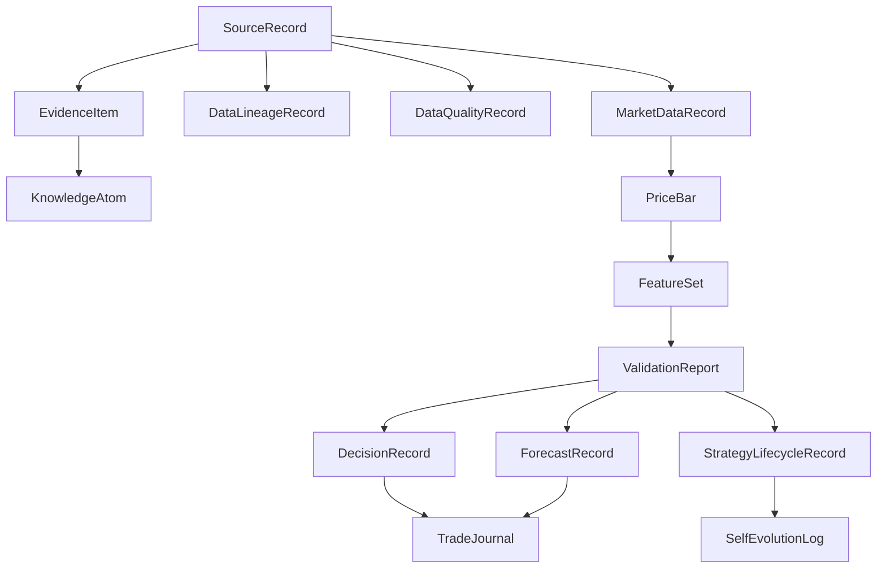

# FOUNDATION-DATA-GOVERNANCE-0001 v2

## Scope

This document records the first formal foundation slice for the A-share mother system:

- unified object-model bindings
- raw/normalized/features/signals/reports/runtime_logs boundaries
- market-data adapter contracts
- capability negotiation and downgrade rules
- data-quality governance

This foundation is additive. It reuses the current runtime spine in:

- `F:/aidanao/brain_core`
- `F:/aidanao/bulletin`
- `F:/aidanao/data`

It does not create a parallel mother system and does not migrate the active runtime into `memory/`.

## Object Model

## Binding Rules

- Existing mother-system runtime contracts remain primary where they already exist.
- New governance-layer schemas are introduced in `F:/aidanao/brain_core/foundation_data_governance.py`.
- Supplier field names remain inside lineage metadata and adapter mappings; they are not promoted into strategy-facing contracts.
- Any schema that exists only as a contract surface is marked `Interface`, `Mock`, `Experimental`, or `Not Implemented Yet`.

## Data Layers

| Layer | Current target | Purpose | Immutable | Git | Notes |
|---|---|---|---|---|---|
| `raw` | `F:/aidanao/data/raw` | Vendor-native payloads and snapshots | Yes | No | Append-only, rebuild source for normalized |
| `normalized` | `F:/aidanao/data/super_brain_v01.sqlite` | Supplier-agnostic objects with lineage | No | No | `SourceRecord`, `MarketDataRecord`, `PriceBar` |
| `features` | `F:/aidanao/data/super_brain_v01.sqlite` | Derived feature rows | No | No | Must preserve feature version and input lineage |
| `signals` | `F:/aidanao/data/super_brain_v01.sqlite` | Decisions, forecasts, validation | No | No | Probabilities and evidence, not absolute calls |
| `reports` | `F:/aidanao/bulletin`, `F:/aidanao/docs`, `F:/aidanao/reports` | Human-readable summaries | No | Yes | Never the sole fact source |
| `runtime_logs` | `F:/aidanao/data/audit/events.jsonl`, `F:/aidanao/logs` | Operations and audit | Yes | No | Separate from research facts |

## Adapter Catalog

### Implemented in this phase

- `HistoricalTradeReplayAdapter`
  - normalizes local CSV/JSON bars into `SourceRecord`, `MarketDataRecord`, `PriceBar`
  - preserves raw-path lineage and quality flags
  - point-in-time semantics are bar-close only

- `TdxMcpSnapshotAdapter`
  - defines the normalized contract for TDX snapshot wiring
  - no real external call in this phase
  - must not treat payload samples as live-readiness proof

- `MockMboAdapter`
  - contract test only
  - cannot justify true cancel-rate, modify-rate, or order persistence

- `MockAuctionAdapter`
  - supports final auction-result semantics only
  - no auction order sequence in this phase

### Interface templates only

- `TdxQuantAdapter`
- `WeStockAdapter`
- `TushareAdapter`

These remain interface/template surfaces until WorkBuddy provides real field packs and point-in-time semantics.

## Capability Negotiation

The foundation layer treats unsupported capabilities as downgrade or block conditions.

Examples:

- no `market_by_order` -> do not compute true cancel-rate
- no `trade_by_trade` original side -> mark direction as `inferred`
- no `auction_order_event` -> restrict analysis to `09:25` final result
- no `sequence_no` or blocking quality flag -> output `no_signal`

## Quality Governance

Current normalized quality flags include:

- `missing_sequence`
- `duplicate`
- `out_of_order`
- `timestamp_regression`
- `field_semantics_unverified`
- `source_disagreement`
- `point_in_time_violation`
- `inferred_not_original`

If a quality issue is marked `blocking=true`, the foundation layer must block or degrade the signal instead of silently continuing.

## A-share Constraints Preserved

- Market assumptions remain A-share first
- T+1 semantics remain active
- OHLCV proxies are not promoted into true DDX/DDY
- live trading remains disabled

## WorkBuddy Follow-up Package

WorkBuddy should later provide:

1. TDX MCP real function names and raw payload samples
2. TdxQuant field catalog and permission notes
3. Historical tick / order schemas and samples
4. WeStock / Tushare point-in-time semantics
5. Connector gap, latency, and recovery reports

## Migration

- Keep current runtime storage in place
- Promote these contracts into broader runtime only after real field packs arrive
- Move strategy thresholds into the later Replay + Validation task

## Rollback

- Remove the new foundation module and docs
- Remove the foundation-specific writeback rows if approved
- Preserve existing sqlite and audit logs as the canonical runtime record
