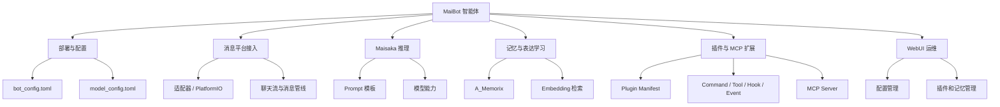

# MaiBot 第二大脑知识地图

## 入口
- 官方文档站：[https://docs.mai-mai.org](https://docs.mai-mai.org)
- 官方 LLM 索引：[https://docs.mai-mai.org/llms.txt](https://docs.mai-mai.org/llms.txt)
- 官方 LLM 全量快照：[https://docs.mai-mai.org/llms-full.txt](https://docs.mai-mai.org/llms-full.txt)
- 本地快照：`F:\aidanao\maibot\sources\maibot-docs-llms-full-2026-06-22.md`

## 核心知识簇
- 产品与部署：MB-0001, MB-0002, MB-0003, MB-0004, MB-0005
- 平台接入与消息：MB-0006, MB-0007
- 推理、记忆和表达：MB-0008, MB-0009, MB-0010, MB-0011, MB-0016
- 插件和扩展：MB-0012, MB-0013, MB-0014
- 内部架构：MB-0015
- 排错与协作：MB-0017, MB-0018

## Mermaid 总览

## 使用方式
1. 先查 [atomic-index.md](../indexes/atomic-index.md) 找概念原子。
2. 需要核对原文时查 [source-catalog.md](../indexes/source-catalog.md)。
3. 做代码修改前，把相关概念原子、来源页和项目根目录 `AGENTS.md` 约束一起读。
