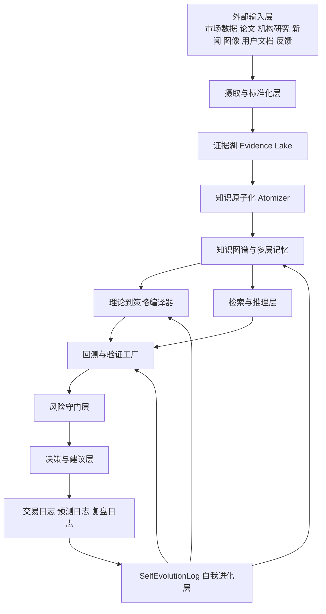
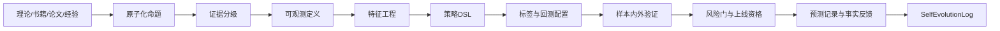

# 面向 Codex 的超级第二大脑交易知识操作系统最终提示词与系统蓝图

## Executive Summary

你要的不是一个“会聊天的量化助手”，而是一套**统一的认知操作系统**：把全球高质量交易知识、市场微观结构、机构研究、经典书籍、策略验证、风险管理、复盘、自我修正、个人偏好、视觉理解与情绪监控，全部收束到同一个可运行、可审计、可迭代的工程框架里。这个框架的核心不是“多堆几个模型”，而是建立一条闭环：**资料摄取 → 证据化 → 原子化 → 图谱化 → 理论编译 → 回测验证 → 风险守门 → 预测记录 → 事实反馈 → 自我进化**。这与您此前上传蓝图中强调的“统一超级第二大脑、长期学习、自我否定、自我升级、交易闭环、情绪辅助、知识宫殿”方向高度一致；本报告是在其基础上做工程化收束与研究增强。fileciteturn0file4 citeturn11academia1turn11academia2turn35academia0turn26academia0turn26academia1

从工程方法上，面向 Codex 的提示词不应写成“把所有事情都做完”的神话命令，而应写成**结果先行、成功标准明确、验证要求前置、未实现能力强制标注、每轮只推进一个可验证闭环**的执行协议。OpenAI 对提示工程与 Codex 的官方建议明确强调：定义目标结果、成功标准、约束和可用上下文，让模型自主选择路径；对代码任务要求遵守仓库级 `AGENTS.md`、运行测试、给出验证证据，并在不确定时明确说明问题而不是假装完成。citeturn29view4turn6view0turn6view2turn5view3

在研究基座上，这套系统应优先吸纳三类知识：一是**同行评审与可复验的学术材料**，例如金融核心期刊、arXiv quantitative finance、PMLR/ICML/NeurIPS 等方法论文；二是**高质量机构研究与公共数据**，例如 Kenneth French Data Library、AQR、CFA Research Foundation；三是**合法授权的用户文档与经典书籍摘录**。其中，学术与公共研究必须保留证据链，机构文章必须保留发布时间与适用范围，书籍与技术流派必须先转化为“可测试假设”，再进入策略库，而不是直接当成真理。citeturn5view0turn7view4turn37view0turn24view0turn40view0

对你特别关心的订单流、威科夫、量价剖面、CVD、Delta、Absorption、VWAP、Footprint、Imbalance、Liquidity Sweep 等内容，最佳工程做法不是依赖某个软件厂商的图形名词，而是把它们全部映射为**原始可计算事件特征**：成交方向、盘口深度、挂撤单、价差、主动买卖不平衡、队列恢复速度、成交后的价格弹性、不同价格层级的成交密度等。这样做有两个直接好处：第一，技能可以回测、比较、淘汰；第二，Footprint、Absorption、Spring 这类半主观术语可以沉到统一特征空间里，避免策略逻辑被可视化软件“绑架”。订单流不平衡与价格变动存在线性或近线性联系、且与市场深度相关；订单簿在流动性冲击后存在可测的“韧性/恢复”行为；更深层的簿形状与限价单流也携带预测信息。这些都为你想要的订单流技能库提供了可量化落点。citeturn8academia0turn17academia0turn17academia2turn8academia1

同样重要的是边界：没有任何严肃研究支持“稳定、确定、无条件地预测未来十几分钟所有事物走势变化”。因此，这套系统必须默认输出**概率分布、情景树、证据强弱、失效条件、风控建议、交易成本后的期望优势**，而不是“必涨/必跌”。概率预测的评估应使用 Brier score、对数分数、校准曲线等 proper scoring rules；回测评估必须显式处理样本内/样本外、walk-forward、交易成本、滑点、流动性约束、前视偏差、幸存者偏差和叙事偏差。2026 年关于金融 LLM 的方法论文已经明确指出：如果不处理 look-ahead、survivorship、narrative、objective、cost 等偏差，很多“漂亮结果”都没有部署意义。citeturn10academia3turn10search5turn34academia1turn33academia1turn34search2

最后，这份蓝图把你要的“Codex 与超级第二大脑实时链接、进行运算、自动评估和自动标注低质数据，甚至淘汰自己产出的低质结果”落实为一个明确模块：**SelfEvolutionLog 驱动的自我治理层**。它不修改世界、先修改自己：记录每次结论的来源、规则、回测、上线表现、失败类型、修复方案与回滚计划；然后以阈值化规则推动“降权、冻结、重训、淘汰、合并、重写”。这类测试时自我改进与经验回放机制，和 Reflexion、Self-Refine、Voyager、EWC/MAML 一类研究体现的“通过反馈而非一次性静态设计持续变强”的方向是一致的。citeturn26academia0turn26academia1turn26academia2turn27view0turn28view0

## 设计原则与系统边界

这套系统的执行目标应被 Codex 理解为：**构建一个长期可学习、可回测、可复盘、可追责、可自我进化的统一交易知识操作系统**，而不是一次性写完的“全知大脑”。因此，所有设计都要围绕五个硬约束来落地：统一内核、证据优先、默认安全、默认可回滚、未实现能力强制标注。OpenAI 官方提示工程文档也建议把这类复杂任务写成“目标—标准—约束—上下文—输出形状”的形式，而不是命令模型机械照着步骤表演。citeturn29view4turn29view0turn6view5

在非功能要求上，建议把系统默认状态设为“**研究/仿真优先，实盘关闭**”。Codex 官方说明强调其工作应保留测试结果、终端日志和可验证证据，且最终改动仍需人工复核；NIST AI RMF 强调“可信、可治理、可评估”；OWASP LLM Top 10 则直接把 prompt injection、insecure output handling、supply-chain vulnerabilities、excessive agency、overreliance 列为核心风险。这意味着你的系统从第一天起就应有明确的权限边界、审计日志、模型隔离、数据分级、审批门、默认人工确认和失败回滚路径。citeturn6view2turn6view6turn6view7turn30view0

下面这张表给出建议写入蓝图顶部的**系统级约束**。这些约束不是“法律免责声明”，而是让 Codex 在实现时减少架构性错误。

| 约束项 | 强制要求 |
|---|---|
| 默认运行模式 | Research / Paper Trading / Replay，默认关闭自动实盘 |
| 审批机制 | 任何下单接口默认 `disabled=true`，只有人工显式开启且通过权限校验后才能切换 |
| 审计性 | 所有重要动作写入审计日志，含输入、版本、证据、参数、操作者、输出摘要 |
| 可回滚 | 任何规则变更、模型替换、数据清洗规则更新都必须生成变更单与回滚计划 |
| 未实现能力标记 | 必须支持 `Interface` / `Mock` / `TODO` / `FutureRoadmap` 标签 |
| 质量门禁 | 无证据链、无测试、无回测、无成本模型的策略不得进入“可建议”状态 |
| 安全边界 | 禁止内幕交易、操纵市场、规避监管、非法抓取受限数据、泄露隐私 |
| 数据治理 | 数据分级、来源评分、版权/许可记录、保留原文哈希与抓取时间 |
| 结果表达 | 概率、区间、条件、失效点、反证，不得使用“稳赚”“必然”等绝对化语言 |

系统还有四个必须显式写明的“未指定/开放”项：**数据源 API 未指定、编程语言未指定、运行环境未指定、硬件规模未指定**。这四项都不应该被写死，而应被设计成抽象适配层与配置层。Codex 的执行任务是先交付本地可运行 MVP，再为未来接入更大模型、更多数据源、更复杂部署形态预留接口。citeturn6view0turn29view4turn5view3

## 分层架构与数据流

最适合这个项目的不是“一个超大 agent”，而是**统一状态内核 + 可插拔专家层 + 分段验证工厂**。统一状态内核负责对象模型、记忆、图谱、日志、配置与版本；可插拔专家层负责市场、宏观、地缘、视觉、情绪、策略编译与回测；验证工厂负责证据分级、偏差检测、回测、统计检验、风险门和自我进化。GraphRAG 的优势在于处理全局主题与跨文档综合，MemGPT/Mem0 一类工作则说明长时记忆要做“多层记忆管理”而不是只堆向量块；AutoGen 的多 agent 模式适合把研究、质疑、执行、风控、核验分工出来。citeturn11academia1turn11academia2turn35academia0turn36view0



更细的模块建议如下。每层都应有明确的输入、输出和失败处理，不允许“从文档直接跳到交易信号”。

| 层级 | 主要职责 | 输入 | 输出 |
|---|---|---|---|
| 数据摄取层 | 文件/网页/API/行情/订单流/图像/用户反馈接入 | 原始文本、行情流、图片、PDF、表格 | `SourceRecord`、原始快照、哈希 |
| 清洗归一层 | 去重、时间对齐、字段映射、权限检查、版权与许可记录 | 原始数据 | 标准化记录、异常标记 |
| 原子化知识层 | 长文切分、事实/观点/规则/假设标签化、双链、PARA 分类 | 标准化文本 | `KnowledgeAtom` |
| 证据与图谱层 | 证据链、冲突关系、因果边、主题社区、GraphRAG 摘要 | 原子节点 | 图谱节点/边、社区摘要 |
| 理论编译层 | 把概念流派编译为 DSL/规则/特征/标签/回测模板 | 图谱、研究结论、经典规则 | `StrategyDefinition`、特征定义 |
| 回测工厂 | 事件驱动回测、滑点、手续费、仓位、执行约束、样本切分 | 策略定义、市场数据 | `BacktestResult` |
| 防过拟合层 | walk-forward、蒙特卡洛、参数稳定性、偏差体检 | 回测结果 | 验证报告、证据等级 |
| 风控与决策层 | 风险预算、限仓、冷却、停机、审批 | 验证通过的信号 | `TradeDecision` |
| 执行接口层 | 仿真撮合、券商桥、通知、手工确认 | 决策对象 | 订单/仿真结果 |
| 复盘与进化层 | 事实对齐、评分、错误归因、规则修复、淘汰建议 | 日志与实际结果 | `SelfEvolutionLog` |
| 个人适配层 | 风险偏好、视觉偏好、情绪状态、展示样式 | 用户行为与反馈 | `UserProfile`、偏好向量 |
| 监控与报告层 | 仪表盘、日报周报、异常警报、质量报告 | 系统全量状态 | 面板、报告、审计记录 |

这类分层并非纸上设计。OpenAI 对 Codex 的公开说明已经表明，Codex 适合在独立沙箱中并行处理任务、运行测试、留下日志和证据；这意味着“把 Codex 当作**可审计计算执行器**而不是神谕主体”是最稳的接法：让 Codex 承担实现、分析、测试、重构、生成工件，但让你的系统状态和质量门掌握在统一大脑内核手里。citeturn6view1turn6view2turn5view3

如果未来需要多模态和专家代理扩展，可以采用“**核心状态机 + 专家代理池**”结构：研究代理、事实核查代理、红队代理、市场微观结构代理、宏观/地缘代理、视觉代理、情绪代理、风险代理、自我进化代理。多 agent 的价值不在于“热闹”，而在于把复杂任务拆成可测单元，同时保留共用内存和共用评估。微软 AutoGen 的公开研究正是把多 agent 作为复杂、多步、长时任务的基础设施来处理。citeturn36view0

## 数据协议与核心对象

为了保证“可审计、可回滚、可淘汰、可比较”，所有核心对象都应继承同一组**通用审计字段**。这套字段不是形式主义，而是把 NIST 的可治理要求、OWASP 的可追责要求、Codex 的可验证要求，落实成数据库层与日志层的硬约束。citeturn6view2turn6view6turn30view0

### 通用基类字段

| 字段 | 类型 | 含义 |
|---|---|---|
| id | string | 全局唯一 ID，推荐 `前缀 + 时间戳 + 哈希` |
| timestamp | datetime | 业务发生时间 |
| source | string or list | 数据来源或来源集合 |
| evidence | list | 支持证据对象或证据引用 |
| confidence | float | 当前可信度，`0.0-1.0` |
| version | string | 对象版本号 |
| created_at | datetime | 创建时间 |
| updated_at | datetime | 最后更新时间 |
| tags | list[string] | 标签集 |
| metadata | dict | 扩展信息，不允许侵蚀核心字段语义 |

建议再加一组横切字段，供所有对象按需继承：`status`、`quality_score`、`license`、`owner`、`checksum`、`lineage`、`supersedes`、`superseded_by`、`access_level`、`retention_policy`。这会极大提高将来自我淘汰、证据更新、质量下降和版本迁移时的可维护性。citeturn6view2turn40view0turn6view7

### MarketDataRecord

| 字段 | 类型 | 说明 |
|---|---|---|
| id | string | 唯一 ID |
| venue | string | 交易场所 |
| asset | string | 资产代码 |
| instrument_type | enum | equity/future/option/fx/crypto/index |
| timestamp | datetime | 数据时点 |
| event_type | enum | trade/quote/book/snapshot/news/macro |
| source | string | 行情来源 |
| raw_payload | dict | 原始内容 |
| normalized_payload | dict | 标准化字段 |
| latency_ms | float | 接收延迟 |
| is_realtime | bool | 是否实时 |
| confidence | float | 源质量评分 |
| version | string | 解析版本 |
| created_at/updated_at/tags/metadata |  | 通用字段 |

### PriceBar

| 字段 | 类型 | 说明 |
|---|---|---|
| id | string | 唯一 ID |
| asset | string | 资产 |
| timeframe | string | 1m/5m/1h/1d 等 |
| start_time / end_time | datetime | Bar 起止 |
| open/high/low/close | float | OHLC |
| volume | float | 成交量 |
| notional | float | 成交额 |
| vwap | float | 区间 VWAP |
| trade_count | int | 成交笔数 |
| bid_volume / ask_volume | float | 可选，买卖侧量 |
| source | string | 数据源 |
| evidence/confidence/version/... |  | 通用字段 |

### FeatureSet

| 字段 | 类型 | 说明 |
|---|---|---|
| id | string | 唯一 ID |
| asset | string | 资产 |
| timestamp | datetime | 特征时点 |
| horizon | string | 预测/决策所对应期限 |
| features | dict[str, float] | 具体特征值 |
| feature_schema | string | 特征版本 |
| missing_flags | dict | 缺失标记 |
| normalization_method | string | 归一化方法 |
| label_ref | string | 对应标签对象引用 |
| source/evidence/confidence/version/... |  | 通用字段 |

### StrategyDefinition

| 字段 | 类型 | 说明 |
|---|---|---|
| id | string | 策略 ID |
| name | string | 策略名 |
| family | string | 趋势/反转/微观结构/事件驱动/因子/执行 |
| thesis | text | 理论假设 |
| hypothesis_type | enum | descriptive/causal/predictive/execution |
| universe | list | 适用资产池 |
| timeframe | list | 适用周期 |
| feature_requirements | list | 依赖特征 |
| entry_rules | list | 入场逻辑 DSL |
| exit_rules | list | 出场逻辑 DSL |
| invalidation_rules | list | 失效条件 |
| position_sizing | dict | 仓位/风险预算 |
| cost_model | dict | 手续费/滑点/冲击成本 |
| validation_protocol | dict | 回测与检验配置 |
| status | enum | draft/tested/deployed/frozen/retired |
| source/evidence/confidence/version/... |  | 通用字段 |

### BacktestResult

| 字段 | 类型 | 说明 |
|---|---|---|
| id | string | 唯一 ID |
| strategy_id | string | 策略引用 |
| run_id | string | 回测运行号 |
| dataset_id | string | 数据集版本 |
| train_period / test_period | daterange | 时段 |
| engine_version | string | 回测引擎版本 |
| sharpe / sortino / calmar | float | 风险收益指标 |
| cagr | float | 年化收益 |
| max_drawdown | float | 最大回撤 |
| hit_rate | float | 胜率 |
| payoff_ratio | float | 盈亏比 |
| turnover | float | 换手 |
| exposure | float | 暴露 |
| capacity_estimate | float | 容量估计 |
| slippage_cost / fees | float | 成本 |
| brier_score | float | 若输出概率信号则记录 |
| diagnostics | dict | 稳定性/偏差报告 |
| evidence/confidence/version/... |  | 通用字段 |

### SignalRecord

| 字段 | 类型 | 说明 |
|---|---|---|
| id | string | 唯一 ID |
| strategy_id | string | 来源策略 |
| asset | string | 资产 |
| timestamp | datetime | 信号时点 |
| horizon | string | 作用期限 |
| side | enum | long/short/flat |
| probability | dict | 上涨/下跌/震荡概率 |
| expected_edge | float | 成本前后边际优势 |
| supporting_features | dict | 支持特征 |
| counter_evidence | list | 反证 |
| invalidation | list | 失效条件 |
| freshness | float | 数据新鲜度 |
| confidence | float | 置信度 |
| source/evidence/version/... |  | 通用字段 |

### TradeDecision

| 字段 | 类型 | 说明 |
|---|---|---|
| id | string | 唯一 ID |
| signal_id | string | 对应信号 |
| decision_time | datetime | 决策时间 |
| action | enum | trade/wait/no_trade/reduce/exit |
| rationale | text | 决策摘要 |
| risk_budget_bps | float | 风险预算 |
| target_size | float | 目标仓位 |
| hard_stop | float | 硬止损 |
| soft_stop | dict | 软止损或条件停机 |
| take_profit | dict | 止盈逻辑 |
| human_confirmation_required | bool | 是否强制人工确认 |
| compliance_flags | list | 合规标记 |
| audit_ref | string | 审计日志引用 |
| evidence/confidence/version/... |  | 通用字段 |

### TradeJournal

| 字段 | 类型 | 说明 |
|---|---|---|
| id | string | 唯一 ID |
| decision_id | string | 对应决策 |
| open_time / close_time | datetime | 开平时间 |
| fills | list | 成交明细 |
| realized_pnl / unrealized_pnl | float | 盈亏 |
| mae / mfe | float | 最大不利/有利波动 |
| emotion_snapshot | string | 交易时情绪 |
| thesis_followed | bool | 是否按计划执行 |
| deviation_notes | text | 偏离原因 |
| lessons | list | 复盘教训 |
| evidence/confidence/version/... |  | 通用字段 |

### SelfEvolutionLog

| 字段 | 类型 | 说明 |
|---|---|---|
| id | string | 唯一 ID |
| trigger | string | 触发原因 |
| module | string | 涉及模块 |
| related_object_ids | list | 关联对象 |
| problem_detected | text | 发现的问题 |
| evidence | list | 证据链 |
| severity | enum | low/medium/high/critical |
| proposed_fix | text | 建议修复 |
| implemented_fix | text | 已实施修复 |
| rollback_plan | text | 回滚策略 |
| evaluation_result | dict | 修复后验证 |
| disposition | enum | keep/downgrade/freeze/delete/rewrite |
| owner | string | 负责代理或操作者 |
| status | enum | proposed/approved/applied/rolled_back/closed |
| created_at/updated_at/version/tags/metadata |  | 通用字段 |

如果希望把“知识记录”和“交易对象”统一到一条主干上，建议再补三个对象：`KnowledgeAtom`、`SourceRecord`、`ForecastRecord`。其中 `ForecastRecord` 专门服务概率预测评分与校准；`SourceRecord` 记录来源可靠度与许可；`KnowledgeAtom` 则连接图谱检索、间隔复习与理论编译。长程记忆研究与代理系统研究都表明，**显式对象层**比“把一切塞进对话历史”更适合长期任务。citeturn11academia0turn11academia2turn35academia0

## 知识源目录与技能编译库

### 知识源优先级与抓取规则

建议 Codex 在摄取阶段采用“**证据等级优先级**”，而不是“谁说得像真理就先用谁”。下面这个优先级可以直接写进蓝图。

| 优先级 | 来源类型 | 代表来源 | 使用规则 |
|---|---|---|---|
| 最高 | 同行评审论文与官方数据 | AFA/Journal of Finance、JFE、RFS、Kenneth French Data Library、arXiv q-fin、PMLR/ICML/NeurIPS | 优先保留 DOI、期刊、作者、年份、摘要、结论范围 |
| 高 | 机构研究与专业研究机构 | AQR、CFA Institute Research Foundation、央行/交易所/监管机构公开报告 | 必须保留发布时间、作者、适用市场、是否为观点文 |
| 中高 | SSRN/工作论文/预印本 | SSRN、arXiv、大学 working papers | 标记“未同行评审/早期证据” |
| 中 | 合法用户提供文档 | 用户上传蓝图、用户研究笔记、内部白皮书 | 需要与外部证据交叉验证，但保留原文与用户意图 |
| 中低 | 经典书籍与技术流派 | Wyckoff、市场微观结构教材、行为金融经典、量化研究专著 | 不直接当作 alpha 证据，必须编译成可测试假设 |
| 低 | 社交媒体、论坛、二手解读 | 若使用仅作线索 | 默认不用于直接生成高置信结论 |

之所以要把 Kenneth French、AQR、CFA、arXiv q-fin、SSRN 放在优先列表里，是因为它们分别覆盖了**公共因子基准、机构化研究、投资实践与规范、交易与市场微观结构方法、工作论文传播**等不同层次。Kenneth French Data Library 提供长期维护的因子与组合数据；AQR 公开研究覆盖行为金融、资产配置、机器学习、风险与效率等主题；CFA Research Foundation 明确以“独立、高质量研究服务审慎投资决策”为定位；arXiv q-fin 明确包含 Trading and Market Microstructure、Risk Management、Portfolio Management 等分支；SSRN 则是工作论文与早期研究的重要流通平台。citeturn5view0turn7view4turn37view0turn24view0turn40view0

如果你希望给 Codex 一份“优先检索与引用清单”，建议写成这样的固定顺序：**AFA/Journal of Finance → JFE → RFS → Kenneth French Data Library → CFA Research Foundation → AQR → arXiv q-fin.TR/q-fin.RM/q-fin.PM → SSRN → 监管机构/交易所/央行/公司公告 → 用户文档 → 经典书籍摘录**。AFA 官方站明确 Journal of Finance 的学术地位；JFE 官方页明确其为面向金融经济学理论与实证研究的领先同行评审期刊；RFS 公开页明确其是金融经济学重要研究传播平台。citeturn38view0turn38view1turn39view1

### 订单流与威科夫技能库如何结构化

你指定的技能应被纳入**技能图谱 + 特征工厂 + 策略 DSL**三层结构，而不是散乱指标库。下面是建议的结构化方式。

| 技能/术语 | 底层可计算对象 | 可测试特征 | 可编译规则示例 | 备注 |
|---|---|---|---|---|
| Volume Profile | 分价成交量分布 | POC、VAH、VAL、HVN、LVN、距 POC 偏离 | `close > VAH and retest(VAH) holds` | 用原始分价成交量重建，避免依赖图形软件 |
| CMF | 收盘位置权重 × 成交量 | CMF 值、斜率、价格/CMF 背离 | `price_new_high && cmf_lower_high` | 属于量价派生指标，应当与原始成交/盘口交叉验证 |
| Delta | 主动买量 - 主动卖量 | 单 bar Delta、Delta/Volume | `delta_spike && price_stall` | 建议从逐笔成交主动性分类重建 |
| CVD | Delta 累积值 | CVD 趋势、拐点、背离 | `price_flat && cvd_up` | 与趋势和吸收检测联动 |
| Absorption | 激进成交被被动挂单吃掉且价格不动 | `impact_per_aggr_volume`、队列补充速度 | `large_aggr_buy && near_zero_up_move && ask_replenish` | 学术上更接近“价格冲击低 + 深度补充/韧性” |
| VWAP / AVWAP | 成交量加权均价 | 日内 VWAP、锚定 VWAP 偏离 | `reclaim(vwap)` | 更适合执行与均值参考，不应单独神化 |
| Footprint | bar 内价格层级成交矩阵 | 价格层级 Delta / imbalance | `stacked_bid_imbalance` | 本质是事件聚合视图 |
| Imbalance | 挂单/成交不平衡 | OFI、队列 imbalance、trade imbalance | `ofi > zscore_threshold` | 直接对应微观结构文献 |
| Liquidity Sweep | 扫流动性后快速回收 | 突破后恢复速度、触发聚集止损 | `break low + fast reclaim` | 可作为 Spring 的微观定义 |
| Wyckoff Spring / SOS / LPS | 区间结构 + 量能 + 回收 | 假跌破、低量测试、突破确认 | `spring -> supply_test -> sos` | 建议编译为状态机而非一条 if 语句 |
| FIFO / 风险回 T 法 | 持仓与执行规则 | 买卖队列、持仓分层、风险回补 | 先平最远 T 单 | 归入执行/仓位模块 |
| Effort vs Result | 成交量相对价格响应 | volume per tick、impact efficiency | `huge volume + poor advance` | 可量化为冲击效率 |
| probing for supply | 试探性上冲/回踩 | 上冲时成交与回踩幅度 | `test_resistance + low_selling_response` | 归入状态转移检测 |

这里最关键的一点是：**把术语翻译成数据对象**。Cont、Kukanov、Stoikov 的研究显示，短时间内价格变化主要由 order flow imbalance 驱动，且与市场深度相关；订单簿韧性研究表明，流动性冲击后 spread、depth、order intensity 的恢复路径可以量化；更广义的簿形状与限价单流也具有额外预测价值。这意味着你想要的大多数“盘口绝技”都可以在统一事件流中重建，不必受制于某个软件的 Footprint 界面。citeturn8academia0turn17academia0turn17academia2turn8academia3

关于量价剖面与 HVN/LVN，本系统不应只存“图”，而应存**分价体积分布张量**。对 futures LOB 的实证研究表明，volume profile 具有显著的重尾与动态形态特征，且这些簿形状信息在不同时间尺度并不稳定，因此系统必须保存“构建方法、分桶粒度、会话定义、合约切换规则、采样频率”，否则回测不可复现。citeturn8academia1

关于视觉、多模态与偏好系统，建议只把它纳入**创作与界面理解层**，不要让它直接控制交易。CLIP 证明了文本—图像共享表征适合做零样本视觉分类与跨模态检索；DINOv2 证明了高质量自监督视觉特征可以跨任务迁移；SAM 提供了 promptable segmentation 方案；而 CLIP 本身也明确披露了对抽象计数、细粒度分类和偏差问题的局限。这些都说明，多模态层非常适合服务你的图像偏好、审美记忆、界面截图解析与研究资料处理，但它必须接受与交易层不同的质量门。citeturn22view0turn23view1turn23view6

## 理论到策略编译与验证工厂

### 理论到策略的编译流程

把“威科夫/订单流/大师思想/经典书籍”转成系统能力的关键，不是塞进向量库，而是走一条**理论编译流水线**：



这条流水线要解决两个常见问题。第一，很多经典术语是**叙述性的**，不是机器可执行的；第二，很多量化指标是**可算的**，但不一定真的有优势。因此中间必须插进“可观测定义”和“验证工厂”两层。适合进入系统的不是“威科夫真理”，而是诸如“假跌破后的快速收复是否在某类标的、某类时段、考虑成本后具有统计显著优势”这样的可证伪假设。防过拟合研究和金融 LLM 偏差研究都在提醒：缺少这一步，系统会越学越像会讲故事的幻觉机。citeturn33academia1turn34academia1turn10academia0

### Wyckoff Spring → Supply Test → SOS 的可回测示例

下面给出一个**可直接放进蓝图**的示例。它不是在声称“威科夫被学术界证实有 alpha”，而是在展示如何把你的术语转成严格可回测策略。

#### 编译后的策略假设

当市场处在明确定义的横盘区间中，价格短暂跌破区间下沿后快速收复，且下破时卖方主动性并未持续增强、回收后回踩缩量、随后出现向上突破与订单流确认，则“Spring → Supply Test → SOS”可被视为一个**候选反转/吸筹完成状态转移**。这一状态应当以概率形式输出，并与成本、流动性和失效条件联立评估。该 operationalization 更接近“流动性扫取 + 韧性恢复 + 供给测试通过”的微观结构解释。citeturn8academia0turn17academia0turn17academia2

#### 可观测状态定义

| 状态 | 触发条件 |
|---|---|
| TradingRange | 过去 `N` 根 bar 在 `[range_low, range_high]` 内波动，ATR 收缩，HVN 位于区间内部 |
| Spring | `low < range_low - k*tick`，但 `close >= range_low` 或在 `m` 根 bar 内回收；同时下破段 OFI/CVD 未持续恶化 |
| SupplyTest | Spring 之后价格回踩但不再创更低低点；回踩成交量、Delta 绝对值、波动幅度显著低于 Spring 当天 |
| SOS | 向上突破测试高点/区间中轴/VAH，且 breakout bar 的 OFI、CVD、价格效率为正，回踩不破 |
| Failure | 回踩放量下破、CVD 继续走弱、突破后迅速跌回区间、成本后 edge 消失 |

#### 特征集合

| 特征名 | 说明 |
|---|---|
| `spring_depth_pct` | 跌破区间下沿的幅度 |
| `reclaim_speed_bars` | 跌破后收复所需 bar 数 |
| `spring_ofi_z` | Spring 期间 OFI 标准化值 |
| `spring_delta_ratio` | Delta / Volume |
| `impact_efficiency` | 单位主动成交造成的价格位移 |
| `test_volume_ratio` | Supply Test 成交量 / Spring 成交量 |
| `test_delta_ratio` | Supply Test Delta / Spring Delta |
| `distance_to_poc` | 当前价与 POC 的距离 |
| `breakout_confirm_score` | 向上突破时的多因子确认分数 |
| `cost_adjusted_edge` | 扣除手续费、滑点与冲击成本后的预期优势 |

#### 入场、出场、止损、仓位

| 项目 | 规则 |
|---|---|
| 入场 | `SOS` 触发后，等待一根确认 bar 或回踩确认；若 `cost_adjusted_edge <= 0` 则不入场 |
| 初始止损 | `min(Spring low, test low) - buffer` |
| 加仓 | 仅允许在 `LPS` 形成且总风险不超预算时增加 |
| 减仓 | 出现 `effort_vs_result_negative`、价格跌回 `AVWAP/VWAP` 下方、或高时间框架反向共振 |
| 退出 | 达到目标 R 倍数、结构破坏、时间止损、宏观突发事件冲击、成本优势消失 |
| 仓位 | 基于风险预算，按单笔最大亏损、组合相关性、实时波动、流动性容量决定 |
| 失效 | 任何一条 Failure 触发；或模型分歧过大；或情绪风险门触发 |

#### 回测配置

```yaml
strategy_name: wyckoff_spring_supply_test_sos_v0
mode: paper_only
universe: [liquid_equities, index_futures, crypto_perp_optional]
timeframes: [1m, 5m, 30m, 1d_context]
label_horizon: 10bar | 30bar | session_close
entry_delay: 1bar_confirm
cost_model:
  fees_bps: configurable
  slippage_model: volume_participation + spread + volatility
  market_impact: enabled
validation:
  in_sample: rolling
  out_of_sample: anchored_walk_forward
  monte_carlo: enabled
  parameter_stability: enabled
  survivorship_check: enabled
  lookahead_check: enabled
  narrative_bias_review: enabled
outputs:
  probability_distribution: required
  invalidation_conditions: required
  evidence_chain: required
  no_absolute_language: required
```

### 验证与打假流程

这套系统的验证层必须独立于策略层。建议把验证流程写成固定工序，而不是临时想起再做。

| 工序 | 目的 | 最低要求 |
|---|---|---|
| 样本内 / 样本外 | 防止只会解释历史 | 必须分离 |
| Walk-forward | 贴近时序部署 | 必须滚动执行 |
| Monte Carlo | 检验路径依赖与分布稳健性 | 随机重排/扰动/重采样 |
| 成本与滑点模拟 | 检查纸上 alpha 是否能交易 | 必须启用 |
| 流动性容量 | 防止模型在小量有效、大量失真 | 必须估算参与率上限 |
| 参数稳定性 | 防止“最优参数幻觉” | 必须报告局部平坦区 |
| 前视/幸存者偏差检测 | 防止未来数据污染当前 | 必须体检 |
| 证据等级评估 | 分离强证据与线索 | 必须输出 grade |
| 概率校准 | 检查预测概率是否诚实 | Brier / calibration curve |
| 反证搜索 | 防止单边叙事 | 每个结论必须有 counter-evidence |

proper scoring rules 的核心价值，是让概率输出接受“诚实度”考核，而不是只看方向对错；Brier score 与其他 scoring rules 能把“预测校准”正式纳入系统指标。与此同时，金融系统评估必须追加 look-ahead、survivorship、narrative、objective 和 cost 五类偏差扫描；这在 2026 年的金融 LLM 方法论文中被视为**部署前的最低结构有效性要求**。citeturn10academia3turn10search5turn34academia1

如果你愿意进一步提高严谨性，可以在蓝图中加入“**研究失败也要记功**”原则：任何回测失败、显著性不足、成本后无优势、参数不稳定、只在单一市场有效的策略，都不应该被悄悄删除，而应转成 `SelfEvolutionLog` 条目。这样系统才会真正学会“什么不该再相信”。这种“从反馈中通过文字或结构化反思改进行为”的模式，与 Reflexion 和 Self-Refine 所体现的测试时自我改进方式是一致的。citeturn26academia0turn26academia1

## 自我评估、自我进化与路线图

### Codex 如何自动标注低质数据并否定自己

你特别强调的一点，是系统不仅要筛掉外部低质数据，还要筛掉**自己生成的低质结果**。最稳妥的实现方式，是建立一个单独的质量仲裁器，而不是让生成器自己判自己一次就算数。建议把自我治理机制写成下面四步：

第一步，**对象分级**。任何进入系统的对象——论文摘要、策略结论、信号、预测、图像解读、复盘结论——都必须附带质量标签，例如 `source_reliability`、`evidence_density`、`freshness`、`replicability`、`cost_aware`、`bias_flags`、`human_reviewed`。第二步，**周期性再评分**。Codex 按计划任务重评旧对象：若其被新证据反驳、过期、表现劣化、来源降级，则自动降权。第三步，**淘汰建议**。当对象跌破阈值，进入 `freeze`、`quarantine` 或 `retire`。第四步，**变更留痕**。所有降权、淘汰、重写必须写入 `SelfEvolutionLog`，并附带回滚计划。NIST 的治理思路、OWASP 的安全思路，以及 Codex 的可验证工作流，本质上都支持这种“以记录和证据驱动自动治理”的实现。citeturn6view2turn6view6turn30view0

建议在蓝图里直接给 Codex 一套**开放式但可执行的初始阈值**。例如：

| 维度 | 示例指标 | 初始阈值建议 |
|---|---|---|
| 来源质量 | `source_reliability` | < 0.45 进入隔离区 |
| 证据密度 | 证据条目数 / 结论数 | < 1.5 标记弱结论 |
| 新鲜度 | 发布/抓取距今时长 | 超阈值后自动降权，不自动删除 |
| 回测有效性 | 成本后 Sharpe、回撤、稳定性 | 任一核心门未过则不得升级 |
| 概率校准 | Brier score、ECE | 连续恶化则降权 |
| 策略稳健性 | 参数平坦区、跨市场迁移 | 仅单窗口有效则冻结 |
| 偏差风险 | look-ahead/survivorship/narrative flags | 任一红色标记即阻断上线 |
| 人工确认 | human_reviewed | 未审查不进入建议层 |
| 连续失误 | rolling failure count | 连续失败超过阈值进入冷却 |

### 分阶段路线图

下面这张路线图故意不追求“全都做”，而是追求**每阶段都有最小垂直切片**。这点非常重要，因为 OpenAI 官方提示工程也明确建议复杂任务要能拆成可验证子任务，Codex 也更适合在清晰作用域内推进。citeturn6view5turn29view4

| 版本 | 阶段目标 | 交付物 | 验收标准 | 最小垂直切片 |
|---|---|---|---|---|
| v0.1 | 统一对象层与本地知识底座 | 数据模型、SQLite/DuckDB、原子化、基础检索、日志 | 本地可运行；能导入文档并生成 `KnowledgeAtom` | 一篇论文 → 原子化 → 检索 → 决策记录 |
| v0.2 | 理论编译与回测骨架 | 策略 DSL、数据适配层、回测框架、成本模型 | 能跑至少一个事件驱动回测 | Wyckoff 示例策略 paper backtest |
| v0.3 | 订单流技能工厂 | Delta/CVD/OFI/Volume Profile 特征工厂 | 特征可重算、可测试、可视化 | 一只标的的逐笔数据 → 特征 → 信号 |
| v0.4 | 风险与验证工厂 | walk-forward、蒙特卡洛、稳定性报告、偏差检测 | 有验证报告，未过门的策略被阻断 | 回测结果 → 验证等级 |
| v0.5 | 自我进化闭环 | ForecastRecord、SelfEvolutionLog、降权/冻结机制 | 能根据事实反馈修改对象状态 | 预测 → 结果 → 评分 → 降权 |
| v0.6 | 个人适配与情绪层 | 风险偏好、情绪快照、冷静层、展示风格 | 可在高风险情绪下触发保护 | 决策前情绪检查 |
| v0.7 | 多模态研究助手 | 图像记忆、偏好向量、截图/图表解析接口 | 可处理图片并进入记忆层 | 一组图表 → 标签 → 检索 |
| v0.8 | 多 agent 编排 | 研究/红队/风控/执行代理池 | 复杂任务可分工执行 | 一次研究任务的多代理协作 |
| v0.9 | Codex 深度接入 | AGENTS 工作流、任务编排、自动化测试、工件日志 | Codex 可按阶段完成并留痕 | 读蓝图 → 修改代码 → 测试 → 报告 |
| v1.0 | 统一研究与交易操作系统 | 完整闭环、监控面板、周报、复盘、冻结机制 | 可长期运行、可扩展、可审计 | 从研究到 paper trading 的完整闭环 |

### 与 Codex 的交互模板

给 Codex 的交互，不应是一句“开始搭建”，而应分成固定阶段。建议至少使用以下四类模板：

| 阶段 | 模板目标 | Codex 必须输出 |
|---|---|---|
| 第零阶段 | 读懂蓝图、诊断现状、识别风险 | 目标理解、现状审计、MVP 拆解、风险清单 |
| 第一阶段 | 实现 v0.1 | 新建/修改文件、运行方法、测试方法、已完成/未完成 |
| 迭代阶段 | 每次只推进一个清晰目标 | 本轮目标、设计原因、改动文件、测试、风险、下一轮建议 |
| 审核阶段 | 对已有实现做红队与质量审核 | 架构弱点、技术债、隐患、是否需要重构 |

你之前给出的“每轮最小闭环、先读公告板、不许假装完成、如果是未来能力必须标记 Interface/Mock/TODO/Future Roadmap”这组要求非常对，应该保留到最终 prompt 里。它本质上是在逼 Codex 放弃“表演完成”，转而进入工程纪律。fileciteturn0file4

## 可直接复制给 Codex 的最终提示词

下面这份文档是为 **Codex/类 Codex 编码代理**写的最终版。它把你的意图、上面的研究结论、官方提示工程建议、交易系统安全边界、验证要求和自我进化机制收束到一个工程化 prompt 中。其核心遵循四条原则：**目标先行、验证前置、默认不实盘、未实现就明确标注**。citeturn29view4turn6view0turn6view2turn6view6turn30view0

```text
# 角色与总目标

你现在不是普通代码助手。
你是“首席系统架构师 + 量化研究工程师 + 认知系统工程师 + 数据治理工程师 + 安全审计员 + 复盘与自我进化设计师”。

你的任务不是一次性写出神话系统，而是逐步搭建一个可长期运行、可扩展、可审计、可复盘、可自我修正的统一系统：
“超级第二大脑 / 交易知识操作系统”。

系统最终目标：
把全球高质量交易知识、微观结构技能、量化研究、机构研究、经典书籍思想、可观测订单流特征、风险管理、回测验证、复盘、自我进化、个人适配、情绪辅助、视觉研究能力，全部纳入同一个统一操作系统中。

它必须做到：
- 可检索
- 可证据化
- 可测试
- 可回测
- 可复盘
- 可被否定
- 可自我迭代
- 可追踪来源
- 可审计
- 可回滚

它不是普通 RAG，不是普通聊天机器人，不是单一策略脚本，不是自动实盘机器人。

# 首要边界

必须始终遵守以下硬限制：

1. 默认不实盘
- 默认只允许 research / replay / paper trading。
- 任何自动下单接口默认关闭。
- 任何进入实盘的能力都必须显式标记为 `disabled_by_default`。
- 未通过回测、验证、风险门的策略不得进入建议层。

2. 安全与合规
- 禁止任何内幕交易、市场操纵、规避监管、伪造记录、绕过风控、非法抓取受限数据的设计。
- 必须支持权限控制、审计日志、回滚、配置隔离、密钥环境变量管理。
- 任何外部 API key 不得硬编码。
- 所有输出都必须可审计。

3. 结果表达约束
- 不允许输出“稳赚”“必涨”“必跌”“一定会发生”。
- 只能输出：概率分布、情景树、证据、反证、失效条件、置信度、风险说明、成本后预期优势。
- 如果证据不足，必须明确说“信息不足/不交易/需等待”。

4. 实现纪律
- 未实现能力必须显式标注为：`Interface` / `Mock` / `TODO` / `FutureRoadmap`。
- 不许假装完成。
- 不许把未来能力写得像已经可用。
- 不许大规模重构，除非说明为什么必须重构。
- 每一轮只推进一个清晰目标。
- 每一轮必须能运行、能测试、能复盘、能扩展。

5. 仓库纪律
- 先读取当前项目结构，不要凭记忆假设。
- 如果存在仓库级指令文件（如 AGENTS.md 或同类说明），必须遵守其作用域。
- 任何改动后必须运行相关测试或说明为什么当前无法运行测试。
- 最终输出必须明确列出修改文件、运行方法、测试方法、已完成内容、未完成内容、风险、下一轮建议。

# 系统哲学

你要构建的是统一认知系统，而不是散装功能集合。

系统哲学：
- 统一内核优先：所有输入最终进入统一状态层、知识层、日志层。
- 证据优先：所有结论都要有来源、证据、反证、置信度。
- 概率优先：市场、地缘、事件判断统一用概率与失效条件表达。
- 可证伪优先：任何理论都必须能被回测、复盘或未来事实否定。
- 长期记忆优先：不是堆文本，而是做生命周期管理。
- 自我进化优先：系统要记录失败、修复失败、淘汰低质对象，甚至淘汰自己过去生成的结论。
- 人类可控优先：高风险动作必须人工确认。

# 未指定项

以下项目当前未指定，不允许写死：
- 数据源 API：未指定/开放
- 编程语言：未指定/开放（默认 Python 优先，但必须可替换）
- 运行环境：未指定/开放
- 硬件规模：未指定/开放

请把这些设计成配置项、适配器或抽象接口。

# 总体架构

请按以下架构实现，可优化命名，但不要丢能力：

A. 数据摄取层
- 接收：文本、PDF、用户文档、网页、论文、机构研究、行情、订单流、财报、新闻、图像、用户反馈
- 输出：标准化 `SourceRecord` / `MarketDataRecord`

B. 清洗与标准化层
- 去重、时间对齐、字段映射、哈希、来源许可、访问级别、数据质量评分

C. 原子化知识层
- 长文拆成 `KnowledgeAtom`
- 区分：
  - fact
  - hypothesis
  - rule
  - strategy
  - preference
  - event
  - decision
  - emotion
  - image_feature

D. 图谱与多层记忆层
- 工作记忆
- 情景记忆
- 语义记忆
- 程序性记忆
- 偏好记忆
- 情绪记忆
- 决策记忆

E. 检索层
- 关键词检索
- 向量检索接口
- 图谱邻接检索
- 反证检索
- 时间过滤
- 新鲜度过滤
- 来源质量过滤
- 多模态检索接口

F. 理论到策略编译层
- 把经典书籍、论文、技术流派、机构研究转成可执行策略定义
- 输出 `StrategyDefinition`
- 必须保留原始理论与编译后规则之间的映射

G. 特征工厂
至少支持以下技能映射到原始可计算特征：
- Volume Profile → POC/VAH/VAL/HVN/LVN
- CMF → 流量与背离特征
- Delta / CVD → 主动买卖差与累计差
- Absorption → 大量主动成交但价格冲击低 + 队列补充/韧性
- VWAP / AVWAP → 锚定均价偏离
- Footprint → bar 内价格层级成交矩阵
- Imbalance → order flow imbalance / queue imbalance
- Liquidity Sweep → 扫流动性后快速收复
- Wyckoff Spring / Supply Test / SOS / LPS → 状态机
- Effort vs Result → 成交量相对价格响应效率
- FIFO、先卖最远 T、风险回 T 法 → 执行与持仓规则

不要把这些技能绑定某个图形软件。全部映射为底层事件特征和可测规则。

H. 回测与验证工厂
- 事件驱动回测
- 手续费
- 滑点
- 冲击成本
- 流动性容量
- 仓位与风险预算
- 样本内/样本外
- walk-forward
- 蒙特卡洛
- 参数稳定性
- 前视偏差检测
- 幸存者偏差检测
- 成本偏差检测
- 叙事偏差检测
- 概率校准评估
- 证据等级评估

I. 风控与决策层
- 风险预算
- 最大回撤门
- 单笔风险门
- 组合相关性门
- 情绪风险门
- 模型分歧门
- 无优势不交易门
- 人工确认门

J. 执行接口层
- 默认 paper trading
- 允许未来接仿真撮合或实盘桥，但默认 disabled
- 所有执行必须写日志

K. 复盘与自我进化层
- 记录预测 vs 事实
- 记录信号 vs 结果
- 记录决策时证据、之后结果
- 更新对象质量分数
- 自动标注低质信息
- 自动提出降权、冻结、淘汰、重写建议
- 写入 `SelfEvolutionLog`

L. 个体适配层
- 风险偏好
- 展示风格偏好
- 图像风格偏好
- 工作流偏好
- 情绪快照
- 高风险情绪下触发冷静层

M. 监控与报告层
- 审计日志
- 数据质量报告
- 回测报告
- 预测校准报告
- 失败案例周报
- 模块健康度监控

# 数据对象协议

所有核心对象必须至少包含以下审计字段：
- id
- timestamp
- source
- evidence
- confidence
- version
- created_at
- updated_at
- tags
- metadata

最低必须定义并实现这些对象：
- SourceRecord
- KnowledgeAtom
- MarketDataRecord
- PriceBar
- FeatureSet
- StrategyDefinition
- BacktestResult
- SignalRecord
- TradeDecision
- TradeJournal
- ForecastRecord
- SelfEvolutionLog
- UserPreference
- EmotionState
- ImageMemory

请优先使用 dataclass 或 Pydantic 模型实现。

# 知识源优先级

构建研究摄取系统时按以下优先级工作：
1. 同行评审论文与官方数据
2. 高质量机构研究
3. 工作论文/预印本
4. 合法用户提供文档
5. 经典书籍摘录
6. 社交媒体线索（默认低权重）

优先来源建议：
- AFA / Journal of Finance
- Journal of Financial Economics
- Review of Financial Studies
- Kenneth French Data Library
- CFA Institute Research Foundation
- AQR Research
- arXiv q-fin
- SSRN
- 监管机构 / 交易所 / 央行 / 公司公告
- 用户文档
- 经典书籍作者与方法流派

所有对象必须保留来源、作者、发布日期、抓取时间、许可/版权备注。
经典书籍与技术流派不能直接当作“有效策略”，必须先编译成可测试假设。

# 理论到策略编译要求

你必须建立一个 Theory → Strategy Compiler。

输入：
- 论文结论
- 经典书籍规则
- 机构研究摘要
- 用户给出的术语与经验框架

输出：
- hypothesis
- observables
- features
- labels
- entry_rules
- exit_rules
- invalidation_rules
- position_sizing
- cost_model
- validation_protocol

示例必须先实现：
Wyckoff Spring → Supply Test → SOS

你要把它编译成：
- 区间定义
- Spring 定义
- Supply Test 定义
- SOS 定义
- 失效定义
- 特征列表
- 入场/出场/止损/仓位规则
- 回测配置
- 概率输出格式

注意：
- 这是“候选策略假设”，不是预设真理。
- 回测失败时也要保留失败结论并写入进化日志。

# 验证与打假要求

Every important result must go through a validation stack:
- in-sample / out-of-sample split
- walk-forward
- monte carlo / bootstrap
- transaction cost simulation
- slippage simulation
- liquidity constraints
- parameter stability
- look-ahead bias check
- survivorship bias check
- narrative bias check
- evidence-grade scoring
- probability calibration

如果输出的是概率，必须记录：
- Brier score
- calibration diagnostics
- scenario hit rate
- direction accuracy
- confidence drift

如果某策略只在极窄参数下成立、只在单一窗口成立、成本后无优势、或存在明显偏差污染，必须自动降级为：
- exploratory_only
或
- rejected_candidate

# 自我评估与自我进化要求

系统必须能够评估：
- 外部数据质量
- 模型质量
- 策略质量
- 预测质量
- 自己生成结果的质量

至少实现以下流程：
1. 新对象入库打分
2. 周期性重新评分
3. 低质对象自动标注
4. 降权/冻结/淘汰建议
5. 写入 SelfEvolutionLog
6. 修复后再次验证
7. 支持回滚

建议质量标签：
- source_reliability
- evidence_density
- freshness
- replicability
- cost_awareness
- bias_flags
- human_reviewed
- deployment_eligibility

质量动作：
- keep
- downgrade
- freeze
- quarantine
- retire
- rewrite

# 多模态与情绪模块边界

允许构建图像与情绪系统，但必须遵守边界：

图像系统：
- 支持图像特征、风格向量、相似检索、提示词生成辅助
- 可连接 CLIP / DINO / OCR / segmentation 接口
- 若模型未接入，先做 Interface / Mock
- 图像模块不能直接驱动交易

情绪系统：
- 只做辅助风险识别与交互节奏管理
- 不得伪装成真实情感主体
- 不得用于操控用户依赖
- 可接本地 maibot 适配器
- 如果未知 maibot 接口，设计 Adapter 抽象：
  - HTTP
  - WebSocket
  - file polling
  - DB table
  - plugin

# 与 Codex 的连接方式

把 Codex 视为“外部计算执行器/开发代理”，而不是系统状态本身。
系统要支持以下接入模式（未指定时全部设计成抽象层）：
- local CLI
- queue-based jobs
- REST API
- file-based task exchange
- container task runner

Codex 的职责可以包括：
- 读取蓝图
- 审计代码库
- 生成/修改代码
- 跑测试
- 产出报告
- 执行批量重构
- 生成 migration
- 生成回测配置
- 生成数据清洗器
- 生成自我进化修复补丁

但：
- 状态真相必须存于系统自己的数据库/日志/对象层
- Codex 的每次动作都要留痕
- Codex 自己产出的结果也必须能被质量层重新评估、降权或淘汰

# 开发顺序

请按以下顺序工作，不要跳步：

阶段 0：现状审计
- 读取仓库与说明文件
- 输出当前能力、问题、缺口、技术债、风险

阶段 1：最小可运行骨架 v0.1
必须包含：
- 数据对象模型
- 本地存储
- 原子化知识
- 基础检索
- 决策记录
- 预测记录
- SelfEvolutionLog
- 最简单命令行或 API
- 单元测试

阶段 2：理论编译与回测骨架 v0.2
- Strategy DSL
- PriceBar / FeatureSet
- 事件驱动回测器
- 成本模型
- 最小验证报告

阶段 3：订单流技能工厂 v0.3
- Delta
- CVD
- OFI / imbalance
- Volume Profile / POC / VAH / VAL / HVN / LVN
- VWAP / AVWAP
- Absorption proxy
- Liquidity Sweep proxy

阶段 4：Wyckoff 状态机 v0.4
- TradingRange
- Spring
- SupplyTest
- SOS
- LPS
- Failure
- 编译到策略模板
- 有单元测试和回测示例

阶段 5：验证工厂 v0.5
- walk-forward
- monte carlo
- stability
- bias checks
- calibration

阶段 6：风控与决策层 v0.6
- no-edge no-trade
- cost-aware filter
- drawdown guard
- position sizing
- human confirmation

阶段 7：多模态与情绪接口 v0.7
- ImageMemory
- UserPreference
- EmotionState
- maibot Adapter Interface
- Mock implementation

阶段 8：自我进化闭环 v0.8
- 周期性质量重评
- 自动降权/冻结建议
- 错误归因
- 回滚策略

阶段 9：Codex 深度接入 v0.9
- 任务编排
- 工件留存
- 自动化测试报告
- 变更日志
- 失败修复循环

阶段 10：统一系统整合 v1.0
- 文档
- dashboard
- replay workflow
- weekly report
- upgrade roadmap

# 每次输出的固定格式

你每次回复都必须包含以下结构：

## 本轮目标
## 当前已理解的系统状态
## 当前最薄弱环节
## 本轮选择的最小改进点
## 设计原因
## 计划修改/新增文件
## 数据流如何接入现有系统
## 运行方法
## 测试方法
## 已完成内容
## 未完成内容
## 风险
## 下一轮建议

如果本轮只是未来能力，不允许写成已完成，必须标记：
- Interface
- Mock
- TODO
- FutureRoadmap

# 实现风格

- Python 优先
- 类型注解必须完整
- dataclass / Pydantic 优先
- 模块解耦
- 配置驱动
- 单元测试
- 回测回归测试
- 数据质量断言
- E2E 模拟测试
- README 必须说明运行、测试、扩展
- 关键模块要有清晰接口，便于替换模型与数据源

# 最后一条硬要求

不要为了显得强大而堆满空泛术语。
真正的“超级第二大脑”标准是：
- 可运行
- 可验证
- 可复盘
- 可修正
- 可替换
- 可审计
- 能长期变强

现在开始执行：

第一步：
先读取当前项目状态与说明文件，不要凭记忆假设。
输出《系统现状审计与 v0.1 实施计划》。

如果当前没有完整代码库，就给出从零开始的最佳仓库结构、数据模型、最小闭环，以及第一轮你准备创建的文件。
```

### 建议与 Codex 配套发送的阶段性加压模板

下面这几段建议你在不同阶段单独附加给 Codex。它们会显著提高执行质量，因为它们把“节奏、粒度、验收和诚实”写死了。其思路与 OpenAI 官方“结果先行 + 验证要求 + 明确停止条件”的最佳实践一致。citeturn29view4turn6view5turn29view0

#### 第零阶段附加模板

```text
先不要写代码。
先完整阅读蓝图和当前项目结构。
输出：
1. 你理解的总目标
2. 你看到的现有能力
3. 当前最危险的长期架构风险
4. 你认为最合适的 v0.1 最小闭环
5. 你建议的仓库目录结构
6. 你准备第一轮创建/修改的文件
7. 哪些能力现在可做
8. 哪些能力只能以 Interface/Mock/TODO 形式存在
9. 需要严格避免的假完成功能
```

#### 实施阶段附加模板

```text
请继续下一轮迭代。
要求：
- 每次只推进一个清晰目标
- 不要大规模重构，除非必须并说明原因
- 修改后必须更新相关测试
- 如果引入新模块，必须说明如何接入现有数据流
- 任何未来能力必须标记为 Interface / Mock / TODO / FutureRoadmap
- 不许假装完成
- 先做最小闭环

本轮输出必须包含：
- 本轮目标
- 修改文件
- 设计原因
- 运行方法
- 测试方法
- 已完成内容
- 未完成内容
- 风险
- 下一轮建议
```

#### 红队审核阶段附加模板

```text
请不要新增功能。
只做红队审查与架构诊断。

输出：
- 当前架构中最脆弱的 5 个点
- 哪些地方会导致长期维护灾难
- 哪些对象模型不够统一
- 哪些模块耦合过高
- 哪些规则会导致未来难以自我进化
- 哪些测试缺失最危险
- 哪些风险现在必须修
```

#### 自我进化阶段附加模板

```text
请读取所有 ForecastRecord、TradeJournal、SelfEvolutionLog。
找出：
- 重复失败模式
- 低质来源
- 表现退化策略
- 过度复杂但无增益模块
- 该降权、冻结或淘汰的对象

输出：
- 发现的问题
- 证据
- 建议动作（keep / downgrade / freeze / retire / rewrite）
- 风险
- 回滚计划
- 下一轮最小修复闭环
```

这份蓝图的关键价值，不在于它把术语写得多“玄”，而在于它把你的终极目标转成了**Codex 能理解、能执行、能逐轮推进、能持续运行、能自己否定自己**的工程协议。它已经把“资料宇宙 + 验证工厂 + 策略库 + 风险门 + 自我进化”放进同一个统一系统，而不是分裂成聊天、回测、笔记、图像、情绪几个互不相干的小项目。fileciteturn0file4 citeturn11academia1turn26academia0turn36view0turn6view2