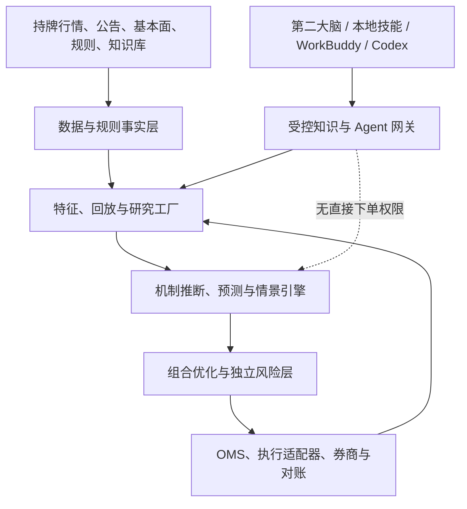

# 企业级 A 股 AI 量化交易系统总蓝图 v2.0

> 基线日期：2026-07-16  
> 定位：**本地优先、企业级治理、研究与决策支持优先，受控执行后置**。  
> 覆盖：沪深 A 股为一期核心；北交所、ETF、期指、港/美市场均以独立规则包和适配器扩展。  
> 安全底线：系统追求经过净成本、容量、风险与样本外验证的长期正期望；不承诺收益，不从公开数据确认具体账户或机构的真实意图；语言模型无权绕过确定性风控下单。

---

## 0. 总体结论：要建设的不是“AI 看盘机器人”

本项目应被设计为五个彼此隔离、又可追溯闭环的系统：

1. **市场事实系统**：保存合法获得的、点时可重放的数据、规则、来源、版本和质量结果。
2. **研究工厂**：把理论、经验、指标和假设转为可复现的特征、标签、试验与样本外验证。
3. **概率推理系统**：用多个竞争假设解释量价、订单流、事件和基本面；输出概率、反证和情景树，而非“已确认主力意图”。
4. **控制与交易系统**：独立完成组合约束、预交易风控、订单状态机、券商通道、对账、熔断和灾备。
5. **知识与智能协作系统**：将本地第二大脑、WorkBuddy、Codex 与自定义技能接入受控网关，只提供检索、研究编排、解释与候选写入能力。

核心产品不是一句买卖建议，而是可审计的 `DecisionPacket`：在某一决策时点，清楚说明事实、规则、竞争机制、概率质量、支持与反对证据、可执行性、仓位风险、失效条件、审批情况与 `NO_TRADE` 路径。

### 0.1 第一性目标函数

\[
\max_\pi \mathbb{E}[R_{net}(\pi)] - \lambda_1 ES_\alpha - \lambda_2 DD - \lambda_3 Cost - \lambda_4 Uncertainty
\]

硬约束：资金保全、最大回撤、日损失、集中度、流动性、冲击、容量、可卖库存、涨跌停退出风险、交易规则、数据许可、程序化交易合规、操作风险与人工授权。

### 0.2 不可妥协边界

- “主力”只能是**候选参与者/行为机制**：被动指数流、机构执行、套利对冲、游资、产业资本、量化、流动性提供者、散户群体或未知混合；不得从盘口断言具体主体身份。
- 预测置信、机制解释置信与身份置信必须分开；身份置信默认不可识别或低。
- 任一历史回测仅使用当时 `available_at` 已可得的数据、规则与版本。
- AI 可提出假设、调度研究、解释结果；特征计算、风险校验、额度、熔断、订单状态和下单均由确定性服务执行。
- 默认状态为 `research_only`；只有许可、券商能力、纸面仿真、合规检查、独立风控和人工授权全部通过，才可进入小规模受控执行。

---

## 1. 目标、范围与成功标准

### 1.1 业务目标

- 以日频/分钟为第一闭环，逐步支持合法 Level-2 的逐笔、订单簿和集合竞价研究。
- 将威科夫、Volume Profile、VWAP、CMF、Delta/CVD、Absorption、Footprint、筹码代理、事件研究、基本面、市场微观结构与行为金融转为**可证伪的候选机制**。
- 形成“数据 → 假设 → 验证 → 决策包 → 纸面结果 → 复盘 → 有条件回写知识库”的持续学习链。
- 为个人本地部署保留低成本、隐私、可离线重放的能力；在数据量、策略数、团队与账户增长后平滑升级为企业级高可用架构。

### 1.2 成功门槛

| 领域 | 可验收的最低标准 |
|---|---|
| 数据 | 有许可台账；原始数据不可变；双源/单源质量可见；可按点时重放与追溯 |
| 规则 | 按交易所、板块、证券状态和生效日期加载；T+1、涨跌停、停复牌、公司行动纳入状态机 |
| 研究 | 每次试验有数据快照、代码、参数、成本、试验族、基准、样本外和失败记录 |
| 模型 | 概率经校准；有替代假设、反证、漂移监控与弃权/不交易能力 |
| 策略 | 相对朴素基准有成本后、容量后、分状态稳定的样本外增量 |
| 执行 | 独立风险层能拒单、限额、幂等、防重复、熔断、对账与恢复 |
| 运营 | 定义并演练 RPO/RTO；审计、权限、告警、备份、供应链完整 |
| AI/知识 | 外部文本被视为数据；本地技能通过版本化契约接入；候选知识不得自动冒充已验证结论 |

### 1.3 非目标

- 不以黑箱模型或单一交易大师理论代替验证。
- 不使用无授权、不可审计或违反数据条款的数据。
- 不假设个人客户端、落盘文件或非正式接口天然可供自动下单。
- 不把当前交易规则、费率或字段格式硬编码为永恒事实。

---

## 2. 总体架构：逻辑域、平面和部署形态



### 2.1 四个平面

| 平面 | 作用 | 关键要求 |
|---|---|---|
| 研究平面 | 数据集、特征、实验、回测、模型、报告 | 可重放、可复现；不持有生产交易凭证 |
| 推理平面 | 状态识别、机制后验、收益/成本分布、情景树 | 输出结构化建议；允许未知和弃权 |
| 交易控制平面 | 风险预算、持仓账本、OMS、执行、对账、熔断 | 低延迟、确定性、独立部署、最小权限 |
| 智能协作平面 | 检索、技能编排、代码与报告协作、知识候选回写 | 异步、可降级；故障绝不影响控制平面 |

### 2.2 服务域与端口适配

所有领域服务仅依赖内部契约，外部供应商由适配器替换：

| 服务域 | 核心职责 | 稳定产物/契约 |
|---|---|---|
| Data Ingestion | 行情、公告、财务、事件、文件采集 | `RawEnvelope`、采集日志 |
| Market Canonical | 证券主数据、标准事件、时间与单位统一 | `MarketEvent`、`SecurityMasterEvent` |
| Rule Engine | 历史规则、可交易性、费用和约束 | `RuleSnapshot` |
| Quality & Replay | 数据闸门、双源对账、事件回放 | `QualityReport`、`ReplayRun` |
| Feature Platform | 线上/离线一致特征与特征注册 | `FeatureVector`、`FeatureSet` |
| Research Factory | 标签、训练、回测、统计审计、模型注册 | `Experiment`、`ValidationReport` |
| Intent/Scenario | 竞争假设、后验、反证、情景树 | `IntentBelief`、`ScenarioTree` |
| Portfolio/Risk | 目标仓位、约束、压力、审批 | `RiskDecision`、`TargetPosition` |
| OMS/Execution | 意图转订单、拆单、回报、TCA、对账 | `OrderIntent`、`ExecutionReport` |
| Knowledge/Agent | 证据、图谱、技能、MCP、审计 | `EvidenceClaim`、`CapabilityReport` |
| Governance/SRE | 身份、密钥、监控、审计、备份、事故响应 | SLO、Runbook、审计事件 |

### 2.3 从本地到企业的三档部署

| 档位 | 推荐形态 | 适用与升级触发 |
|---|---|---|
| A：本地研究工作站 | Parquet + DuckDB/Polars + PostgreSQL/SQLite + 本地对象目录 + Docker Compose | 单人、离线研究、日频/分钟回放；优先验证事实和规则 |
| B：小团队准生产 | 对象存储 + PostgreSQL + ClickHouse + Kafka 兼容事件总线 + 容器编排 | 多数据源、L2 回放、多人协作、实时影子运行 |
| C：企业高可用 | 多可用域事件总线、Lakehouse、在线特征服务、模型注册、Kubernetes、独立交易网络 | 多策略/账户、实时执行、明确 RTO/RPO 与灾备切换需求 |

技术选型不预设具体厂商。原则是：**原始数据与事件日志可迁移；业务语义由版本化 Schema 固定；基础设施可替换。**

---

## 3. 数据平台：点时事实、质量门控与 A 股适配

### 3.1 数据分层与不可变性

| 层级 | 内容 | 强制要求 |
|---|---|---|
| L0 Raw | 原始文件/消息、供应商头、公告原文、接收日志 | WORM/追加式保存、哈希、许可、来源、解析器版本 |
| L1 Canonical | 标准化成交、委托、撤单、盘口、事件、证券状态 | Schema 版本、源序号、时间语义、质量标记 |
| L2 Curated | 复权、公司行动、交易日历、标的池、公告结构化 | 仅派生、可重建、有效期与血缘 |
| L3 Feature | 离线/在线特征、窗口、缺失策略和延迟 | 特征定义版本、as-of 查询、训练服务一致 |
| L4 Research | 标签、实验、模型、策略和验证报告 | 数据快照、代码提交、环境摘要、试验族 |
| L5 Decision | 决策、审批、订单、成交、归因、复盘 | 不覆盖历史、可回放、可审计 |

### 3.2 必须同时保存的时间

`event_time`（事件发生）/ `published_at`（公开）/ `received_at`（系统收到）/ `available_at`（经质量闸门后可用）/ `revised_at`（修订）/ `valid_from`、`valid_to`（规则或主数据有效区间）。

回测查询条件必须是：`available_at <= simulation_clock`。任何以当前最终数据库状态回放历史的做法一律视为未来信息风险。

### 3.3 原始消息统一信封

```yaml
RawEnvelope:
  source_id: string
  feed_id: string
  venue: string
  channel_id: string
  source_sequence: integer|null
  exchange_timestamp: timestamp|null
  vendor_timestamp: timestamp|null
  receive_timestamp: timestamp
  payload_schema_version: string
  payload_hash: string
  license_policy_id: string
  parser_version: string
  raw_ref: uri
```

### 3.4 数据质量闸门

采集、标准化、特征和交易前分别运行质量规则：序列缺口/重复/乱序、时钟偏差、字段漂移、映射错误、价格数量金额守恒、盘口重建、跨源匹配、停牌/交易日一致性、公司行动与复权、公告时间、缺失比例和许可范围。

状态：`HEALTHY → DEGRADED_SINGLE_SOURCE → STALE → HALTED → RECOVERING → HEALTHY`。

- 单源降级仅允许已经验证为对缺失字段不敏感的策略，并显式降低置信度与限额。
- 两源冲突、规则状态不一致或关键行情陈旧：系统进入 `NO_TRADE`。
- 恢复必须先补数、重放、对账、恢复持仓状态，再解除熔断；不得直接恢复交易。

### 3.5 A 股规则引擎

规则以 `(venue, board, security_type, security_status, trading_method, effective_from, effective_to)` 为键，输出 `RuleSnapshot`。它至少包含交易时段、集合竞价撤单规则、订单类型、申报单位、最小价位、涨跌幅/价格范围、临停、T+1/回转、费用、两融/券源条件、程序化交易限额与官方来源版本。

特别要求：

- 持仓账本区分 `total / available_to_sell / frozen / unsettled / corporate_action_pending`；普通股票当日买入不能被错误地模拟为当日卖出。
- 涨跌停仅是价格状态，不代表可成交；必须模拟封单队列、开板、次日一字板和无法退出风险。
- 集合竞价、连续竞价和收盘竞价使用独立状态模型；09:15–09:20 可撤订单与 09:20–09:25 不可撤订单的证据权重不能混用。
- 程序化交易、券商接口、费率和规则均通过可热更新规则包维护；进入仿真或实盘前以交易所、监管和券商当日文件复核。

---

## 4. 研究、特征与“主力行为机制”推断

### 4.1 研究对象链

`DatasetSpec → FeatureSet → LabelSpec → Experiment → Model/Strategy → ValidationReport → DecisionPolicy`

每一对象都有 ID、语义版本、哈希、创建者、审核状态、适用范围、失效条件和依赖血缘。任何结果引用对象 ID，而不是手工复制来源不明的 CSV。

### 4.2 特征家族

| 家族 | 第一批可实现内容 |
|---|---|
| 价量与状态 | 收益、波动、振幅、缺口、换手、区间位置、行业/指数残差 |
| 流动性与订单流 | 主动买卖差、Delta、CVD、OFI、价差、深度、撤补、冲击与恢复 |
| 拍卖与成交分布 | Volume Profile、POC、Value Area、VWAP/锚定 VWAP、竞价不平衡 |
| 威科夫候选机制 | Effort-vs-Result 残差、Spring/Test、Upthrust、SOS/SOW、LPS/LPSY；均为可检验候选，不是真理标签 |
| 筹码代理 | 历史换手加权成本、浮盈/套牢分布、成本带迁移；明确不是账户真实成本 |
| 事件和基本面 | 公告、业绩预期差、解禁、回购/减持、股东变动、行业链、宏观日历 |
| 行为与跨市场 | 注意力、拥挤、ETF/指数调仓、期现、融资融券、板块共振 |
| 数据质量 | 延迟、丢包、源一致率、方向分类置信度、规则不确定性；直接参与交易门控 |

### 4.3 竞争假设，而非单一“吸筹”故事

每次推断至少包含以下三类解释：

1. H1 主机制：如“主动卖压被吸收，存在潜在库存建立”。
2. H2 市场机制替代：如 ETF/指数再平衡、套利对冲、事件驱动、流动性供给。
3. H3 数据与执行替代：如成交方向误判、盘口丢包、尾盘集合竞价或无法成交造成假象。

推荐机制本体：信息型、机械型、流动性型、被迫型、拥挤型、混合/未知；库存方向为建立/降低/双边/未知；市场阶段为盘整/突破尝试/趋势/衰竭/反转尝试/不可判定。威科夫状态仅属于候选市场阶段之一。

```yaml
IntentBelief:
  instrument_id: string
  as_of: timestamp
  horizon: string
  hypotheses:
    - code: PASSIVE_ABSORPTION
      probability: 0.0-1.0
      evidence: [claim_id]
      counterevidence: [claim_id]
      confounders: [string]
      observable_prediction: string
      falsifier: string
      expiry: timestamp
  predictive_confidence: calibrated_score
  mechanism_confidence: calibrated_score
  identity_confidence: unidentifiable|low
  data_quality_status: string
```

概率总和为 1。低信息或模型分歧应将质量分配给 `MIXED_OR_UNKNOWN`；不强迫模型做强结论。

### 4.4 模型栈与升级纪律

按复杂度逐级晋升：规则评分与逻辑回归 → HMM/HSMM/状态空间与变点检测 → 梯度提升和生存模型 → Hawkes/订单流点过程 → 深度订单簿模型 → 图模型和制度混合专家 → 校准、Conformal/选择性预测与模型分歧门控。

复杂模型只有同时在**净成本样本外收益、概率校准、稳定性、延迟、可解释性和容量**上超过简单基线，才允许上线。LLM 仅做文本结构化、假设生成和解释，数值与风险结论由确定性计算服务产生。

### 4.5 验证与反过拟合

- 训练/验证/最终锁箱按时间分割；滚动或扩展窗口。
- 标签重叠时采用 purge 与 embargo；记录全部试验次数与试验族。
- 成本模型包括佣金、税费、价差、冲击、排队、未成交机会成本、涨跌停、停牌、T+1 与容量。
- 对比指数、行业中性、简单动量/反转、随机/不交易基准。
- 做市场状态、板块、流动性、规模、事件窗口、年份和极端情形切片；报告失败期。
- 需要时使用 PBO/CSCV、Deflated Sharpe、White Reality Check 或 Hansen SPA；概率模型报告 Brier、Log Loss、可靠性图与校准误差。

---

## 5. 情景、组合、风险与执行

### 5.1 情景引擎

每份决策包生成 3–5 条近似互斥的未来路径。每条包含：当前概率或定性等级、触发条件、确认与反证、截止时间、对价格/流动性/组合的影响、风险预算、推荐动作和下一条最有价值的信息。动作层级固定为：

`NO_TRADE → 观察 → 纸面试探 → 人工审批的小风险仓位 → 已验证策略内调整`。

“不交易”是一类高质量决策，而不是系统失败。

### 5.2 独立风险层

风险服务不信任模型服务与 Agent 输出。它依据账户、持仓、规则快照、行情质量和审批状态，对每个 `OrderIntent` 给出 `APPROVE / RESIZE / DEFER / REJECT / HALT`。最少覆盖：

- 单标的、行业、主题、风格、账户和策略族集中度；
- 单笔、日内、隔夜、总回撤、VaR/ES、跳空和尾部情景；
- 流动性、参与率、冲击、容量、涨跌停和可卖库存；
- 数据陈旧、模型漂移、时钟偏差、源冲突、服务异常；
- 申报速率、撤单率、券商限额、程序化交易报告要求；
- 人工审批、职责隔离和紧急停机。

### 5.3 OMS、执行与对账

订单意图不是券商订单：

```yaml
OrderIntent:
  decision_id: string
  portfolio_snapshot_id: string
  symbol: string
  target_or_delta: decimal
  urgency: low|normal|high
  max_participation: decimal
  limit_policy: string
  expiry: timestamp
  scenario_id: string
  risk_budget: decimal
  human_approval_required: boolean
  idempotency_key: string
```

OMS 将通过风控的意图转为订单；执行适配器负责券商协议，不向模型暴露账户凭证。订单状态机至少有 `NEW → VALIDATED → ROUTED → ACKED → PART_FILLED → FILLED/CANCELLED/REJECTED → RECONCILED`，支持幂等重试、断线恢复、重复订单防护和回报顺序异常处理。

盘中、收盘后和次日开盘前对账现金、可用资金、持仓、可卖数、委托、成交、费用和公司行动；任何无法解释的差异阻断新增风险。

### 5.4 熔断与降级

触发条件：行情陈旧、关键字段缺失、双源大幅不一致、重复订单、拒单激增、超限损失、订单/持仓对账差异、时钟偏差、模型漂移、券商连接异常或人工紧急停机。

动作顺序：停止新单 → 撤销未成交订单（按规则/风险判断）→ 保留/降低现有风险的受控路径 → 冻结策略 → 保全证据 → 人工复核 → 按 Runbook 恢复。Kill switch 必须独立于模型、策略与 Agent 服务。

---

## 6. 本地第二大脑、WorkBuddy、Codex 与自定义技能

### 6.1 分层边界

| 层 | 应承载的内容 | 禁止承载的内容 |
|---|---|---|
| `AGENTS.md` | 项目硬规则、目录、真实命令、测试和验收 | 大量教材、密钥、实时敏感数据 |
| Skill | 可复用研究流程、输出模板、验证步骤 | 生产凭证、无版本实时结论 |
| MCP Resources | 知识、规则、目录、schema、实验的只读视图 | 不受控写入和直接下单 |
| MCP Tools | 查询、特征、回测、仿真、候选提案 | 无审批实盘交易 |
| 确定性服务 | 数据、特征、风控、OMS、账本 | 自由文本直接决策 |

### 6.2 标准技能插件契约

本地每个自定义技能（指标、因子、风控规则、知识检索、回测审计、事件雷达）都注册为一个版本化插件包：

```yaml
SkillManifest:
  skill_id: local.wyckoff.effort_result
  version: 1.2.0
  type: feature|signal|risk_rule|knowledge_retriever|reporter
  inputs: [dataset_id, as_of, parameters]
  outputs: [FeatureVector|SignalCandidate|RiskFinding|EvidenceClaim]
  determinism: deterministic|model_assisted
  offline_online_parity: required|not_applicable
  data_permissions: [market_l2_licensed]
  latency_budget_ms: 100
  quality_preconditions: [orderbook_complete]
  tests: [golden_sample, no_lookahead, schema_compatibility]
  owner: team_or_person
  lifecycle: candidate|validated|deprecated
```

接入流程：注册 Manifest → Schema/权限校验 → 金样本与无前视测试 → 沙箱回放 → 试验登记 → 审核 → 允许在指定环境启用。插件只能输出声明的对象，不能自行读密钥、写生产订单或绕过风险策略。

### 6.3 MCP 资源与工具（最小权限）

只读资源示例：

```text
kb://documents/{id}?as_of=
kb://claims/{id}?as_of=
market://datasets/{id}/schema
rules://a-share/{rule_id}?as_of=
research://experiments/{id}
portfolio://snapshots/{id}
```

受控工具示例：`build_point_in_time_dataset`、`compute_feature_set`、`run_backtest`、`validate_decision_packet`、`generate_scenario_tree`、`submit_paper_order`、`propose_claim`。所有调用都记录 `trace_id / actor / purpose / decision_id / as_of / idempotency_key`。

外部网页、公告和知识库文本均是**不可信数据**，不是给 Agent 的指令；网关必须进行提示注入隔离、来源标记、脱敏、权限校验和输出 Schema 校验。

### 6.4 第二大脑知识图谱与回写

最小关系：`Document → Claim → Evidence → Entity/Event → Dataset → Feature → Model → Hypothesis → Scenario → Decision → Outcome`。

知识状态仅允许：

| 状态 | 含义 | 可否作为生产依据 |
|---|---|---|
| candidate | 理论、经验或初步样本支持 | 否 |
| validated | 经预设样本外与稳健性门槛验证 | 可在批准范围内 |
| rejected | 已反证或成本后失效 | 否，保留失败原因 |
| deprecated | 规则、接口或市场结构变化后过时 | 否 |

每次回写必须有来源、证据等级、适用范围、反例、版本、失效条件、复核日期和负责人。一次个股复盘不可自动泛化为全市场规律。

---

## 7. 高可用、灾备、安全与可观测性

### 7.1 可用性设计

- 交易控制平面与研究/Agent 网络隔离；订单、风险、账本与行情关键缓存部署在低延迟区域。
- 事件消息使用可持久化日志、消费者幂等和可重放 offset；关键账本使用强一致主库与审计追加日志。
- 原始数据、模型、配置、规则与决策包分层备份；恢复过程可验证哈希与版本。
- 多活只适用于经过冲突与一致性设计的读/计算服务；订单主控采用明确主写、fencing token 与单一交易权威，避免双重下单。

### 7.2 RPO/RTO 建议起点

| 域 | RPO | RTO | 恢复原则 |
|---|---:|---:|---|
| 原始行情与审计日志 | 近零/按源能力 | 4 小时内 | 日志优先，允许延后派生重建 |
| 研究数据与模型 | 24 小时 | 24 小时 | 可从原始层重建 |
| 订单/持仓/风险账本 | 近零 | 15 分钟内 | 先与券商对账，再恢复交易权 |
| Agent/知识服务 | 24 小时 | 24 小时 | 故障不阻断风控，仅降低解释与研究能力 |

具体数值在券商、资金、频率和部署地域确认后由 ADR 固化。

### 7.3 观测、告警与审计

监控四类信号：

- **数据**：完整率、延迟、乱序、字段漂移、跨源匹配、回放成功率。
- **模型/策略**：特征漂移、训练服务偏差、校准、命中率、成本、容量、状态覆盖、弃权率。
- **执行/风险**：信号到订单延迟、成交率、实现缺口、拒单、撤单、敞口、损失、账本差异。
- **基础设施**：CPU/内存/磁盘、队列积压、数据库复制、时钟、证书、备份、依赖可用性。

告警分 P1（立即停机/人工响应）、P2（降级）、P3（观察）；每条 P1/P2 必有 Runbook、负责人、演练记录与复盘。

### 7.4 安全与软件供应链

最小权限 RBAC：`research_reader`、`research_runner`、`knowledge_curator`、`paper_trader`、`risk_approver`、`live_operator`，且模型开发与 live operator 分离。密钥放入专用密钥服务，绝不进入 Notebook、Skill、Prompt、日志或第二大脑。部署仅允许可追溯构建产物，要求依赖锁定、SBOM、代码审查、镜像扫描、签名、变更审批与回滚。

---

## 8. 数据与接口契约

### 8.1 `MarketDataRecord` 示例

```json
{
  "schema_version": "1.0.0",
  "instrument_id": "CN:XSHG:600000:EQUITY",
  "event_time": "2026-07-16T06:30:00.123Z",
  "received_at": "2026-07-16T06:30:00.180Z",
  "available_at": "2026-07-16T06:30:00.220Z",
  "source": "licensed_source",
  "source_sequence": "123456789",
  "event_type": "trade",
  "price": "10.230",
  "quantity": 1200,
  "side_method": "exchange_or_classifier",
  "quality_flags": [],
  "snapshot_id": "sha256:..."
}
```

价格、资金、数量使用整数最小单位或定点十进制；二进制浮点不得作为账本真相。所有对外 API 都必须有 `schema_version`、`as_of`、质量状态、权限范围、错误码与幂等语义。

### 8.2 `DecisionPacket` 最小字段

```text
decision_id / as_of / data_snapshot_ids / rule_snapshot_id
feature_set_id / model_versions / strategy_version / code_commit
hypotheses + probabilities + evidence + counterevidence + falsifiers
scenario_tree / forecast_distribution / transaction_cost_model
portfolio_snapshot / risk_decision / order_intents / approval_status
execution_status / no_trade_reason / audit_trace / outcome_link
```

没有数据质量、规则、风险、审批或可交易性字段的“建议”，不得进入 OMS。

---

## 9. 组织、治理与研发流程

### 9.1 逻辑职责隔离

| 角色 | 拥有权 | 不能单独决定 |
|---|---|---|
| 研究/策略 | 假设、模型、试验与解释 | 自行放宽风险或实盘上线 |
| 数据工程 | 采集、质量、血缘、点时与回放 | 修改研究结论以掩盖数据问题 |
| 平台/SRE | 部署、可用性、备份、观测 | 改变策略经济逻辑 |
| 风险/合规 | 规则、限额、审批、异常处置 | 为达收益而修改验证标准 |
| 执行运营 | 券商接入、订单、对账、事故响应 | 绕过审批和 kill switch |
| 知识管理员 | 来源、声明、冲突与状态升级 | 将未验证经验标为 validated |

个人项目也应通过独立配置、账户、目录、审批步骤与代码路径实现同等逻辑分权。

### 9.2 架构决策与变更

每个重要选择创建 ADR：背景、已知/未知、备选方案、决定、理由、代价、回滚、复核日期。数据契约、规则包、风控规则、技能 Manifest 和模型发布均走版本化变更流程；生产变更必须可审计、可回滚。

---

## 10. 分阶段实施路线（先闭环，再智能，再受控执行）

### 阶段 0：事实盘点与边界冻结

交付：项目参数、数据/许可台账、券商能力表、Unknown Registry、风险政策、ADR、仓库/环境盘点。  
退出：能回答“数据从哪来、何时可得、规则是什么、谁能下单、出错如何停”。

### 阶段 1：最小可审计研究闭环

交付：标准化 `MarketDataRecord/PriceBar`、证券主数据、公司行动、点时数据集、基础特征、SMA/动量/反转基准、成本后回测、实验登记、`DecisionPacket`。  
退出：固定快照重复得到相同结果；无未来函数与账本守恒测试通过。

### 阶段 2：事件与第二大脑闭环

交付：公告/新闻/宏观事件日历、证据卡、知识图谱、受控检索、候选回写、事件研究模板。  
退出：任一结论可回到原文、发布时间、快照和证据链。

### 阶段 3：L2、订单流与行为机制基线

交付：合法 L2 解析器、金样本、双源对账、回放器、Delta/CVD/OFI/VWAP/Absorption 等特征、竞争假设基线与校准报告。  
退出：数据质量和替代解释足以阻止“看见大单就讲故事”。

### 阶段 4：多分支建议与组合风控

交付：情景树、收益/成本/风险分布、组合优化、T+1/涨跌停状态机、独立风控和审批流。  
退出：每项建议要么可执行，要么明确说明为什么不交易。

### 阶段 5：实时影子与纸面仿真

交付：实时流、线上/离线特征一致、纸面 OMS、监控、漂移检测、事故/灾备演练、TCA 与对账。  
退出：连续稳定运行并通过模拟故障、重连、重复订单和持仓恢复演练。

### 阶段 6：受控执行候选

前置：程序化交易报告/券商确认、权限与合规审查、纸面验收、人工授权、硬限额与独立 kill switch。  
交付：最小资金、低频、单策略/单账户、双重审批、逐日复核的受控执行。  
退出：仅在预设成功与安全指标持续通过后，按 Canary 扩大；任何失败自动退回纸面或研究状态。

---

## 11. 首个 30 天实施包

| 周次 | 重点 | 可验收交付 |
|---|---|---|
| 第 1 周 | 盘点与契约 | 数据/许可/券商/技能清单、Unknown Registry、项目参数、ADR-001 |
| 第 2 周 | 数据与规则 | Canonical Schema v0、交易规则包 v0、证券主数据、质量检查与金样本 |
| 第 3 周 | 重放与基线 | 事件回放、基础特征、SMA/动量/反转、成本与 T+1 回测、实验登记 |
| 第 4 周 | 决策与知识闭环 | `DecisionPacket` v0、候选证据卡、本地技能 Manifest、纸面建议与复盘模板 |

第一批明确不做：实盘自动下单、无许可 L2 依赖、复杂多智能体、未校准的“主力身份”识别、跳过成本/容量的策略排名。

---

## 12. 当前未知项登记表

| 未知项 | 对架构的影响 | 验证材料 | 未验证时的安全默认 |
|---|---|---|---|
| 两套 L2 的字段、时钟、许可与历史范围 | 能否构建订单流/队列特征 | 合同、字段表、样例、接口说明 | 日频/分钟研究；不假造 L2 字段 |
| 券商与自动化能力 | 能否纸面/受控执行 | 接口、限速、订单类型、报告要求 | `research_only` |
| 资金规模、频率、持有期与最大回撤 | 容量、延迟、风险配置 | 项目参数 | 低换手、小风险、纸面仿真 |
| 第二大脑存储与检索方式 | MCP 资源与图谱适配 | 路径、schema、API/CLI、权限 | 只读 Markdown/索引适配器 |
| WorkBuddy/Codex 技能与连接器 | 能力编排边界 | 清单、调用方式、沙箱权限 | 仅研究/解释，无法执行 |
| 硬件、备份与网络条件 | 部署档位、RPO/RTO | CPU/GPU、存储、网络、预算 | 单机可重放与离线备份 |

---

## 13. 最终验收清单

- [ ] 数据源、许可证、字段、延迟、留存和血缘全部有台账。
- [ ] 任意历史结论均可按当时 `available_at`、规则版本、数据快照和代码重放。
- [ ] L2 解析、方向/订单关联、双源对账均有金样本与降级规则。
- [ ] 特征、模型、策略和技能均有 Manifest、版本、测试、适用范围和弃用流程。
- [ ] 回测计入费用、滑点、冲击、容量、T+1、涨跌停、停牌、公司行动与未成交。
- [ ] 决策包包含竞争假设、概率/校准、反证、情景、风险、可交易性和不交易理由。
- [ ] AI/Agent 无实盘直连权限；外部文本的提示注入得到隔离。
- [ ] 风控独立于模型与执行适配器，具有限额、拒单、熔断、对账和人工紧急停机。
- [ ] 影子/纸面运行、异常演练、灾备恢复和对账验收全部通过。
- [ ] 只有在监管、券商、权限、人工授权和小规模 Canary 条件都满足后，才可受控执行。

---

## 附录 A：建议仓库结构

```text
quant-system/
  AGENTS.md
  contracts/          # Schema、事件与 API 契约
  data/               # adapters、raw catalog、quality、replay
  rules/              # A 股历史规则包与测试
  features/           # 特征定义、插件 Manifest、金样本
  research/           # datasets、experiments、models、backtests
  intent/             # 假设本体、校准、情景引擎
  portfolio-risk/     # 组合、限额、压力、审批
  oms-execution/      # 订单状态机、券商适配、对账、TCA
  knowledge-gateway/  # 第二大脑、MCP、证据与技能网关
  observability/      # dashboard、alerts、runbooks
  infra/              # IaC、部署、备份、灾备
  tests/              # 单元、性质、金样本、回放、集成、混沌演练
  docs/               # ADR、模型卡、数据卡、运行手册、验收报告
```

## 附录 B：对 Codex / WorkBuddy 的统一任务头

复杂、未知项多的任务使用：

`【Codex模式：项目计划模式】先基于真实仓库、现有数据和接口生成可更新计划；不得虚构文件、接口或验证结果。`

目标明确但需要多轮验证的任务使用：

`【Codex模式：目标模式】以给定验收标准推进；在数据、规则、许可、风控不确定时保持安全默认并报告阻塞。`

统一回传字段：任务 ID、模式、当前目标、成功标准、当前阶段、完成比例、已验证事实、变更文件、运行命令与测试、关键决策及依据、考虑过的替代方案、风险/未知项、下一步。
