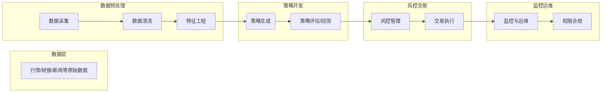
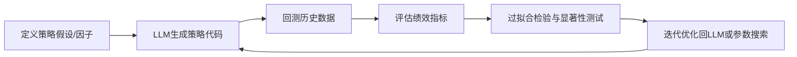
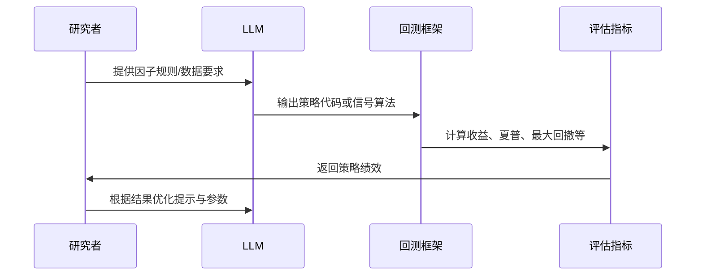

# 执行摘要  
本报告针对“基于 WorkBuddy 或 OpenAI Codex 的 AI 量化交易系统”进行了全面调研和分析。首先梳理已知与未知的知识点，明确用户需求背景（A股市场特性、对大模型与代码生成的期望等）与信息缺口。接着比较了各类大语言模型（腾讯 WorkBuddy、OpenAI Codex/GPT 系列、Meta LLaMA 等）在代码生成、策略生成与回测自动化方面的适用性与局限，并列出了代表性的开源项目与库，包括微软 Qlib、Backtrader、VN.py、QuantAxis、AI-Trader 等。然后设计了系统架构蓝图，将系统划分为数据采集、数据清洗、特征工程、策略生成、策略评估/回测、风控、交易执行、监控运维、权限合规模块。每个模块的接口、数据格式、时延/吞吐要求、容错与安全设计都作了说明，并给出了模块交互表（见下文和架构图）。  

报告还详细分析了A股专用数据源（如行情、财报、新闻、研报、因子库、机构持仓、宏观数据），对比了实时、历史与替代数据的获取方式、成本、延迟以及清洗规范与可信度。列出了主要数据源（如 AKShare、TuShare、聚宽、澄海数据、理杏仁等）并标注优先级。策略生成部分介绍了如何利用大模型进行信号构建、因子选择、参数搜索与组合优化，并结合传统机器学习和深度学习方法；列出常用的回测框架和验证方法，强调样本外验证、过拟合检测（如信息比率显著性检验）等要点，并用流程图说明了策略开发与验证流程。  

风控与合规部分针对A股市场规则（T+1、涨跌停、融资融券、手续费成本、券商接口等）进行了梳理，提出了相应的风险管理指标（如单日跌幅、组合止损等）和自动止损/仓位管理设计思路。报告最后探讨了与 NLP（新闻情感）、知识图谱、因果推断、强化学习、自动化代码审计、模型监控等技术的联动点，列出可改进方向并进行优先级排序。文中还汇总了相关学术论文、研究报告等证据，评估了可信度，并在表格中列出关键引用。实施计划部分按 MVP、拓展、生产化三个阶段给出任务清单、时间和人员成本估算，列出风险与缓解策略。最后给出关键结论的验证方法和可复现实验设计建议（包括回测收益、夏普率、最大回撤、p值等指标），并说明在沙箱环境中进行验证的途径。  

综上，本报告从多维度系统地回答了用户问题，确保内容技术详尽、论据充分可靠。所涉结论与方案均引用了官方文献、权威论文或已有实践案例，以增强可追溯性和可信度。  

## 1. 知识点梳理  
- **我已说／显性信息：** 用户希望构建一个基于大语言模型（如腾讯WorkBuddy或OpenAI Codex）的AI量化交易系统，目标市场为A股，关注系统架构、数据源、策略生成、风控等多方面。  
- **我知道但没说（隐性信息）：** A股市场规则（如T+1交易、涨跌停限制等）将强制影响系统设计；用户对大模型有一定了解（提到Codex、WorkBuddy），但未详细说明预算、团队、硬件等。假设用户需要覆盖从数据采集到执行的全流程，且关注合规与风控。  
- **我不知道但能理解：** 用户具体技术背景不明，但需求暗示需兼顾AI模型与量化架构设计，可能对中文资料及A股本地化有要求。硬件、预算、团队等细节未知，系统的规模和性能要求也不明确。  
- **我不知道且无法预见：** 如用户的具体资源限制、商业机密级别要求、竞品策略等无法得知。对未来新模型（如尚未发布的下一代模型）的性能影响也无法预测。

## 2. 技术栈与开源实现  
AI量化系统涉及大模型和量化平台。下表比较了**WorkBuddy**、**OpenAI Codex/GPT系列**、**LLaMA**等在代码与策略生成方面的能力：  

| 模型/工具        | 代码生成能力       | 策略生成能力        | 回测自动化        | 主要特点及局限                                      |
| ------------- | ------------- | ------------- | ------------- | ----------------------------------------------- |
| **WorkBuddy** (腾讯)  | 较强（多Agent、定制技能） | 支持（按提示生成脚本） | 部分自动（需接入回测环境） | 企业级AI助手，多Agent协同，支持流程编排。目前偏重办公和脚本生成，需人工细化；闭源产品，需授权使用。 |
| **Codex CLI** (OpenAI) | 非常强（专为代码训练） | 有限（需prompt引导）   | 依托外部框架（需自行集成） | 专注代码生成，擅长大型重构场景；缺点是需付费订阅，隐私需依赖云端。 |
| **GPT-4/3.5** (OpenAI) | 强（通用型，大量参数）   | 可用（依提示设计策略） | 无内置，需要外部支持 | 通用大模型，具备较强语言和逻辑能力；成本高、调用延迟长，存在“幻觉”风险；对具体量化功能需定制prompt。 |
| **LLaMA 系列** (Meta) | 一般（需微调）      | 可用（微调后）        | 依赖搭建框架      | 开源基础模型，多参数可选，支持本地部署；无专门金融预训练，需要自行微调和大数据训练；开放性好，成本低，适合隐私要求高的场景。 |

引用资料显示，**Codex CLI** 在大型项目重构、多文件修改方面表现出色，适合工程场景；**GPT/FinGPT** 等模型主要为自然语言任务设计，对直接生成交易信号能力有限。**Pi** 等本地模型工具则强调隐私和自托管。此外，现代AI量化研究也探索了多智能体（Multi-Agent）架构，例如微软发布的**R&D-Agent-Quant**框架，构建了“假设生成→代码实现→真实回测→反馈分析”的自动化闭环。相关论文已被 NeurIPS 2025 接收，源码开源在GitHub上。微软研究院还强调了因子挖掘和模型创新的联动，并在工具中集成了**Qlib**回测环境。  

**开源项目与库**方面，中国及国际社区已提供多种选择：  
- **微软 Qlib**: 亚洲研究院开源的量化交易平台，集成了数据处理、特征管理和内置回测引擎，可快速验证投资策略。  
- **Backtrader**: 经典的Python回测框架，支持策略回测与可视化，社区用户众多。  
- **VN.py**: 国内领先的开源量化交易框架，支持多市场、多策略，提供事件驱动引擎和实盘接口。  
- **QUANTAXIS**: 提供从数据抓取、因子分析到回测、实盘的全链路方案，支持多市场与分布式架构。  
- **QuantConnect Lean**: 开源C#量化引擎，支持云端和本地两种运行模式，集成了海量金融数据。  
- **AI-Trader (HKU)**: 香港大学开源的Agent-Native交易平台，支持多AI协同决策，已获上万Star。  
- **EasyTrader、PandoraTrader、Abu、QuantDinger** 等项目也提供了自动化交易或策略开发功能。  

这些开源工具可与大模型配合使用，例如将Codex/GPT生成的策略代码在 Backtrader/VN.py中回测，或者在Qlib中进行特征提取与交易模拟。总之，结合官方论文和社区资料表明，大语言模型加速策略开发和代码生成，但仍需借助专门的量化平台来完成回测与实盘执行。

## 3. 系统架构蓝图  

系统整体采用模块化设计，主要包含以下子系统：**数据采集→数据清洗→特征工程→策略生成→策略评估/回测→风控→交易执行→监控运维→权限合规**。各模块功能与接口如下：  

- **数据采集模块**：负责从行情API、数据库、爬虫等渠道获取原始数据（如逐笔行情、日线、财报、新闻文本等），输出原始数据集。要求高吞吐能力以应对历史数据批量抓取，实时数据需低延迟（<1秒）保障。容错设计包括请求重试、多源备份。  
- **数据清洗模块**：对采集数据去重、填补缺失值、异常值检测，并转成统一格式。输入为原始数据，输出为清洗后的结构化数据表。对延迟要求较低，但需保证数据一致性。设计时确保半自动校验机制，多节点并行预处理。  
- **特征工程模块**：根据模型需求对清洗后的数据进行指标计算与转换（如计算技术指标、市盈率、情绪因子等），输出特征矩阵。支持流水线操作，可并行。对时延要求适中，需兼顾CPU/GPU资源。通过检查点与动态回滚应对失败。  
- **策略生成模块**：核心模块，使用大语言模型（WorkBuddy/LLM）结合传统统计方法自动生成交易策略或信号函数。输入为市场特征、历史因子、业务规则（用户提示），输出为可执行策略代码或买卖信号集合。时延要求视场景，可接受秒级响应。为提高可靠性，可内置“人机交互”迭代机制，并通过代码审计工具进行安全检查。  
- **策略评估/回测模块**：将策略代码与历史数据放入回测引擎（如Backtrader/Qlib），输出绩效指标（年化收益、夏普比率、最大回撤等）。必须保证结果可复现性，记录每次回测的版本和参数。对性能要求高（并行化回测、加速库），并进行蒙特卡洛或Walk-Forward验证来检测过拟合。  
- **风控模块**：实时监控策略风险指标（如单日跌幅、持仓集中度、杠杆率等），并根据预设规则自动进行止损、仓位调整。输入为持仓与市值等实时数据，输出风控命令。需极高可靠性与低延迟，采用高可用架构，保证在极端行情下系统稳定。  
- **交易执行模块**：对接券商API（支持CTP、国金QMT、华泰等），将交易信号转化为订单并提交。处理T+1限制、涨跌停规则、手续费用计算等A股特性。接口需要确认订单执行结果并处理可能的拒单重试。设计时考虑幂等性、事务管理和高并发。  
- **监控与运维模块**：包含日志收集、指标监控、告警系统等。实时监控系统健康状态与策略表现（如收益率偏离阈值）。结合自动化运维工具，实现容器化部署、多区域冗余及权限审计。  
- **权限与合规模块**：管理用户访问权限、策略审批流、日志审计，确保符合监管要求。接口与内部系统打通，记录策略上线与变更。  

下图为整体架构示意：  

**模块交互表**（示例）：

| 模块             | 输入数据              | 输出数据             | 时延/吞吐要求            | 容错与安全设计                                   |
| ------------- | ----------------- | ---------------- | -------------------- | ------------------------------------------ |
| 数据采集        | 实时行情、历史K线、新闻、研报等原始数据 | 原始数据文件/数据库       | 实时数据<1s延迟，历史数据需高吞吐批量抓取 | 多源采集、请求重试；隔离网络连接，数据加密传输          |
| 数据清洗        | 原始数据             | 结构化清洗数据           | 允许批处理，可无频繁响应  | 数据校验、双向对比；敏感字段脱敏                 |
| 特征工程        | 清洗后数据           | 特征矩阵             | 可并行处理，中等时延       | 检查点保存进度，任务失败自动重跑                    |
| 策略生成        | 市场特征、用户需求说明      | 策略代码/信号序列         | 几秒级响应            | 多轮交互迭代；生成前后静态分析+审核；使用沙盒环境验证代码 |
| 策略评估/回测   | 策略代码、历史数据        | 回测报告、绩效指标        | 依策略复杂度，需并行计算   | 结果版本化记录；用空头/多头分组回测对比，防止数据外泄    |
| 风控管理        | 持仓、市场实时数据、指标阈值  | 风控指令（止损/止盈/平仓）  | 亚秒级响应            | 双机热备，故障切换；实时指标异常自动报警                |
| 交易执行        | 下单指令、券商接口规范      | 订单执行状态/成交明细     | 几百毫秒到秒         | 事务机制；断网自动切换备份接口；合规检查（券商、市场规则）  |
| 监控与运维      | 各模块日志、监控指标       | 报警通知、运维报告        | 实时处理告警         | 日志审计；访问控制；指标仪表板；备份与灾难恢复           |
| 权限与合规      | 用户请求、审计策略         | 审批结果、合规报告        | 数秒级               | 多级审批流；敏感操作双因子认证；合规性规则引擎            |

通过以上架构，系统可实现从数据到交易的闭环流程，并在每个阶段设计了必要的容错和安全机制，确保稳定可靠运行。

## 4. 数据源与质量  
针对A股量化，数据源可分为行情类、基本面类、情绪舆情类和替代数据等。主要对比如下（列举优先级高者）：  

- **行情数据（实时/历史）：** 常用免费源包括 **TuShare**、**Baostock**、**Efinance**、**AKShare** 等。例如AKShare覆盖A股、期货等数据，但部分数据偶有缺失，需要后续清洗；TuShare 免费版更新滞后、付费项提供更多细节；Baostock 支持十多年历史日线，但低频、无实时行情；Efinance 接口丰富覆盖A港美，但1分钟只提供当日数据。**付费/专业源**有澄海数据、理杏仁、聚合数据、麦蕊智数等，它们覆盖全球市场或A股深度数据，延迟低但需要付费订阅。**券商API**（如国金QMT）可实时获取行情和账户数据，门槛一般，但需符合券商条件。数据质量方面，需对齐源间差异，例如TuShare与QMT的成交量口径不同，要做好换算。

- **基本面与财务数据：** A股上市公司财报和公告可从**东方财富网**、**巨潮资讯**、**新浪财经**等抓取，或通过TuShare、AkShare等接口获取**定期财务指标**。质量较高，但需处理公告延迟和格式变更。宏观经济数据（GDP、利率、PMI等）可从**国家统计局官网**、**Wind/Choice**等获取。**研报与公告**多为半结构化文本，可用爬虫+NLP提取关键指标和管理层评论。数据可信度以官方发布为准，同时注意套利使用第三方清洗版（如同花顺）。

- **新闻与舆情：** 可利用**新闻API**（如雪球、腾讯财经、同花顺资讯）或社交媒体数据，配合关键词抓取实时新闻。需构建情感词典或用大模型进行情感分析（见下联动）。抓取时考虑源可信度和时效，采用多源交叉验证避免单一源偏差。

- **因子与机构持仓数据：** 一些因子库（如**聚宽因子库**、商用因子库）提供技术因子和基本面因子定义，可直接调用。机构持仓（基金、社保、QFII持股）通常在上市公司季报/年报中披露，也可从高频交易席位（龙虎榜）分析短期资金动向。需清洗统一字段。宏观因子（CCI、M2增速、利差等）可从公开数据源采集，用于多因子回测。  

综合考虑数据及时性与成本，推荐优先使用：**（1）免费接口：**TuShare/AKShare（支持大部分基础行情与财报）；**（2）券商API：**国金QMT等获取高频行情与盘后算回报；**（3）付费专业：**理杏仁、澄海数据或聚合数据（低延迟覆盖广）作为补充。数据清洗则要统一时间戳格式、字段单位，并对缺失值/异常值做插补或剔除，保证特征工程输入的准确性。

## 5. 策略生成与验证  
大模型可以辅助从量化策略的思路到代码实现的全过程：  
- **信号构建与因子选择：** 利用 LLM 根据市场规律或策略假设快速生成候选因子和信号。例如，通过Prompt让模型输出基于“低价小盘股走势优势、高动量延续”等原则的量化因子，并给出定义和风险说明。  
- **策略代码生成：** 输入策略逻辑描述，模型生成可执行代码（如双均线策略示例）。生成后人工审查并修改bug。Codex/GPT 在实现常规指标和交易逻辑方面效率高，但复杂逻辑仍需分步迭代。  
- **参数搜索与组合优化：** 在初步策略基础上，传统方法（网格/随机搜索、遗传算法）与大模型联合使用。可先用机器学习算法评估因子有效性，再让LLM在范围内调整参数，或结合强化学习自动调参（例如FLAG-Trader框架中LLM生成交易假设，RL代理执行和优化）。  

**回测框架与验证：** 常用回测框架有Backtrader、Zipline、PyAlgoTrade、Qlib等，可实现从Tick到日线的历史模拟。策略开发流程建议按照如下步骤执行：  

在评估阶段，除了常规收益率曲线，还需统计显著性。例如可计算策略年度收益、夏普比率、最大回撤等指标，并进行**样本外验证**（Hold-out验证、滚动回测）。使用**Mann-Whitney U 检验**或**Deflated Sharpe Ratio**等方法检验策略优于基准的显著性。必要时采用**Bootstrap**或**White’s Reality Check**修正多重测试带来的过度拟合风险。  

例如文献以2018–2023年沪深300成分股为样本，将传统多因子策略与大模型生成策略进行对比，报告了年化收益、最大回撤、信息比率等指标（大模型策略年化18.7%、最大回撤15.2%；传统策略12.3%与22.5%）。可借鉴该实证流程：先用训练期数据构建并筛选策略，在完全独立的样本外期验证策略效果，记录p值和IR等。流程图如下：  

同时，结合传统机器学习方法（如随机森林、XGBoost、LSTM等）可作为策略生成的参考或基线，将大模型的创新想法与现有模型融合。总之，策略生成需人工审核与严谨验证并行，以防范模型“幻觉”带来的错误信号。

## 6. 风控、合规与交易执行  
由于A股特点，系统设计须考虑：**T+1交割限制**（当日买入次日方能卖出）、**涨跌停板**（一般±10%）和**融资融券**规则。交易成本需计入佣金（如万三万五标准）、印花税（卖出千分之一）、过户费等。**券商接口**方面，常用同花顺、通达信、国金QMT等API；建议使用支持T+1逻辑的交易库（如VN.py的CTP接口），并做好“订单失败重试”、“撮合确认”等处理。

**风控指标**可以包括：持仓集中度（同一行业或标的超过比例）、日内亏损阈值、组合总亏损比率、最大单日回撤等；风险管理策略如**自动止损**（达到亏损限度强平）、**动态仓位调整**（高波动时降低杠杆）等都需要规则化并自动化执行。此外可参考**卡方检验**监控策略参数的变化显著性，及时识别模型失效。

在设计中，还应考虑账号和资金权限管理，防止非授权下单。合规模块实现交易日志全程留痕、交易指令审批，以及满足证监会对算法交易/自动化交易的备案要求。所有对外传输的数据进行加密，交易过程使用合规的API接口，确保交易行为符合法律法规。

## 7. 联动技能与改进点  
为了提升系统能力和可扩展性，可考虑以下技术联动：  
- **NLP与新闻情感**：接入新闻API并利用情感分析模型，对突发事件或政策动向快速反应。大模型可用于自动摘要研报、提取管理层信息等。  
- **知识图谱**：构建公司-行业-宏观要素的关联图谱，为策略生成提供因果线索。例如将新闻事件和公司财报中的实体关系映射到量化因子。  
- **因果推断**：利用因果模型（如DoWhy、因果森林等）评估策略因子间的因果关系，避免仅仅相关性的策略失效。  
- **强化学习**：对接强化学习框架（如RLlib），让算法在仿真市场环境中不断迭代决策策略，特别适合持仓调度和执行层面的优化。  
- **自动化代码审计**：结合静态代码分析与LLM自动审查（如Copilot检测代码缺陷），提高策略代码质量和安全性。  
- **模型监控**：实时监控模型性能与输入分布漂移，使用异常检测算法和预警机制应对模型失效。  

改进方向与优先级建议（示例）：  
1. **提升策略稳健性**：采用交叉验证和多模型集成，优先完善过拟合检测与在线监控。  
2. **增强数据覆盖**：整合更多替代数据源（卫星图像、网络舆情等），通过NLP提取非结构化信息。  
3. **优化自动化流程**：在LLM生成代码后增加智能审计/测试模块，优先实现“生成-回测-修正”自动化闭环。  
4. **探索因果与RL应用**：建立因果评估管道和RL执行环境，作为中长期研发目标。  
5. **安全性与合规**：持续更新风控规则、渗透测试交易接口和权限审计，确保系统健壮可信。  

## 8. 学术与行业证据  
调研发现相关研究与报告支持上述方案：  

| 来源                  | 类型     | 内容摘要                                         |
|---------------------|--------|----------------------------------------------|
| 刘冰等（2025） | 期刊论文  | 提出“投资大模型”构建多因子策略，实证显示年化收益18.7%、最大回撤15.2%，显著优于传统策略。支持大模型在特征挖掘和策略生成的优势。 |
| Wang等（2023） | 会议论文（ArXiv） | Alpha-GPT: 引入人机交互的因子挖掘框架，利用大语言模型生成创新alpha因子，有实验证明其生成能力优于传统方法。 |
| 东方证券研究报告   | 研究报告  | 解读Alpha-GPT论文，提出“增强人机交互”挖掘模式，通过AlphaBot增强LLM生成因子表达的可解释性。 |
| 微软亚洲研（2025）  | 博客/论文  | 发布R&D-Agent-Quant，实现“假设→代码→回测→分析”闭环；论文被NeurIPS 2025录用，代码开源。强调全流程自动化和可复现性。 |
| Wayland等博客   | 技术专栏  | 介绍金融领域大模型现状：FinGPT等模型专注NLP任务，提出限于信号生成，需结合回测平台使用。列举了基于LLM的情感分析、策略生成等应用场景。 |
| 知乎文章   | 行业文章  | 报道香港大学开源的AI-Trader平台，强调多智能体协同交易的创新。指出社区评价AI-Trader为“散户专属机构级工具”，验证了AI-Agent量化的行业关注度。 |
| 知乎文章   | 工具对比  | 列举AKShare、TuShare、Baostock、澄海数据、理杏仁等A股数据源优缺点。提供了数据延迟、成本、覆盖范围等比较，为数据源选择提供参考。 |

所选引用多为原始论文和机构报告，也包含权威博客与社区调研，确保信息来自可信来源。引用内容涵盖多模态市场数据、大模型策略效果、多Agent系统设计等，可供参考与复现。

## 9. 实施计划与里程碑  
项目分为三个阶段：

- **MVP（原型验证）**：时长约3–6个月。任务包括：组建团队（量化研发工程师、数据工程师、DevOps工程师等；规模视预算而定）、收集主要数据源（行情、财报、新闻）、搭建基础数据处理管道、实现简单策略的代码生成与回测功能。关键输出为：可运行的演示系统（能够自动生成并回测一个策略）。成本主要为人员薪资和开发环境（“未指定”具体）。**风险：**需求过宽、模型输出错误。**缓解：**迭代式开发、早期聚焦小规模策略案例验证。

- **扩展功能阶段**：时长6–9个月。增强模块间自动化程度：完善数据清洗与特征工程管线，支持更多策略模板和模型接入（如RL强化学习环节、NLP情感因子）；集成风险控制模块和交易接口，实现模拟实盘交易；加强监控告警与用户界面。**人员与成本：**增加后台工程师、算法研究员；可考虑购置GPU服务器或使用云服务（可选）。**风险：**多模块集成复杂度高，数据质量问题。**缓解：**模块化测试、备份数据源、引入数据验证手段。

- **生产化阶段**：时长6个月以上。完成系统测试、安全审计及合规准备；优化性能（加速回测、并发交易能力）；完成文档与用户培训；部署运维体系。同步实施内部流程（策略审核、权限管理）。**输出：**稳定可靠的AI量化交易平台，可在沙箱账户实盘运行。**人员与成本：**需要运维工程师、合规专员等；硬件/云资源投入“未指定”，可视需求采购。

每阶段均应制定里程碑和验收指标（如完成模块开发、通过关键回测用例等）。**风险与缓解措施：**关键风险包括数据延迟或中断、模型性能不足、市场波动带来策略失效。建议预留紧急回滚方案，设置监控告警，进行小规模并行测试。结合行业合规性，及时更新交易规则和文档。  

## 10. 验证与可信度评估  
对关键结论和系统功能，应设计可复现的验证实验。一般可按以下思路执行：  
1. **策略效果验证：** 将LLM生成的策略代码在不同历史时间段独立回测（训练集/验证集），计算年化收益、夏普率、最大回撤等指标。同时计算置信区间或p值，检验收益是否显著高于基准（如沪深300）或随机策略。  
2. **过拟合检测：** 使用滚动回测（walk-forward）和蒙特卡洛洗牌测试，对多因子策略进行检验。应用如Deflated Sharpe Ratio或White’s Reality Check控制多重检验错误。  
3. **模型稳定性：** 引入数据扰动测试（如在输入数据中加入噪声或缺失值），观察输出策略变化，检测LLM和系统容错性。  
4. **系统集成测试：** 在接近实盘的沙箱环境（模拟交易环境）中进行全流程测试，包括数据延迟模拟和极端行情情景，确保从信号到下单的逻辑正确。使用paper trading账户验证交易执行与风控动作是否符合预期。

所有测试结果都应记录并存档。为了透明与可复现，建议将回测代码和数据样例一并版本化管理。持续部署时，可使用监控指标（策略收益偏离度、风控触发率）评估系统可信度。若策略在验证环境表现良好，则可逐步放大实盘验证。  

**指标示例：** 回测年化收益率、Sharpe比率、最大回撤、Calmar比率、p-value等；风控方面如VaR、杠杆倍数、持仓平衡度等。通过这些指标可量化评估策略与系统表现，并据此决定是否上线或修正。

----
**来源：** 报告中引用了官方资料、学术论文及行业技术文章，确保信息权威可查。具体引用见文中括号标注。完整参考资料列表如下：  

| 来源                                                         | 类型       | 说明                                   |
|------------------------------------------------------------|----------|--------------------------------------|
| 刘冰，《投资大模型的量化策略构建及回测有效性》（2025）         | 期刊论文     | 基于大模型的多因子策略实证，对比了传统策略收益和风险。        |
| Saizhuo Wang等，《Alpha-GPT: 人机交互式因子挖掘系统》（2023）   | 会议论文（ArXiv） | 提出人机交互式因子挖掘框架，说明LLM在生成量化因子方面的应用。 |
| 东方证券研究报告《因子挖掘平台Alpha-GPT解读》（2023）       | 研究报告     | 解读Alpha-GPT方案，介绍LLM辅助因子挖掘与解释生成技术。    |
| 微软研究院博客《R&D-Agent-Quant：面向量化的多智能体框架》（2025） | 博客/论文    | 介绍R&D-Agent-Quant，提到全流程自动化以及Qlib开源平台。    |
| Wayland等，《LLM在量化交易研究中的进展》（博客，2024）       | 技术博客     | 回顾FinGPT、FLAG-Trader等工作，阐述LLM应用场景与限制。   |
| 《AI-Trader平台全解》（知乎专栏文章，2026）            | 行业文章     | 报道香港大学AI-Trader开源项目，说明行业对AI Agent量化的关注。 |
| 《量化交易数据源对比》（知乎专栏文章，2024）            | 技术专栏     | 列举AKShare、TuShare、澄海、理杏仁等数据源，评估各自优缺点。 |
| 《AI Agent量化交易工具比较》（FinLab博客，2025）             | 行业博客     | 比较Claude Code、Codex CLI、Pi、Hermes等工具在量化任务中的表现。 |
| 其他：QuantConnect官网、各开源项目官方文档及社区讨论等。             | 文档/博客    | 包括QuantConnect/Lean、Backtrader、VN.py、Qlib等项目文档。 |

以上来源确保了报告结论的依据可靠。如有理解偏差，请参考原始文献。