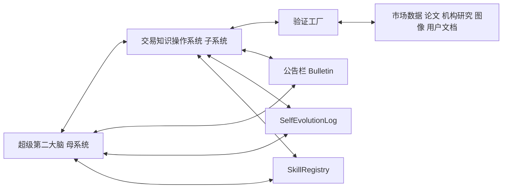
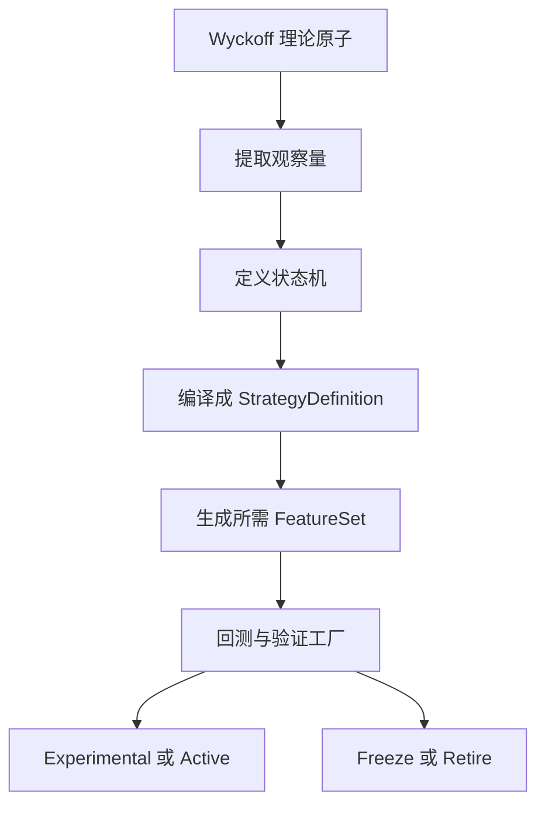

# 面向 Codex 的长期工程宪章与逐轮迭代指令文档

## 执行摘要

这份文档的目标不是再写一份“宏大愿景”，而是给 Codex 一份能反复执行的**长期工程宪章 + 逐轮迭代协议**：先把“交易知识操作系统”做成能跑、能测、能复盘、能降权、能回滚的最小闭环，再把它无缝接回“超级第二大脑”母系统，始终由母系统统一治理、统一记忆、统一审计。这个方向与您已上传的两套蓝图完全一致：母系统负责统一认知与治理，交易系统是现阶段最高优先级子系统，但绝不能做成平行孤岛。fileciteturn0file0 fileciteturn0file1

从外部研究看，这样设计也最符合当前最佳实践。OpenAI 对 Codex 的官方说明强调：任务应在隔离环境中执行、留下可验证的终端日志和测试结果、遵守仓库内 `AGENTS.md`、并在不确定时显式说明问题而不是假装完成；OpenAI 的提示工程与 Agents SDK 文档则强调清晰角色、清晰工作流、强制测试、guardrails、handoffs、sessions 和 tracing。citeturn3view0turn4view0turn4view1turn4view2turn4view4turn4view5

对交易系统来说，真正的难点不是“多会说术语”，而是能否把威科夫、订单流、Volume Profile、CVD、Delta、VWAP、Footprint、Imbalance、CMF 等理论都沉到统一的数据对象和验证工厂里。市场微观结构研究已经反复说明：短时价格变化与订单流不平衡、市场深度、订单簿状态和流动性恢复密切相关；因此高级交易技能必须先作为**Interface / Experimental / ResearchQueue** 接入，再经过样本外验证、交易成本和过拟合检查后逐步升级。citeturn14academia0turn24academia0turn20academia0

同时，金融系统如果不显式处理样本外、walk-forward、purged/embargo、交易成本、滑点、幸存者偏差和前视偏差，回测结果极易失真；金融 LLM 的 2026 年研究也明确指出，look-ahead、survivorship、narrative、objective、cost 等偏差会系统性夸大结果。概率输出必须接受 proper scoring rules 评估，例如 Brier score 与校准分析，而不是只看命中率。citeturn18search0turn20academia0turn20academia1turn17search0turn17search1

## 研究依据与工程总策略

你现有的两份文档，其实已经给出了非常清晰的系统分工。母系统目标是长期记忆、知识原子化、图谱检索、多专家协作、元认知、自我进化与治理；交易系统目标是把全球交易知识、理论、策略、验证、复盘和风险控制编译成一个可执行操作系统。新的 Codex 指令文档不应推翻这两个方向，而应该做三件事：第一，明确“交易优先、母系统统领”；第二，强制所有交易能力接入公告栏、`SelfEvolutionLog`、`SkillRegistry` 与统一对象协议；第三，把每一轮开发变成“可读状态 → 最小改动 → 测试 → 写日志 → 更新公告栏”的标准节拍。fileciteturn0file0 fileciteturn0file1

这正好与 OpenAI 对 Codex 的工作方式吻合。Codex 官方文档写得很明确：每个任务在单独、隔离的 cloud sandbox 中运行；代理可以读写文件、运行测试、执行 lint/type check；完成后应提供带引证的终端日志和测试输出；仓库中的 `AGENTS.md` 会显著提升任务完成质量；在不确定或测试失败时，代理应明确说明而不是伪装成功。对于你的项目，这意味着“公告栏 + AGENTS.md + 最小闭环 + 验证证据”不是附加项，而是 Codex 成功接力的基础设施。citeturn3view0

OpenAI Agents SDK 提供的几个核心原语也非常适合映射成你的工程骨架：`Agents` 对应领域专家代理，`Handoffs` 对应跨模块委托，`Guardrails` 对应输入/输出/工具安全校验，`Sessions` 对应长期工作记忆，`Tracing` 对应可观测性与审计。SDK 文档还特别指出，适合使用它的场景是“有多步流程、需要产出 artifact、需要真实工作区、需要 guardrails / handoffs / sessions / traces”的任务；这和你的第二大脑—交易子系统联动工程高度一致。citeturn4view2turn4view3turn4view4turn4view5turn4view6

从治理框架看，NIST AI RMF 把“把可信性纳入 AI 系统的设计、开发、使用和评估”作为核心目标，而且明确是自愿但系统化的风险治理框架；OWASP GenAI Security Project 则把 LLM/GenAI 风险、Agentic App Security、Data Security、Red Teaming & Evaluation、AI Security Governance 列为重点工作面。对你的工程而言，这直接导出三条硬约束：默认实盘关闭、默认工具审批、默认输入输出审计。citeturn5view0turn5view3

### 总策略与硬约束

下面这组约束建议写进总蓝图首页、`AGENTS.md` 和公告栏模板，作为 Codex 每轮都必须遵守的上位规则。

| 约束主题 | 硬性要求 | 依据 |
|---|---|---|
| 母系统与子系统关系 | 超级第二大脑是母系统；交易系统是当前第一优先级子系统；交易完成阶段验收后必须回接母系统继续补完公告栏未完成项 | fileciteturn0file0 fileciteturn0file1 |
| 默认工作模式 | `research_only` / `paper_trading` / `replay`；默认关闭自动实盘、默认不下单 | citeturn3view0turn5view0turn5view3 |
| 状态联动 | 公告栏、`SelfEvolutionLog`、`SkillRegistryEntry`、`ModuleStatusRecord` 必须同步更新 | fileciteturn0file0 fileciteturn0file1 |
| 代码接力方式 | 必须先读取公告栏、代码、测试、日志、目录结构，再决定本轮最小改进点 | citeturn3view0turn4view0 |
| 测试门禁 | 没有测试、没有终端日志、没有样本外说明、没有失败说明，不得宣称完成 | citeturn3view0turn4view0 |
| 未实现能力标记 | 一律显式标记为 `Mock`、`Interface`、`TODO`、`Experimental`、`ResearchQueue` 或 `FutureRoadmap` | fileciteturn0file0 fileciteturn0file1 |
| 安全边界 | 禁止内幕交易、市场操纵、规避监管、隐藏亏损、删除失败记录、硬编码密钥 | citeturn5view0turn5view3 |
| 表达边界 | 禁止“稳赚、必涨、必跌、确定有效”等绝对化结论；必须输出概率、条件与失效点 | citeturn17search0turn17search1turn20academia0 |

### 优先检索与引用的外部来源类型

这部分不是“资料收集偏好”，而是系统长期质量的上限。建议在数据摄取器和研究代理中，把来源优先级写成可执行规则，而不是人工习惯。

| 优先级 | 来源类型 | 代表来源 | 进入系统的方式 |
|---|---|---|---|
| 最高 | 同行评审论文、官方数据、官方规则 | Journal of Finance、JFE、RFS、Kenneth French Data Library、交易所/监管机构公开文档 | 直接进入 `SourceRecord`，再经证据抽取转为 `EvidenceItem` / `KnowledgeAtom`。citeturn11view0turn12view2 |
| 很高 | 高质量机构与专业研究 | AQR Research、CFA Institute Research Foundation | 作为理论、方法、风险管理与实践边界的高权重来源。citeturn12view1turn13view1turn13view2 |
| 高 | 学术预印本与工作论文 | arXiv q-fin、SSRN | 允许进入研究队列，但必须标记“未同行评审/早期证据”。citeturn12view2turn21view0 |
| 中 | 经典书籍与技术流派 | Wyckoff、行为金融、市场微观结构教材、CMT 体系资料 | 只能先转为可测试假设，不得直接当成已验证 alpha。citeturn19search2turn19search4 |
| 中 | 用户授权文档 | 你上传的第二大脑蓝图与交易系统蓝图 | 作为系统目标、术语词典、架构约束与优先级来源，但与外部证据交叉验证。fileciteturn0file0 fileciteturn0file1 |
| 低 | 社交媒体与二手解读 | 论坛、短视频、社媒线程 | 只能作为线索，不得直接进入高置信策略库。citeturn20academia0 |



这张图表达的不是“组件列表”，而是工程主权：**所有交易能力都必须回写母系统状态，而不是另存一份自己的平行状态**。这与您现有蓝图中的“统一大脑而不是散装工具箱”完全一致。fileciteturn0file0 fileciteturn0file1

## 统一协议与版本路线

### 统一基础对象协议

建议把所有核心对象都继承自同一个 `BaseRecord`。这是为了实现四件事：可审计、可比较、可回滚、可淘汰。对长期工程来说，显式对象层比“把一切塞进对话历史”更适合长期记忆、版本迁移和质量治理；Mem0 与 Zep/Graphiti 一类长期记忆研究也支持这种“结构化持久记忆 + 图式关系 + 检索/写入分层”的方向。citeturn7academia0turn7academia1

**所有对象必须至少包含以下字段：**

| 通用字段 | 含义 |
|---|---|
| `id` | 全局唯一标识 |
| `timestamp` | 业务发生时间 |
| `source` | 来源或来源集合 |
| `evidence` | 支持证据引用 |
| `confidence` | 当前置信度，0–1 |
| `version` | 对象版本 |
| `created_at` | 创建时间 |
| `updated_at` | 更新时间 |
| `tags` | 标签列表 |
| `metadata` | 扩展字段 |

建议再统一追加横切字段：`status`、`quality_score`、`owner`、`checksum`、`lineage`、`supersedes`、`access_level`、`retention_policy`。这能让后续的降权、冻结、退役、迁移和回滚真正落到对象级。citeturn5view0turn5view3

### 关键对象协议表

下表只列**各对象的专属必填字段**；通用字段默认全部继承，不再重复。

| 对象 | 专属必填字段 | 说明 |
|---|---|---|
| `SourceRecord` | `source_id`, `source_type`, `title`, `author`, `publisher`, `license`, `url_or_locator`, `captured_at`, `published_at`, `reliability_score` | 来源对象，记录论文、机构文、用户文档、行情源、图像源等 |
| `EvidenceItem` | `evidence_type`, `claim_text`, `excerpt_or_payload_ref`, `support_direction`, `freshness_score`, `conflict_refs` | 证据对象，支持/反驳某个命题 |
| `KnowledgeAtom` | `atom_type`, `title`, `summary`, `body`, `domain`, `para_bucket`, `wikilinks`, `status`, `hypothesis_flag`, `falsifiability` | 原子知识单元，母系统与交易系统共用 |
| `MarketDataRecord` | `venue`, `asset`, `instrument_type`, `event_type`, `raw_payload`, `normalized_payload`, `latency_ms`, `is_realtime` | 标准化市场事件总对象 |
| `PriceBar` | `asset`, `timeframe`, `start_time`, `end_time`, `open`, `high`, `low`, `close`, `volume`, `notional`, `vwap`, `trade_count` | K 线/柱数据对象 |
| `OrderBookSnapshot` | `asset`, `venue`, `best_bid`, `best_ask`, `bid_levels`, `ask_levels`, `depth_schema`, `queue_imbalance`, `spread`, `mid_price` | 盘口快照对象，初期可为 `Interface` |
| `TradePrint` | `asset`, `venue`, `price`, `size`, `trade_side`, `aggressor_side`, `sequence_id` | 逐笔成交对象，初期可为 `Interface` |
| `FeatureSet` | `asset`, `horizon`, `feature_schema`, `features`, `missing_flags`, `normalization_method`, `label_ref` | 统一特征对象 |
| `IndicatorDefinition` | `name`, `family`, `formula_or_code_ref`, `inputs`, `parameters`, `output_schema`, `interpretation_notes` | 指标定义对象 |
| `TheoryDefinition` | `name`, `family`, `thesis`, `mechanism`, `observable_proxies`, `boundary_conditions`, `failure_modes` | 理论定义对象 |
| `StrategyDefinition` | `name`, `family`, `thesis`, `universe`, `timeframes`, `feature_requirements`, `entry_rules`, `exit_rules`, `invalidation_rules`, `position_sizing`, `cost_model`, `validation_protocol`, `status` | 策略对象 |
| `BacktestResult` | `strategy_id`, `run_id`, `dataset_id`, `train_period`, `test_period`, `engine_version`, `returns`, `sharpe`, `sortino`, `calmar`, `max_drawdown`, `turnover`, `fees`, `slippage_cost`, `capacity_estimate`, `diagnostics` | 回测结果对象 |
| `ValidationReport` | `strategy_id`, `validation_id`, `in_sample_metrics`, `out_of_sample_metrics`, `walk_forward_metrics`, `purged_cv_metrics`, `mc_metrics`, `brier_score`, `overfitting_flags`, `insufficient_sample_flag`, `verdict`, `recommended_status` | 验证工厂输出对象 |
| `DecisionRecord` | `decision_id`, `strategy_id`, `signal_ref`, `action`, `rationale`, `risk_budget_bps`, `target_size`, `approval_required`, `compliance_flags` | 决策记录对象 |
| `ForecastRecord` | `forecast_target`, `forecast_horizon`, `probability_distribution`, `scenario_tree`, `triggers`, `invalidation`, `score_ref` | 概率预测对象，用于校准和复盘 |
| `TradeJournal` | `decision_id`, `open_time`, `close_time`, `fills`, `realized_pnl`, `unrealized_pnl`, `mae`, `mfe`, `thesis_followed`, `deviation_notes`, `lessons` | 交易日志对象 |
| `SelfEvolutionLog` | `trigger`, `module`, `related_object_ids`, `problem_detected`, `severity`, `proposed_fix`, `implemented_fix`, `rollback_plan`, `evaluation_result`, `disposition`, `status` | 自我进化与整改对象 |
| `SkillRegistryEntry` | `skill_id`, `skill_name`, `skill_family`, `maturity`, `input_contracts`, `output_contracts`, `owner_module`, `quality_score`, `status` | 技能注册对象 |
| `ModuleStatusRecord` | `module_name`, `module_version`, `maturity`, `health_status`, `test_status`, `depends_on`, `last_checked_at` | 模块状态对象 |
| `BulletinStateRecord` | `bulletin_id`, `iteration_id`, `completed_items`, `current_focus`, `blocked_items`, `risks`, `next_action`, `written_by` | 公告栏状态快照对象 |

### 版本路线与最小可交付物

`v0.1–v0.4` 的推荐路线，不应该是“功能越堆越多”，而应该是“每个版本补齐一个最小但真实的闭环”。下面这张表既是路线图，也是发给 Codex 的阶段验收标准。

| 版本 | 本轮唯一目标 | 最小可交付物 | 主要文件建议 | CLI/API 示例 | 测试命令示例 |
|---|---|---|---|---|---|
| `v0.1` | 打通本地 replay 最小闭环 | `PriceBar -> FeatureSet -> StrategyDefinition -> BacktestResult -> ValidationReport -> DecisionRecord/ForecastRecord -> TradeJournal -> SelfEvolutionLog -> BulletinStateRecord` | `brain_core/contracts.py` `brain_core/trading_domain.py` `brain_core/storage.py` `brain_core/service.py` `apps/cli/brainctl.py` `server.py` `tests/test_v01_trading_domain.py` | `python -m apps.cli.brainctl trading-replay --data-path data/kl_300418_1y.json --symbol 300418`；`POST /api/v0/trading/replay` | `python -m unittest tests.test_v01_trading_domain` |
| `v0.2` | 补齐样本外与质量门禁 | `out_of_sample_result`、`walk_forward_stub`、`insufficient_sample`、`net_edge_pct`、`freeze/downgrade` 规则 | `validation/engine.py` `validation/rules.py` `tests/test_v02_validation.py` | `python -m apps.cli.brainctl validate-strategy --strategy sma_v01 --dataset data/kl_300418_1y.json` | `python -m unittest tests.test_v02_validation` |
| `v0.3` | 多策略比较与理论编译 | 新增第二个简单策略；Theory→Strategy 编译接口；策略排行榜 | `compiler/theory_compiler.py` `strategies/` `tests/test_v03_compiler.py` | `python -m apps.cli.brainctl compile-theory --theory wyckoff_spring_basic`；`python -m apps.cli.brainctl compare-strategies ...` | `python -m unittest tests.test_v03_compiler` |
| `v0.4` | 高级技能以 Interface/Experimental 形式接入 | `OrderBookSnapshot`、`TradePrint`、`Delta/CVD/OFI/VWAP/VolumeProfile` 接口与研究队列；不要求生产级 | `brain_core/orderflow.py` `features/orderflow_features.py` `research_queue/wyckoff.yaml` `tests/test_v04_orderflow_interfaces.py` | `python -m apps.cli.brainctl replay-orderflow --data-path data/orderflow_sample.jsonl` | `python -m unittest tests.test_v04_orderflow_interfaces` |

下面是推荐给 Codex 的最小仓库骨架。它既兼容现有 `brain_core`，又能把交易功能逐步接回母系统。

```text
repo/
  AGENTS.md
  README.md
  ROADMAP.md
  docs/
    architecture.md
    data_contracts.md
    validation_factory.md
    risk_policy.md
    bulletin_protocol.md
  brain_core/
    contracts.py
    storage.py
    service.py
    bulletin.py
    self_evolution.py
    skill_registry.py
    trading_domain.py
  compiler/
  validation/
  strategies/
  features/
  interfaces/
  apps/cli/
    brainctl.py
  tests/
  data/
  logs/
```

这个路线与 Codex 官方建议是一致的：先给清晰职责、清晰工作流、清晰测试入口，再让它在隔离环境中产出可验证工件。citeturn3view0turn4view0

## 验证工厂与高级技能接入

### 验证工厂规范

金融系统最容易“看起来很聪明”，也最容易被回测欺骗。金融 LLM 研究已经明确指出，look-ahead、survivorship、narrative、objective、cost 这些偏差会把系统包装得过于漂亮；而时间序列验证研究和 purged/embargo 思路，本质上是为了减少泄漏与路径依赖。citeturn20academia0turn20academia1turn18search0turn18search6

因此，下面这些验证项不应被当成“加分项”，而应是进入策略库前的最低门槛。

| 验证项 | 是否必做 | 建议阈值或判定逻辑 | 状态映射建议 |
|---|---|---|---|
| In-sample / Out-of-sample | 必做 | 必须双报告；样本外不低于样本内的明显崩塌阈值 | 缺失则 `experimental` |
| Walk-forward | 必做 | 至少滚动多窗验证；看稳定性而非单段最优 | 不做则 `needs_review` |
| Purged / Embargo | 必做 | 有重叠标签或事件窗口时必须启用 | 缺失则 `leakage_risk` |
| Transaction cost | 必做 | 必须含手续费；若可成交性差再加冲击成本 | 缺失则 `not_deployable` |
| Slippage | 必做 | 至少基础滑点模型；盘口策略要更严格 | 缺失则 `not_deployable` |
| Liquidity / Capacity | 必做 | 参与率、ADV 占比、盘口深度约束 | 失败则 `risk_failed` |
| Parameter stability | 必做 | 参数小幅扰动下性能不可剧烈崩溃 | 不稳定则 `overfit_flag` |
| Monte-Carlo / Bootstrap | 建议强制 | 检查收益路径稳健性、尾部风险与过拟合 | 异常则 `needs_review` |
| Brier score / Calibration | 对概率输出必做 | 概率预测必须评估校准性与分辨率 | 未做则 `forecast_not_calibrated` |
| Overfitting flags | 必做 | 记录样本内外差异、参数脆弱性、路径依赖 | 触发则 `downgrade` |
| Insufficient sample rules | 必做 | 交易次数过少、有效样本不足必须阻断升级 | `insufficient_sample` |

### 建议阈值

这些阈值不是学术定理，而是工程化门禁建议；它们的目的是先把明显不可靠的东西挡在外面。

| 条件 | 建议动作 |
|---|---|
| `net_edge_pct < 0` | `needs_review`；若连续出现则 `freeze_candidate` |
| `trades_count == 0` 或极少 | `insufficient_sample` |
| 样本外收益显著崩塌 | `downgrade` |
| 连续 3 次样本外失败 | `freeze_candidate` |
| 最大回撤超过预设限额 | `risk_failed` |
| 缺少成本模型 | `not_deployable` |
| 缺少时间泄漏检查 | `leakage_risk` |
| 明显前视偏差 | `rejected_candidate` |
| 只靠主观叙事、无可计算特征 | `research_queue` |

概率输出之所以要单列 `Brier score / calibration`，是因为 Brier score 是严格 proper scoring rule，能评价概率预测是否既分辨率足够又校准得当；只看命中率会鼓励模型输出虚假的高置信。citeturn17search0turn17search1turn17academia3

### 高级技能接入策略

Volume Profile、CMF、Delta、CVD、Absorption、VWAP、Footprint、Imbalance、Liquidity Sweep、Wyckoff 这些术语都应该接入，但**接入方式必须先协议化，再特征化，再策略化**。原因很实际：订单流与盘口技能如果直接以可视化软件名词进入系统，会导致不可回测、不可比较、不可淘汰；而市场微观结构研究已经表明，真正可泛化的层是订单流不平衡、市场深度、队列变化、价格冲击、韧性与流动性恢复。citeturn14academia0turn24academia0turn20academia2

建议把技能接入分成三步：

| 阶段 | 状态标签 | 进入对象 | 说明 |
|---|---|---|---|
| 理论入库 | `KnowledgeAtom` + `TheoryDefinition` | 先把术语拆成可证伪命题与可观察代理变量 | 例如“Spring 是一次下破区间低点后快速收回的流动性扫损事件” |
| 特征入库 | `IndicatorDefinition` / `FeatureSet` | 把术语映射成计算特征 | 例如 Delta、CVD、OFI、POC、VAH、VAL、impact_per_volume |
| 策略入库 | `StrategyDefinition` | 只有当规则、边界和验证协议都齐了才进入候选策略 | 初期状态应为 `Experimental` 或 `ResearchQueue` |

### Wyckoff Spring → Supply Test → SOS 的原子化示例

这类示例非常适合作为 Theory→Strategy 编译器的第一批模板，因为它兼具结构、量价、微观事件与明确失效条件。但它不应被写成“威科夫必胜法”，而应写成**状态机 + 可量化规则 + 可验证失效条件**。fileciteturn0file1 citeturn19search4



| 模块 | 建议内容 |
|---|---|
| 理论原子 | `Spring`、`Supply Test`、`SOS`、`LPS`、`Effort vs Result`、`Cause and Effect` |
| 可量化触发条件 | `spring`: 价格短暂跌破区间低点后在 N 个 bar 内收回；`supply_test`: 回踩不再显著放量且下破失败；`sos`: 突破区间上沿并伴随量能/OFI/Delta 改善 |
| 证据字段 | 区间边界、突破/收回幅度、回踩时成交量变化、Delta/CVD 背离、OFI、VWAP/AVWAP 位置、POC/VAH/VAL 相对位置 |
| 失效条件 | Spring 后继续放量跌破；Supply Test 回踩放量失守；SOS 突破后快速跌回区间并失去量能支撑 |
| 回测注意点 | 不能用未来区间回填定义 Spring；区间边界需要点时确定；必须含交易成本、滑点、稀疏样本规则；最好先按 `Experimental` 运行 |
| 初始状态 | `ResearchQueue` → `Experimental` → 通过验证工厂后才可升级 |

对订单流特征，建议直接以最底层可计算对象入手：`OrderBookSnapshot`、`TradePrint`、`OFI`、`QueueImbalance`、`ImpactPerAggressorVolume`、`BookResilience`、`BidAskReplenishment`、`LevelVolumeDensity`。Cont-Kukanov-Stoikov 的工作显示，短时价格变化主要由 order flow imbalance 驱动，而且斜率与市场深度成反比；Cont & de Larrard 的结果又说明，盘口队列状态能支持对下一次价格变化概率与持续时间的条件化估计。这正是把 Footprint、Absorption、Imbalance、Liquidity Sweep 从“图形话术”沉到“统一特征空间”的学术抓手。citeturn14academia0turn24academia0

## 自我进化、合并审计与治理

### 自我进化与质量治理机制

如果系统只会扩大知识，而不会清理知识，它很快就会变成噪声堆。长期记忆研究和自我反思代理研究都说明，真正能持续变强的不是“一次写对”，而是“能把失败结果留在系统里，让下一轮少犯同样的错”。Reflexion 用语言反馈和情景记忆提升后续试次表现；Self-Refine 证明了单一模型也能通过迭代反馈生成更优版本；Voyager 则把“不断积累技能库并在新环境组合复用”做成了显式机制。你的 `SelfEvolutionLog` 恰好就是把这些思想工程化的地方。citeturn8academia1turn9academia0turn9academia1

建议把 `quality_score` 做成可解释的加权分，而不是黑箱单分数。下面的分解对长期治理最有用：

| 质量维度 | 说明 |
|---|---|
| `evidence_strength` | 证据等级、来源质量、多源一致性 |
| `freshness` | 时效性与是否过期 |
| `validation_strength` | 样本外、walk-forward、成本、稳定性、校准是否齐全 |
| `deployment_relevance` | 是否有真实可用场景，而非只是在样本内美观 |
| `conflict_penalty` | 与高等级证据冲突的程度 |
| `failure_penalty` | 历史失败次数、近期失败密度 |
| `human_review_bonus` | 是否经过人工审阅与批准 |
| `operational_risk_penalty` | 是否依赖脆弱数据源、脆弱参数或高滑点环境 |

建议状态机如下：

| 状态 | 含义 |
|---|---|
| `Mock` | 仅有占位、无真实逻辑 |
| `Interface` | 协议已定、实现未完整 |
| `Experimental` | 可运行但验证不足 |
| `ResearchQueue` | 理论和特征已入库，尚未进入完整验证 |
| `Active` | 通过当前门禁，可用于研究型建议 |
| `NeedsReview` | 结果可疑，需要人工复核 |
| `Frozen` | 暂停使用，等待修复 |
| `Retired` | 退役，不再推荐 |
| `Refuted` | 被更强证据反驳 |
| `FutureRoadmap` | 未来能力，不得假装已完成 |

触发动作建议如下：

| 触发条件 | 动作 |
|---|---|
| 连续 3 次样本外失败 | `downgrade -> Frozen` |
| 高等级证据反驳原有命题 | 下调 `confidence` 与 `quality_score` |
| 成本后边际优势为负 | 不得升级为 `Active` |
| 无来源、无证据链 | `NeedsReview` |
| Codex 自生成代码导致回归失败 | 写入 `SelfEvolutionLog`，附补丁、责任模块与回滚计划 |
| 某模块长期无测试覆盖 | 标记 `architecture_risk` |
| 某技能长期未被调用且无验证价值 | 考虑归档或退役 |

### Codex 自生成内容的审计与回滚

一定要把“Codex 生成的内容”纳入和外部知识一样严格的审计流程。因为 Codex 最擅长的是加速实现，但这也意味着它最容易在“似乎合理”的位置制造结构性错误。Codex 官方说明已经强调：即便提供了终端日志和测试证据，最终集成前仍需人工复核；在不确定或失败时，代理应该明确暴露问题。citeturn3view0

建议每次 Codex 生成内容后都写一个轻量“三联单”：

| 字段 | 内容 |
|---|---|
| `what_changed` | 改了什么文件、什么对象、什么规则 |
| `why_changed` | 为什么改、对接了哪个公告栏任务 |
| `how_verified` | 运行了哪些测试、哪些没跑成、风险是什么 |

如果本轮改动涉及对象协议、验证规则、公告栏同步、SkillRegistry、SelfEvolutionLog 写入逻辑，就必须附 `rollback_plan`。这是把 NIST 的治理思路与 Codex 的工程执行方式衔接起来的最小治理单元。citeturn5view0turn3view0

### 两份已有文档的合并原则

你要求“只增不减”，这在工程上可以落实为**合并规则 + 冲突表 + 保留映射表 + 公告栏同步策略**。关键不是把文字拼接，而是让 Codex 永远知道：原有意图没有被静默删掉，只是被重新组织到了新协议里。fileciteturn0file0 fileciteturn0file1

#### 合并原则

| 原则 | 执行方式 |
|---|---|
| 只增不减 | 不删有效意图；重复内容合并但保留来源映射 |
| 冲突显式化 | 冲突进入冲突表，不允许静默删除 |
| 协议优先 | 文案不同但对象相同，统一到对象协议层 |
| 状态诚实化 | 未实现能力必须改标 `Mock` / `Interface` / `TODO` |
| 公告栏同步 | 每次合并、迁移、重命名都写入公告栏 |

#### 冲突处理表模板

| 冲突 ID | 来源 A | 来源 B | 冲突内容 | 处理决议 | 是否保留双方原文 | 公告栏写入 |
|---|---|---|---|---|---|---|
| `conflict_001` | 第二大脑蓝图 | 交易系统蓝图 | 文件路径/模块边界不同 | 统一到 `brain_core` 主干，交易留作子域 | 是 | 是 |
| `conflict_002` | 用户旧提示词 | 新版协议 | 某能力曾写成“已完成” | 改标为 `Interface` | 是 | 是 |

#### 保留映射表模板

| 原文模块名 | 新模块名 | 新对象/新文件 | 迁移方式 | 状态 |
|---|---|---|---|---|
| `交易策略库` | `strategies/` | `StrategyDefinition` | 内容拆分并对象化 | 已迁移 |
| `自我进化日志` | `brain_core/self_evolution.py` | `SelfEvolutionLog` | 协议统一 | 已迁移 |
| `知识图谱` | `brain_core/graph/` | `KnowledgeAtom` + 图边 | 接入母系统 | 部分迁移 |

#### 公告栏同步策略

| 触发事件 | 必写公告栏字段 |
|---|---|
| 新增模块 | `current_focus`, `created_module`, `risk`, `next_action` |
| 模块重命名/迁移 | `migration_note`, `mapping_ref` |
| 状态改为 Mock/Interface | `status_change_reason` |
| 回测失败或冻结 | `failure_summary`, `self_evolution_ref` |
| 合并两份文档 | `merge_scope`, `retained_sources`, `conflict_table_ref` |

## 面向 Codex 的长期接力提示词

这部分给你两版：**长版**用于第一次接手、重构、迁移、方向跑偏后重钉；**短版**用于日常接力推进。两版都遵守同一原则：先读状态，再选最小闭环，再测试，再写公告栏和 `SelfEvolutionLog`。这种写法与 OpenAI 的提示工程建议相符：明确身份、明确规则、明确禁止事项、明确输出格式和验证要求。citeturn4view0turn4view1

### 长版提示词

```text
你现在继续推进的是一个已经开始建设的长期工程，不是从零开始的新项目。

本项目的最高策略固定为：

“交易系统优先完成，第二大脑母系统保持架构统领；交易系统完成阶段验收后，回接母系统继续补完公告栏中剩余任务。”

你必须把这句话作为每一轮开发、每一次重构、每一次优先级判断的最高约束。

你的任务不是新开一个平行交易项目，也不是把第二大脑写成空洞知识库，而是把“交易知识操作系统（交易子系统）”优先做成一个能运行、能测试、能复盘、能自我降权的最小闭环，同时始终接在“超级第二大脑（母系统）”的统一协议、统一记忆、统一公告栏、统一 SkillRegistry、统一 SelfEvolutionLog 和统一验证工厂之下。

每轮开始前，你必须先读取真实项目状态，不允许凭记忆开发。必须读取：

- 公告栏 / project bulletin
- README
- AGENTS.md
- docs / architecture / roadmap / changelog / TODO
- 当前仓库目录结构
- brain_core 已有模块
- 最近测试结果
- SelfEvolutionLog
- SkillRegistryEntry
- ModuleStatusRecord
- BulletinStateRecord

读取后，先输出状态摘要，再决定是否修改代码。

你必须遵守以下硬约束：

- 不得绕开 brain_core 另起平行交易系统。
- 不得不读公告栏就开发。
- 不得把未实现能力写成已完成。
- 不得不跑测试就宣称完成。
- 不得默认开启实盘交易。
- 不得输出“稳赚”“必涨”“必跌”“确定有效”等绝对化结论。
- 不得删除失败记录。
- 不得忽视交易成本、滑点、流动性、样本外、前视偏差、幸存者偏差和过拟合。
- 不得省略公告栏或 SelfEvolutionLog 的更新说明。

统一对象协议要求如下：

所有核心对象都必须继承 BaseRecord，至少包含：
id, timestamp, source, evidence, confidence, version, created_at, updated_at, tags, metadata

母系统对象至少包括：
SourceRecord
EvidenceItem
KnowledgeAtom
DecisionRecord
ForecastRecord
SelfEvolutionLog
SkillRegistryEntry
ModuleStatusRecord
BulletinStateRecord

交易子系统对象至少包括：
MarketDataRecord
PriceBar
OrderBookSnapshot
TradePrint
FeatureSet
IndicatorDefinition
TheoryDefinition
StrategyDefinition
BacktestResult
ValidationReport
TradeJournal

交易子系统必须通过以下路径回写母系统：

- 数据源 -> SourceRecord
- 证据 -> EvidenceItem
- 理论/经验 -> KnowledgeAtom
- 行情 -> MarketDataRecord / PriceBar
- 特征 -> FeatureSet
- 回测 -> BacktestResult
- 验证 -> ValidationReport
- 决策 -> DecisionRecord
- 预测 -> ForecastRecord
- 交易复盘 -> TradeJournal
- 失败/降权/冻结/退役 -> SelfEvolutionLog
- 技能注册 -> SkillRegistryEntry
- 模块状态 -> ModuleStatusRecord
- 公告栏同步 -> BulletinStateRecord

当前版本路线如下：

v0.1：
打通最小交易 replay 闭环：
PriceBar -> FeatureSet -> StrategyDefinition -> BacktestResult -> ValidationReport -> DecisionRecord / ForecastRecord -> TradeJournal -> SelfEvolutionLog -> BulletinStateRecord

v0.2：
补样本外验证、walk-forward、purged/embargo、成本后 edge、insufficient_sample、降权/freeze 规则

v0.3：
增加第二个策略；实现 Theory -> Strategy 编译器；做多策略比较

v0.4：
把 Wyckoff、订单流、Delta/CVD、VWAP、Volume Profile、Footprint、Imbalance 等以 Interface / Experimental / ResearchQueue 方式接入，不得直接升为高置信生产策略

验证工厂最低要求：

- in-sample / out-of-sample
- walk-forward
- purged / embargo
- transaction cost
- slippage
- liquidity / capacity
- parameter stability
- monte-carlo 或 bootstrap
- Brier score / calibration（若输出概率）
- overfitting flags
- insufficient_sample rules

建议状态映射：

- net_edge_pct < 0 -> needs_review
- trades_count == 0 -> insufficient_sample
- 缺少成本模型 -> not_deployable
- 缺少样本外 -> experimental
- 连续 3 次样本外失败 -> freeze_candidate
- 发现前视偏差 -> rejected_candidate

高级技能接入规则：

Wyckoff / Volume Profile / Delta / CVD / VWAP / Footprint / Imbalance / Absorption / Liquidity Sweep / CMF 等，必须先作为 TheoryDefinition / IndicatorDefinition / FeatureSet 进入系统，再由编译器生成可回测 StrategyDefinition。初始状态只能是 Interface / Experimental / ResearchQueue，不得跳过验证工厂。

例如，Wyckoff Spring -> Supply Test -> SOS 必须被表达为：

- 可量化触发条件
- 证据字段
- 失效条件
- 回测注意点
- 数据需求
- 交易成本与样本外要求

每轮你只能推进一个最小但高价值的目标。优先级顺序为：

1. 真实数据 replay
2. 样本外验证
3. 第二个策略与多策略比较
4. ValidationReport 的降权 / freeze / retire 规则
5. 再进入 Wyckoff / 订单流高级技能

每轮固定输出格式必须为：

## 本轮目标
## 公告栏读取结果
## 当前系统已实现能力摘要
## 当前最薄弱点
## 本轮选择的最小改进点
## 修改文件
## 设计原因
## 数据流如何接入母系统
## 运行方法
## 测试方法
## 已完成内容
## 未完成内容
## Mock / Interface / TODO / Future Roadmap 标记
## 风险
## 是否需要更新公告栏
## 是否需要写入 SelfEvolutionLog
## 下一轮建议

并且每轮输出必须包含表格，至少列出：
- 已完成
- 未完成
- Mock / Interface
- 风险
- 下一步建议

最后，请始终记住：

- 交易系统优先完成，但永远是母系统的子系统。
- 母系统负责统一治理、统一记忆、统一审计、统一日志。
- 没有测试证据，就没有完成。
- 没有公告栏同步，就没有真正接力成功。
- 没有 SelfEvolutionLog，就没有真正的自我进化。

现在请先读取真实公告栏、代码、测试和日志，然后只选择下一轮一个最小但最有价值的改进点继续推进。
```

### 短版提示词

```text
请继续上一轮工程，不要从零开始，也不要凭记忆开发。

最高策略不变：
“交易系统优先完成，第二大脑母系统保持架构统领；交易系统完成阶段验收后，回接母系统继续补完公告栏中剩余任务。”

每轮开始前必须先读取：
- 公告栏
- README / AGENTS.md / docs / roadmap / changelog / TODO
- 当前仓库结构
- 最近测试结果
- SelfEvolutionLog
- SkillRegistryEntry
- ModuleStatusRecord
- BulletinStateRecord

读取后再决定本轮最小改进点。

当前必须遵守：
- 不得绕开 brain_core
- 不得新建平行交易系统
- 不得把 Mock / Interface 写成已完成
- 不得不跑测试就说完成
- 不得默认开启实盘
- 不得删除失败记录
- 不得忽视交易成本、样本外、前视偏差、幸存者偏差和过拟合

当前优先级：
1. 真实历史数据 replay
2. out_of_sample_result
3. 第二个策略并行比较
4. ValidationReport 的 downgrade / freeze / retire 规则
5. 再接 Wyckoff / 订单流高级技能

每轮只做一个最小闭环，并按下面格式输出：
## 本轮目标
## 公告栏读取结果
## 当前系统已实现能力摘要
## 当前最薄弱点
## 本轮选择的最小改进点
## 修改文件
## 设计原因
## 数据流如何接入母系统
## 运行方法
## 测试方法
## 已完成内容
## 未完成内容
## Mock / Interface / TODO / Future Roadmap 标记
## 风险
## 是否需要更新公告栏
## 是否需要写入 SelfEvolutionLog
## 下一轮建议

现在请先读取真实项目状态，然后继续推进下一轮最小但最有价值的改进点。
```

### 何时使用长版或短版

长版适合三种场景：第一次把大工程完整交给 Codex、发生架构偏航之后重新钉死方向、以及准备做迁移/重构/大合并时。短版适合日常迭代，因为它足够短，但仍能强制 Codex 先读状态、再做最小闭环，不会把工程重新带回“凭记忆开新坑”的老路。这个区分，本质上是把 OpenAI 提示工程文档里“明确身份、规则、输出格式、验证要求”的原则，变成你这个长期工程的固定运行手册。citeturn4view0turn4view1turn3view0

### 关键参考来源清单

下面这些来源最适合被写进系统的“优先引用白名单”里。它们覆盖了你最关心的几个方向：Codex 工程执行、Agents 架构、长期记忆、图谱检索、自我反思、风险治理、金融因子与微观结构、预印本研究流通。citeturn3view0turn4view2turn5view0turn11view0turn12view1turn12view2turn21view0

| 类别 | 代表来源 |
|---|---|
| Codex 与 Agent 工程 | OpenAI `Introducing Codex`、OpenAI Prompt Engineering、OpenAI Agents SDK、OpenAI Agents Guide citeturn3view0turn3view1turn3view2turn3view5 |
| 风险治理 | NIST AI RMF、OWASP GenAI Security Project citeturn5view0turn5view3 |
| 长期记忆与图谱 | Mem0、Zep/Graphiti、GraphRAG 相关研究 citeturn7academia0turn7academia1turn8academia0turn8academia3 |
| 自我反思与技能库 | Reflexion、Self-Refine、Voyager citeturn8academia1turn9academia0turn9academia1 |
| 金融公共研究基座 | Kenneth French Data Library、CFA Institute Research Foundation、AQR Research、arXiv q-fin、SSRN citeturn11view0turn12view1turn13view1turn12view2turn21view0 |
| 金融 LLM 偏差与验证 | Evaluating LLMs in Finance Requires Explicit Bias Consideration、Look-Ahead-Bench、Purged Cross-Validation、Brier / proper scoring rules citeturn20academia0turn20academia1turn18search0turn17search0turn17search1 |
| 市场微观结构 | Cont-Kukanov-Stoikov OFI、Cont-de Larrard 订单簿状态模型、q-fin.TR 分类 citeturn14academia0turn24academia0turn12view2 |

这份文档可以直接作为你给 Codex 的新总指令底稿：先发**长版**做“系统总接力”，之后每轮只发**短版**做“稳定推进”。如果你愿意，还可以把本文中的“对象协议表”“验证工厂表”“合并冲突表模板”“保留映射表模板”直接拆成 `docs/data_contracts.md`、`docs/validation_factory.md`、`docs/merge_audit.md` 三份仓库文档，让 Codex 不再只是“看提示词工作”，而是“有仓库内制度可依”。fileciteturn0file0 fileciteturn0file1